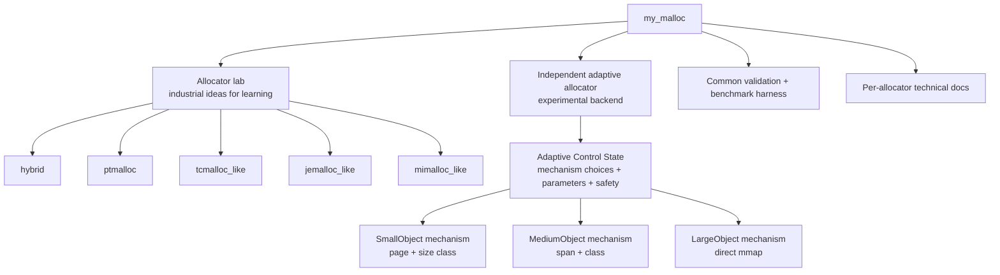

# my_malloc

`my_malloc` is a C++17 learning-oriented memory allocator. It can be used as an `LD_PRELOAD` malloc replacement, and it also provides a strategy/benchmark lab for comparing allocator designs.

The project tries to reproduce the core ideas of industrial allocators without fully cloning glibc malloc, jemalloc, tcmalloc, or mimalloc. Those implementations are the teaching allocator lab. The separate `adaptive` allocator is the project's experimental design: it owns its metadata and telemetry, and uses a runtime control state to configure adaptive-internal mechanisms.

## What This Project Implements

The project is organized around four parts:

1. **Allocator lab**: simplified implementations of classic industrial allocator ideas for learning and comparison.
2. **Adaptive allocator**: an independent experimental allocator with adaptive-owned metadata, base allocation mechanisms, runtime mechanism control, and parameter tuning.
3. **Common harness**: validation, built-in benchmarks, optional external benchmarks, and LD_PRELOAD smoke tests.
4. **Technical docs**: design documents for each allocator, including architecture, data structures, simplifications, and benchmark guidance.

Runtime-selectable strategies:

| Strategy | Category | Core design |
|---|---|---|
| `hybrid` | Teaching allocator | 16B size-class slab frontend for small objects plus ptmalloc-style fallback. |
| `ptmalloc` | Teaching allocator | Boundary-tag chunks, tcache, fastbins, small/unsorted/large bins, arenas, top chunk, mmap. |
| `tcmalloc_like` | Teaching allocator | Size classes, thread caches, central free lists, batch refill/drain, 64KB spans. |
| `jemalloc_like` | Teaching allocator | Arenas, per-thread tcache, size-class runs, arena-local refill. |
| `mimalloc_like` | Teaching allocator | Per-thread heaps, page ownership, local free lists, remote-free queues. |
| `adaptive` | Experimental allocator | Adaptive-owned metadata, SmallObject/MediumObject/LargeObject base mechanisms, runtime control state, mechanism parameters, and soft switching. |
| `adaptive_demo` / `demo_all` | Teaching demo | Legacy dispatcher across teaching allocators for policy demonstration and mixed-ownership stress tests. |
| `libc` / `glibc` | Baseline | System allocator for comparison in tools. |

Main features:

| Area | Implemented feature |
|---|---|
| Public API | `malloc`, `free`, `calloc`, `realloc`, `memalign`, `posix_memalign`, `aligned_alloc`, `mallopt`, `malloc_usable_size` |
| Drop-in usage | `LD_PRELOAD=./build/libmy_ptmalloc.so ./program` |
| Runtime modes | `hybrid`, `ptmalloc`, `tcmalloc_like`, `jemalloc_like`, `mimalloc_like`, `adaptive`, `adaptive_demo` |
| Learning tools | heap inspector, statistics, trace option, strategy API, plugin example |
| Benchmarks | built-in configurable benchmark runner plus external `mimalloc-bench`, Redis, and real-application smoke hooks |

## Architecture At A Glance



Public allocation calls still use one API surface. New allocations choose a mode through `MY_MALLOC_MODE`, while `free`/`realloc` route by pointer ownership metadata so objects return to the allocator that created them.

For the detailed system architecture, read [docs/system_architecture.md](docs/system_architecture.md).

## Build

```bash
cmake -B build .
cmake --build build -j$(nproc)
```

Important build targets:

| Target | Purpose |
|---|---|
| `my_ptmalloc` | Shared library for `LD_PRELOAD` |
| `my_ptmalloc_static` | Static library used by tests/tools |
| `test_basic` | Basic correctness tests |
| `test_tcache` | Tcache-specific tests |
| `test_stress` | Multi-threaded stress test |
| `allocator_validate` | Validates built-in or plugin strategies |
| `bench_runner` | Configurable benchmark runner |
| `heap_inspect` | Heap inspection tool |
| `example_counting_strategy` | Example external allocator strategy plugin |

## Run Tests

```bash
ctest --test-dir build --output-on-failure
```

Validate allocator strategies:

```bash
./build/allocator_validate --strategy hybrid
./build/allocator_validate --strategy ptmalloc
./build/allocator_validate --strategy tcmalloc_like
./build/allocator_validate --strategy jemalloc_like
./build/allocator_validate --strategy mimalloc_like
./build/allocator_validate --strategy adaptive
./build/allocator_validate --strategy libc
```

Run with `LD_PRELOAD`:

```bash
LD_PRELOAD=./build/libmy_ptmalloc.so MY_MALLOC_MODE=hybrid ./build/test_basic
LD_PRELOAD=./build/libmy_ptmalloc.so MY_MALLOC_MODE=ptmalloc ./build/test_basic
LD_PRELOAD=./build/libmy_ptmalloc.so MY_MALLOC_MODE=tcmalloc_like ./build/test_basic
LD_PRELOAD=./build/libmy_ptmalloc.so MY_MALLOC_MODE=jemalloc_like ./build/test_basic
LD_PRELOAD=./build/libmy_ptmalloc.so MY_MALLOC_MODE=mimalloc_like ./build/test_basic
LD_PRELOAD=./build/libmy_ptmalloc.so MY_MALLOC_MODE=adaptive ./build/test_basic
```

## Use As A Drop-in Allocator

```bash
LD_PRELOAD=./build/libmy_ptmalloc.so ./your_program
```

Switch allocator mode:

```bash
MY_MALLOC_MODE=hybrid   LD_PRELOAD=./build/libmy_ptmalloc.so ./your_program
MY_MALLOC_MODE=ptmalloc LD_PRELOAD=./build/libmy_ptmalloc.so ./your_program
MY_MALLOC_MODE=tcmalloc_like LD_PRELOAD=./build/libmy_ptmalloc.so ./your_program
MY_MALLOC_MODE=jemalloc_like LD_PRELOAD=./build/libmy_ptmalloc.so ./your_program
MY_MALLOC_MODE=mimalloc_like LD_PRELOAD=./build/libmy_ptmalloc.so ./your_program
MY_MALLOC_MODE=adaptive LD_PRELOAD=./build/libmy_ptmalloc.so ./your_program
MY_MALLOC_MODE=adaptive MY_MALLOC_ADAPTIVE_POLICY=ucb1 LD_PRELOAD=./build/libmy_ptmalloc.so ./your_program
MY_MALLOC_MODE=adaptive MY_MALLOC_ADAPTIVE_POLICY=thompson_sampling LD_PRELOAD=./build/libmy_ptmalloc.so ./your_program
MY_MALLOC_MODE=adaptive MY_MALLOC_ADAPTIVE_POLICY=ucb1 MY_MALLOC_ADAPTIVE_PARAM_POLICY=heuristic LD_PRELOAD=./build/libmy_ptmalloc.so ./your_program
MY_MALLOC_MODE=adaptive MY_MALLOC_ADAPTIVE_PARAM_POLICY=static MY_MALLOC_ADAPTIVE_SMALL_PAGE_SIZE=32768 LD_PRELOAD=./build/libmy_ptmalloc.so ./your_program
MY_MALLOC_MODE=adaptive_demo MY_MALLOC_ADAPTIVE_POLICY=bandit LD_PRELOAD=./build/libmy_ptmalloc.so ./your_program
```

`MY_MALLOC_MODE=adaptive` is a standalone adaptive allocator backend. It controls adaptive-internal mechanisms and does not route through the teaching allocators. `SmallObject`, `MediumObject`, and `LargeObject` are base allocation mechanisms, not complete allocator architectures. The current compatibility policies (`heuristic`, `fixed:*`, `round_robin`, `epsilon_greedy`, `ucb1`, `thompson_sampling`) mostly choose or bias those base mechanisms. Parameter policies are selected with `MY_MALLOC_ADAPTIVE_PARAM_POLICY=static|heuristic|coordinate_bandit|bayesian_offline`. The old demonstration behavior that dispatches across teaching allocators is available as `adaptive_demo` / `demo_all`.

Important adaptive knobs:

| Env var | Meaning |
|---|---|
| `MY_MALLOC_ADAPTIVE_POLICY` | Compatibility mechanism-selection policy. |
| `MY_MALLOC_ADAPTIVE_PARAM_POLICY` | Parameter tuning policy. |
| `MY_MALLOC_ADAPTIVE_ARCH_WINDOW` | Legacy name for the mechanism-control window. |
| `MY_MALLOC_ADAPTIVE_PARAM_WINDOW` | Allocation window before parameter tuning runs. |
| `MY_MALLOC_ADAPTIVE_SMALL_PAGE_SIZE` | Initial small-object page size. |
| `MY_MALLOC_ADAPTIVE_MEDIUM_SPAN_SIZE` | Initial medium-object span size. |
| `MY_MALLOC_ADAPTIVE_LOCAL_BATCH` | Local-cache batch hint for future adaptive cache work. |
| `MY_MALLOC_ADAPTIVE_EMPTY_CACHE_LIMIT` | Empty page/span cache limit before release. |
| `MY_MALLOC_ADAPTIVE_COOLDOWN_WINDOWS` | Cooldown after mechanism preference changes. |
| `MY_MALLOC_ADAPTIVE_PROFILE` | Initial control preset/objective: `balanced`, `low_latency`, `low_rss`, `large_heavy`, `cross_thread`. |

Enable optional observability:

```bash
MY_MALLOC_STATS=1 LD_PRELOAD=./build/libmy_ptmalloc.so ./your_program
MY_MALLOC_TRACE=1 LD_PRELOAD=./build/libmy_ptmalloc.so ./your_program
```

## Use From C++

```cpp
#include "my_ptmalloc/my_malloc.h"

void* p = my_ptmalloc::my_malloc(1024);
p = my_ptmalloc::my_realloc(p, 2048);
size_t usable = my_ptmalloc::my_malloc_usable_size(p);
my_ptmalloc::my_free(p);
```

Aligned allocation:

```cpp
void* p = my_ptmalloc::my_memalign(64, 4096);
my_ptmalloc::my_free(p);
```

## Benchmark

Built-in benchmarks:

```bash
./build/bench_runner --strategy hybrid --profile smoke
./build/bench_runner --strategy hybrid --profile micro
./build/bench_runner --strategy hybrid --profile stress --json
./build/bench_runner --strategy ptmalloc --profile all --json
./build/bench_runner --strategy tcmalloc_like --profile all --json
./build/bench_runner --strategy jemalloc_like --profile all --json
./build/bench_runner --strategy mimalloc_like --profile all --json
./build/bench_runner --strategy adaptive --profile all --json
./build/bench_runner --strategy libc --profile all --json
```

Run individual workloads:

```bash
./build/bench_runner --strategy hybrid --bench same_size --size 64 --iters 1000000
./build/bench_runner --strategy hybrid --bench random --random-iters 500000 --slots 8192
./build/bench_runner --strategy hybrid --bench fragmentation --iters 100000 --min-size 16 --max-size 16384
./build/bench_runner --strategy hybrid --bench cross_thread_free --threads 8 --batch 10000
./build/bench_runner --strategy adaptive --bench phase_changing --json
./build/bench_runner --strategy adaptive --bench same_size_64 --repeats 5 --json
```

External benchmarks:

```bash
scripts/external_bench.sh setup-mimalloc-bench
scripts/external_bench.sh build-mimalloc-bench bench
scripts/external_bench.sh build-mimalloc-bench redis
scripts/external_bench.sh run-mimalloc-bench rptest larson alloc-test glibc-thread
scripts/external_bench.sh run-redis
scripts/external_bench.sh run-real-apps
```

Full benchmark instructions and current results:

| Document | Contents |
|---|---|
| [docs/benchmarking.md](docs/benchmarking.md) | Built-in profiles, parameters, JSON output, external benchmark commands |
| [docs/external_benchmark_results.md](docs/external_benchmark_results.md) | Latest external run notes, Redis results, skipped tests, known environment blockers |

## Documentation Map

| Document | Read this for |
|---|---|
| [docs/system_architecture.md](docs/system_architecture.md) | Project architecture: teaching allocator lab, independent adaptive allocator, ownership, validation, and benchmark harness |
| [docs/ptmalloc_design.md](docs/ptmalloc_design.md) | ptmalloc-style allocator: chunk/tcache/bin/arena implementation and simplifications |
| [docs/tcmalloc_design.md](docs/tcmalloc_design.md) | tcmalloc-like allocator: size classes, thread cache, central lists, spans |
| [docs/jemalloc_design.md](docs/jemalloc_design.md) | jemalloc-like allocator: arenas, runs, tcache |
| [docs/mimalloc_design.md](docs/mimalloc_design.md) | mimalloc-like allocator: per-thread heaps, page ownership, remote-free queues |
| [docs/adaptive_allocator.md](docs/adaptive_allocator.md) | Independent adaptive backend: metadata, ownership, two-layer adaptation, parameter policies, and future ML/RL hooks |
| [docs/allocator_lab.md](docs/allocator_lab.md) | Custom allocator strategy/plugin API and validation workflow |
| [docs/benchmarking.md](docs/benchmarking.md) | Benchmark methodology, commands, smoke results |
| [docs/external_benchmark_results.md](docs/external_benchmark_results.md) | External benchmark run notes and environment blockers |

## Current Performance Snapshot

The latest local benchmark sample was performed on May 6, 2026 with `bench_runner` after adding mechanism control, window stats, and parameter tuning. It compares `libc` with selected adaptive configurations.

Micro profile highlights:

| Strategy / config | `same_size_64` ops/sec | `same_size_256` ops/sec | `batch` ops/sec | `random` ops/sec |
|---|---:|---:|---:|---:|
| `libc` | 12,574,450 | 9,694,595 | 7,019,472 | 996,505 |
| `adaptive` default | 24,430,358 | 24,197,039 | 9,799,662 | 814,750 |
| `adaptive`, `ucb1+static` | 27,902,697 | 28,317,132 | 10,642,325 | 840,813 |
| `adaptive`, `ucb1+heuristic` | 24,653,533 | 25,055,846 | 9,568,574 | 1,047,587 |
| `adaptive`, `ucb1+coordinate_bandit` | 20,157,150 | 20,690,505 | 9,333,185 | 927,191 |

Stress sample:

| Strategy / config | `random` ops/sec | `fragmentation` ops/sec | `cross_thread_free` ops/sec |
|---|---:|---:|---:|
| `libc` | 1,304,079 | 1,392,338 | 881,577 |
| `adaptive`, `ucb1+heuristic` | 1,302,661 | 1,613,490 | 820,079 |

The results are useful for learning because they expose concrete design tradeoffs:

- `adaptive` can beat `libc` on the local micro hot paths, and `ucb1+heuristic` is competitive on the random micro sample;
- `ucb1+static` is the strongest tested configuration for steady same-size and batch micro workloads;
- `ucb1+heuristic` is the strongest tested adaptive configuration for random micro and fragmentation stress in this sample;
- `adaptive` now has an ownership fast path, per-class pool locks, window delta stats, and conservative empty page/span release;
- broader LD_PRELOAD and external workload results are still needed before making general claims.

## Current Limitations

- Empty slabs in the hybrid frontend are cached but not yet returned to the OS.
- Cross-thread slab frees do not yet use owner-thread remote-free queues.
- The size-class table is simple 16-byte spacing, not a production-tuned table.
- Large allocation and extent management are simpler than jemalloc/tcmalloc/mimalloc.
- The adaptive backend now has dedicated small pages, medium spans, direct mmap, mechanism control, parameter tuning, ownership fast path, per-class locks, window stats, and conservative empty release. It still lacks real thread-local caches, remote-free queues, profile-specific schemas, and contextual ML/RL.
- External benchmark coverage depends on local tools such as Redis, glibc benchtests, SQLite, clang, Z3, jemalloc, tcmalloc, and mimalloc.
