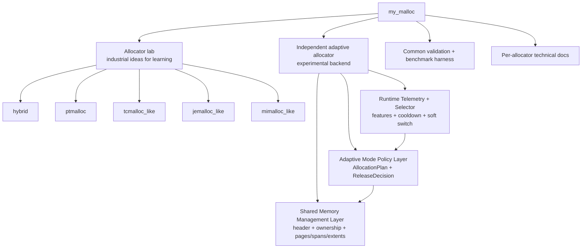

# my_malloc

`my_malloc` is a C++17 learning-oriented memory allocator. It can be used as an `LD_PRELOAD` malloc replacement, and it also provides a strategy/benchmark lab for comparing allocator designs.

The project tries to reproduce the core ideas of industrial allocators without fully cloning glibc malloc, jemalloc, tcmalloc, or mimalloc. Those implementations are the teaching allocator lab. The separate `adaptive` allocator is the project's experimental multi-mode design: it owns its metadata and telemetry, records allocation-time mode ids, and can soft-switch future allocations between adaptive modes.

## What This Project Implements

The project is organized around four parts:

1. **Allocator lab**: simplified implementations of classic industrial allocator ideas for learning and comparison.
2. **Adaptive allocator**: an independent experimental allocator with shared adaptive metadata, a mode table, allocation-time mode routing, workload telemetry, and rule-based soft switching.
3. **Common harness**: validation, built-in benchmarks, optional external benchmarks, and LD_PRELOAD smoke tests.
4. **Technical docs**: design documents for each allocator, including architecture, data structures, simplifications, and benchmark guidance.

Runtime-selectable strategies:

| Strategy | Category | Core design |
|---|---|---|
| `hybrid` | Teaching allocator | 16B size-class slab frontend for small objects plus ptmalloc-style fallback. |
| `ptmalloc` | Teaching allocator | Boundary-tag chunks, tcache, fastbins, small/unsorted/large bins, arenas, top chunk, mmap. |
| `tcmalloc_like` | Teaching allocator | Size classes, thread caches, central free lists, batch refill/drain, 64KB spans. |
| `jemalloc_like` | Teaching allocator | Arenas, per-thread tcache, size-class runs, arena-local refill. |
| `mimalloc_like` | Teaching allocator | Per-thread heaps, page ownership, local free lists, remote-free queues. |
| `adaptive` | Experimental allocator | Two-layer adaptive backend with shared memory services, mode policy, telemetry, selector, and soft switching. |
| `libc` / `glibc` | Baseline | System allocator for comparison in tools. |

Main features:

| Area | Implemented feature |
|---|---|
| Public API | `malloc`, `free`, `calloc`, `realloc`, `memalign`, `posix_memalign`, `aligned_alloc`, `mallopt`, `malloc_usable_size` |
| Drop-in usage | `LD_PRELOAD=./build/libmy_ptmalloc.so ./program` |
| Runtime modes | `hybrid`, `ptmalloc`, `tcmalloc_like`, `jemalloc_like`, `mimalloc_like`, `adaptive` |
| Learning tools | heap inspector, statistics, trace option, strategy API, plugin example |
| Benchmarks | built-in configurable benchmark runner plus external `mimalloc-bench`, Redis, and real-application smoke hooks |

## Architecture At A Glance



Public allocation calls still use one API surface. `MY_MALLOC_MODE` chooses the allocator backend. Inside the `adaptive` backend, new allocations use the active `AdaptiveMode`, while `free`/`realloc`/`usable_size` route by allocation-time metadata so objects return through the mode that created them.

For the detailed system architecture, read [docs/system_architecture.md](docs/system_architecture.md).

## Build

```bash
cmake -B build .
cmake --build build -j$(nproc)
```

Important build targets:

| Target | Purpose |
|---|---|
| `my_ptmalloc` | Shared library for `LD_PRELOAD` |
| `my_ptmalloc_static` | Static library used by tests/tools |
| `test_basic` | Basic correctness tests |
| `test_tcache` | Tcache-specific tests |
| `test_stress` | Multi-threaded stress test |
| `allocator_validate` | Validates built-in or plugin strategies |
| `bench_runner` | Configurable benchmark runner |
| `heap_inspect` | Heap inspection tool |
| `example_counting_strategy` | Example external allocator strategy plugin |

## Run Tests

```bash
ctest --test-dir build --output-on-failure
```

Validate allocator strategies:

```bash
./build/allocator_validate --strategy hybrid
./build/allocator_validate --strategy ptmalloc
./build/allocator_validate --strategy tcmalloc_like
./build/allocator_validate --strategy jemalloc_like
./build/allocator_validate --strategy mimalloc_like
./build/allocator_validate --strategy adaptive
./build/allocator_validate --strategy libc
```

Run with `LD_PRELOAD`:

```bash
LD_PRELOAD=./build/libmy_ptmalloc.so MY_MALLOC_MODE=hybrid ./build/test_basic
LD_PRELOAD=./build/libmy_ptmalloc.so MY_MALLOC_MODE=ptmalloc ./build/test_basic
LD_PRELOAD=./build/libmy_ptmalloc.so MY_MALLOC_MODE=tcmalloc_like ./build/test_basic
LD_PRELOAD=./build/libmy_ptmalloc.so MY_MALLOC_MODE=jemalloc_like ./build/test_basic
LD_PRELOAD=./build/libmy_ptmalloc.so MY_MALLOC_MODE=mimalloc_like ./build/test_basic
LD_PRELOAD=./build/libmy_ptmalloc.so MY_MALLOC_MODE=adaptive ./build/test_basic
```

## Use As A Drop-in Allocator

```bash
LD_PRELOAD=./build/libmy_ptmalloc.so ./your_program
```

Switch allocator mode:

```bash
MY_MALLOC_MODE=hybrid   LD_PRELOAD=./build/libmy_ptmalloc.so ./your_program
MY_MALLOC_MODE=ptmalloc LD_PRELOAD=./build/libmy_ptmalloc.so ./your_program
MY_MALLOC_MODE=tcmalloc_like LD_PRELOAD=./build/libmy_ptmalloc.so ./your_program
MY_MALLOC_MODE=jemalloc_like LD_PRELOAD=./build/libmy_ptmalloc.so ./your_program
MY_MALLOC_MODE=mimalloc_like LD_PRELOAD=./build/libmy_ptmalloc.so ./your_program
MY_MALLOC_MODE=adaptive LD_PRELOAD=./build/libmy_ptmalloc.so ./your_program
MY_MALLOC_MODE=adaptive MY_MALLOC_ADAPTIVE_MODE=throughput_cache LD_PRELOAD=./build/libmy_ptmalloc.so ./your_program
MY_MALLOC_MODE=adaptive MY_MALLOC_ADAPTIVE_MODE=compact_rss LD_PRELOAD=./build/libmy_ptmalloc.so ./your_program
MY_MALLOC_MODE=adaptive MY_MALLOC_ADAPTIVE_MODE=large_object LD_PRELOAD=./build/libmy_ptmalloc.so ./your_program
MY_MALLOC_MODE=adaptive MY_MALLOC_ADAPTIVE_MODE=auto MY_MALLOC_ADAPTIVE_MODE_SELECTOR=rule LD_PRELOAD=./build/libmy_ptmalloc.so ./your_program
```

`MY_MALLOC_MODE=adaptive` is a standalone adaptive allocator backend. It is not a dispatcher over `ptmalloc`, `jemalloc_like`, `tcmalloc_like`, or `mimalloc_like`. Its architecture is:

1. **Shared Memory Management Layer**: `AdaptiveHeader`, ownership table, registry, size-class pages, spans, direct mappings/extents, central free lists, reclaim, and raw telemetry events.
2. **Adaptive Mode Policy Layer**: each mode returns an `AllocationPlan` and `ReleaseDecision`; modes do not directly manipulate page/span/mmap internals.
3. **Runtime Telemetry and Selector**: extracts workload features, applies rule selection with window/cooldown/hysteresis, and soft-switches the active mode.

Soft switching only affects future allocations. `free`, `realloc`, and `usable_size` route through allocation-time `mode_id` in `AdaptiveHeader`.

Important adaptive knobs:

| Env var | Meaning |
|---|---|
| `MY_MALLOC_ADAPTIVE_MODE` | `balanced`, `throughput_cache`, `deterministic_latency`, `compact_rss`, `fragmentation_stable`, `cross_thread`, `large_object`, `hardened_debug`, or `auto`. |
| `MY_MALLOC_ADAPTIVE_MODE_SELECTOR` | `rule`, `fixed`, or `manual`. |
| `MY_MALLOC_ADAPTIVE_MODE_WINDOW` | Rule-selector observation window. |
| `MY_MALLOC_ADAPTIVE_MODE_COOLDOWN` | Cooldown in windows after a mode switch. |
| `MY_MALLOC_ADAPTIVE_DEBUG_MODE` | Force `hardened_debug` when set to `1`. |
| `MY_MALLOC_ADAPTIVE_SMALL_PAGE_SIZE` | Initial small-object page size. |
| `MY_MALLOC_ADAPTIVE_MEDIUM_SPAN_SIZE` | Initial medium-object span size. |
| `MY_MALLOC_ADAPTIVE_EMPTY_CACHE_LIMIT` | Empty page/span cache limit before release. |

Enable optional observability:

```bash
MY_MALLOC_STATS=1 LD_PRELOAD=./build/libmy_ptmalloc.so ./your_program
MY_MALLOC_TRACE=1 LD_PRELOAD=./build/libmy_ptmalloc.so ./your_program
```

## Use From C++

```cpp
#include "my_ptmalloc/my_malloc.h"

void* p = my_ptmalloc::my_malloc(1024);
p = my_ptmalloc::my_realloc(p, 2048);
size_t usable = my_ptmalloc::my_malloc_usable_size(p);
my_ptmalloc::my_free(p);
```

Aligned allocation:

```cpp
void* p = my_ptmalloc::my_memalign(64, 4096);
my_ptmalloc::my_free(p);
```

## Benchmark

Built-in benchmarks:

```bash
./build/bench_runner --strategy hybrid --profile smoke
./build/bench_runner --strategy hybrid --profile micro
./build/bench_runner --strategy hybrid --profile stress --json
./build/bench_runner --strategy ptmalloc --profile all --json
./build/bench_runner --strategy tcmalloc_like --profile all --json
./build/bench_runner --strategy jemalloc_like --profile all --json
./build/bench_runner --strategy mimalloc_like --profile all --json
./build/bench_runner --strategy adaptive --profile all --json
./build/bench_runner --strategy libc --profile all --json
```

Run individual workloads:

```bash
./build/bench_runner --strategy hybrid --bench same_size --size 64 --iters 1000000
./build/bench_runner --strategy hybrid --bench random --random-iters 500000 --slots 8192
./build/bench_runner --strategy hybrid --bench fragmentation --iters 100000 --min-size 16 --max-size 16384
./build/bench_runner --strategy hybrid --bench cross_thread_free --threads 8 --batch 10000
./build/bench_runner --strategy adaptive --bench phase_changing --json
./build/bench_runner --strategy adaptive --bench same_size_64 --repeats 5 --json
./build/bench_runner --strategy adaptive --bench generated_workload --workload-template adaptive_mix --json
./build/bench_runner --strategy ptmalloc --bench generated_workload --workload-template adaptive_mix --json
./build/bench_runner --strategy adaptive --bench generated_workload \
  --workload-template adaptive_mix --workload-realtime \
  --phase-ms 10000 --target-ops-per-sec 50000 --telemetry-port 8080
```

External benchmarks:

```bash
scripts/external_bench.sh setup-mimalloc-bench
scripts/external_bench.sh build-mimalloc-bench bench
scripts/external_bench.sh build-mimalloc-bench redis
scripts/external_bench.sh run-mimalloc-bench rptest larson alloc-test glibc-thread
scripts/external_bench.sh run-redis
scripts/external_bench.sh run-real-apps
```

Full benchmark instructions and current results:

| Document | Contents |
|---|---|
| [docs/benchmarking.md](docs/benchmarking.md) | Built-in profiles, parameters, JSON output, external benchmark commands |
| [docs/external_benchmark_results.md](docs/external_benchmark_results.md) | Latest external run notes, Redis results, skipped tests, known environment blockers |

## Documentation Map

| Document | Read this for |
|---|---|
| [docs/system_architecture.md](docs/system_architecture.md) | Project architecture: teaching allocator lab, independent adaptive allocator, ownership, validation, and benchmark harness |
| [docs/ptmalloc_design.md](docs/ptmalloc_design.md) | ptmalloc-style allocator: chunk/tcache/bin/arena implementation and simplifications |
| [docs/tcmalloc_design.md](docs/tcmalloc_design.md) | tcmalloc-like allocator: size classes, thread cache, central lists, spans |
| [docs/jemalloc_design.md](docs/jemalloc_design.md) | jemalloc-like allocator: arenas, runs, tcache |
| [docs/mimalloc_design.md](docs/mimalloc_design.md) | mimalloc-like allocator: per-thread heaps, page ownership, remote-free queues |
| [docs/adaptive_allocator.md](docs/adaptive_allocator.md) | Two-layer adaptive backend: shared memory services, mode policy, telemetry selector, soft switching |
| [docs/adaptive_workload_generator.md](docs/adaptive_workload_generator.md) | Generated multi-phase workloads for comparing adaptive and fixed allocators |
| [docs/adaptive_visualization.md](docs/adaptive_visualization.md) | Optional local web UI for generated workload and adaptive mode telemetry |
| [docs/allocator_lab.md](docs/allocator_lab.md) | Custom allocator strategy/plugin API and validation workflow |
| [docs/benchmarking.md](docs/benchmarking.md) | Benchmark methodology, commands, smoke results |
| [docs/external_benchmark_results.md](docs/external_benchmark_results.md) | External benchmark run notes and environment blockers |

## Current Limitations

- Empty slabs in the hybrid frontend are cached but not yet returned to the OS.
- Cross-thread slab frees do not yet use owner-thread remote-free queues.
- The size-class table is simple 16-byte spacing, not a production-tuned table.
- Large allocation and extent management are simpler than jemalloc/tcmalloc/mimalloc.
- The adaptive backend now has shared memory services, `AllocationPlan` / `ReleaseDecision` mode policy, allocation-time `mode_id`, mode-specific thread-local cache limits, owner-keyed remote-free queues, compact targeted reclaim, fragmentation-stable waste-aware medium routing, hardened debug canary/redzone checks, owner-thread telemetry, rule-based soft switching, and per-mode stats. It still lacks dynamic tcache tuning, abandoned-owner cleanup, adaptive size-class-table rebalancing, sampled p99 latency, and front-redzone/page-guard debug variants.
- External benchmark coverage depends on local tools such as Redis, glibc benchtests, SQLite, clang, Z3, jemalloc, tcmalloc, and mimalloc.
