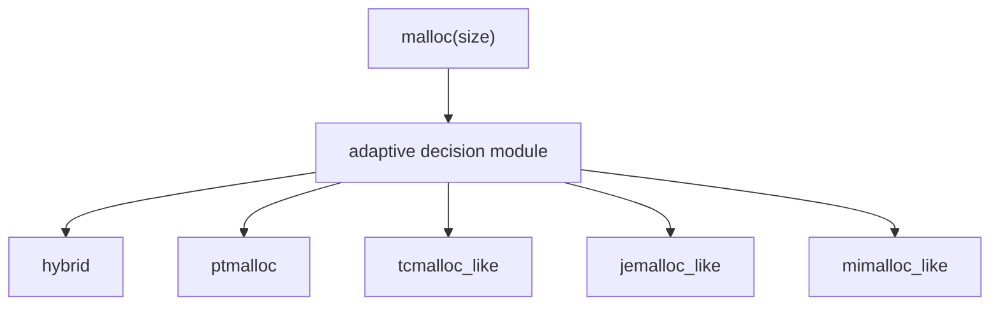

# Adaptive Policy Layer

`MY_MALLOC_MODE=adaptive` does not select a separate allocator implementation. It enables a decision module in the runtime dispatcher. For each allocation, the decision module chooses one concrete allocator implementation:

```text
hybrid
ptmalloc
tcmalloc_like
jemalloc_like
mimalloc_like
```



## Policy Selection

Configure the policy with:

```bash
MY_MALLOC_MODE=adaptive
MY_MALLOC_ADAPTIVE_POLICY=heuristic
```

Supported policies:

| Policy | Meaning | Status |
|---|---|---|
| `heuristic` | Size-based rules that can choose every concrete allocator | Implemented |
| `round_robin` | Rotates through all concrete allocators, useful for stress-testing mixed ownership | Implemented |
| `bandit` / `rl_bandit` | Lightweight exploration around the heuristic baseline | Implemented as a simple teaching baseline |
| `fixed:<impl>` | Adaptive dispatcher is enabled but always chooses one implementation | Implemented |
| `ml:<model>` | Offline model policy | Interface direction, not implemented |
| `llm:<endpoint>` | LLM-driven policy controller | Interface direction, not implemented |
| `rl:<agent>` | Full reinforcement-learning agent | Interface direction, not implemented |

Examples:

```bash
MY_MALLOC_MODE=adaptive MY_MALLOC_ADAPTIVE_POLICY=heuristic ./build/bench_my
MY_MALLOC_MODE=adaptive MY_MALLOC_ADAPTIVE_POLICY=round_robin ./build/bench_my
MY_MALLOC_MODE=adaptive MY_MALLOC_ADAPTIVE_POLICY=bandit ./build/bench_my
MY_MALLOC_MODE=adaptive MY_MALLOC_ADAPTIVE_POLICY=fixed:jemalloc_like ./build/bench_my
```

Valid fixed targets:

```text
hybrid
ptmalloc
tcmalloc_like
jemalloc_like
mimalloc_like
```

## Current Heuristic

The default policy is:

```text
size <= 128       -> mimalloc_like
size <= 1024      -> tcmalloc_like
size <= 4096      -> jemalloc_like
size <= 64 KiB    -> ptmalloc
size > 64 KiB     -> hybrid
```

This deliberately touches all concrete implementations. It is not claiming to be optimal; it is a readable baseline that makes the adaptive layer observable.

## Bandit Baseline

`bandit` is a lightweight teaching policy. It starts from the heuristic choice but occasionally explores under-used allocator implementations. It is not a production RL allocator because it does not yet measure reward from latency, RSS, or fragmentation.

To make it a real RL/bandit policy, the runtime must record:

- selected implementation;
- allocation size class;
- allocation latency;
- free latency;
- remote-free ratio;
- mapped bytes;
- live bytes;
- fragmentation estimate;
- failure count.

Then the reward can be something like:

```text
reward = throughput_score - latency_penalty - rss_penalty - fragmentation_penalty
```

## ML / LLM / RL Extension Point

The adaptive layer should remain a policy module, not an allocator. A future ML, LLM, or RL policy should only decide:

```text
observation -> allocator implementation
```

It should not own allocation metadata. Concrete allocator implementations still own their own memory layout and free paths.

Possible observations:

- current allocation size;
- per-size-class histogram;
- recent allocator choice;
- per-implementation hit/miss count;
- remote-free rate;
- arena lock contention;
- live bytes vs mapped bytes;
- empty span/page count;
- p50/p99 latency samples.

Possible policy implementations:

| Policy type | How it would work |
|---|---|
| Heuristic | Static rules or configurable thresholds |
| Offline ML | Load a small decision tree/table trained from benchmark logs |
| LLM controller | Periodically rewrite high-level policy parameters, not per-allocation decisions |
| RL agent | Online or offline agent updates policy from measured reward |

Per-allocation LLM calls are not practical. If an LLM is used, it should operate as a slow control-plane policy tuner.

## Run

```bash
./build/allocator_validate --strategy adaptive
MY_MALLOC_ADAPTIVE_POLICY=heuristic ./build/bench_runner --strategy adaptive --profile all --json
MY_MALLOC_ADAPTIVE_POLICY=bandit ./build/bench_runner --strategy adaptive --profile all --json
MY_MALLOC_ADAPTIVE_POLICY=fixed:mimalloc_like ./build/bench_runner --strategy adaptive --profile all --json
```
