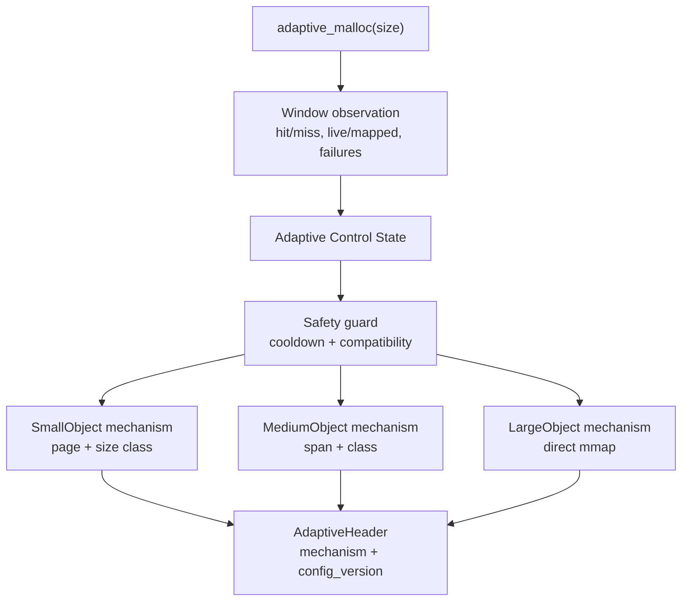

# Adaptive Allocator Backend

`MY_MALLOC_MODE=adaptive` selects the project's independent adaptive allocator. It is not a dispatcher over `ptmalloc`, `tcmalloc_like`, `jemalloc_like`, or `mimalloc_like`; those are teaching allocators used for comparison.

The current adaptive backend is best described as:

```text
Adaptive Control State =
  base allocation mechanism choices
  + mechanism modes
  + tunable parameters
  + safety guards
```

The allocator does not try to be innovative by simply switching among three complete architectures. `SmallObject`, `MediumObject`, and `LargeObject` are base allocation mechanisms. The adaptive controller changes how these mechanisms are preferred, configured, and constrained over time.

## 1. Design Goal

The adaptive allocator is designed as a learning platform for runtime allocator control:

- keep a stable ownership model so control changes do not break `free`;
- use window observations instead of only global lifetime counters;
- tune mechanism parameters without running complex models in the hot path;
- let presets express objectives such as low latency or low RSS;
- keep the current implementation small enough to test and inspect.



## 2. Base Allocation Mechanisms

The adaptive allocator currently has three base allocation mechanisms:

| Mechanism | Default size range | Current implementation |
|---|---:|---|
| `SmallObject` | `size <= 1024` | 16B size classes backed by adaptive pages |
| `MediumObject` | `1025 .. 64 KiB` | 1KiB classes backed by adaptive spans |
| `LargeObject` | `> 64 KiB` | direct mmap with adaptive header |

These are not complete allocator architectures. They are reusable paths controlled by the adaptive runtime state.

Current code still uses the historical type name `AdaptiveStrategyId` and JSON field `architecture_switches` for compatibility. In the design model, those values mean base mechanism ids and mechanism switches.

## 3. Ownership And Soft Switching

Every adaptive allocation has an `AdaptiveHeader`. The header records:

- magic number;
- base mechanism id;
- runtime `config_version`;
- requested and usable size;
- mmap region base and mapped size;
- page/span owner pointer for pooled allocations;
- debug ownership registry links.

`adaptive_free(ptr)` uses allocation-time metadata. It never asks the current controller where the pointer should go. This keeps soft switching safe: new allocations use the current control state, while old allocations free through the mechanism and page/span metadata they were created with.

The hot ownership path uses a page-level adaptive ownership table before reading the header. The intrusive registry remains a debug fallback when `MY_MALLOC_ADAPTIVE_DEBUG_REGISTRY=1`.

## 4. Adaptive Control State

The runtime control state is represented in code by `AdaptiveControlStateSnapshot` and the internal atomic config fields.

| Control state field | Meaning |
|---|---|
| `control_preset` | Current preset/objective: `balanced`, `low_latency`, `low_rss`, `large_heavy`, or `cross_thread`. |
| `mechanism_policy` | Compatibility policy that currently chooses or biases a base mechanism. |
| `parameter_policy` | Parameter tuner: `static`, `heuristic`, `coordinate_bandit`, or `bayesian_offline`. |
| `small_page_size` | Page size used when the SmallObject mechanism creates new pages. |
| `medium_span_size` | Span size used when the MediumObject mechanism creates new spans. |
| `empty_cache_limit` | EmptyReleaseMechanism keep limit before releasing empty pages/spans. |
| `local_batch_size` | Reserved cache/batch mechanism hint. It is not a full thread-local cache yet. |
| `cooldown_windows` | Safety guard after mechanism preference changes. |
| `large_path_preferred` | Whether the preset biases suitable requests toward direct mmap. |
| `remote_free_reserved` | Reserved flag for future remote-free/owner-aware mechanisms. |

Environment variables remain compatible and now jointly initialize or influence this control state:

| Env var | Meaning |
|---|---|
| `MY_MALLOC_ADAPTIVE_POLICY` | Compatibility mechanism policy. |
| `MY_MALLOC_ADAPTIVE_PARAM_POLICY` | Parameter tuning policy. |
| `MY_MALLOC_ADAPTIVE_PROFILE` | Initial control preset/objective. |
| `MY_MALLOC_ADAPTIVE_SMALL_PAGE_SIZE` | SmallObject page size. |
| `MY_MALLOC_ADAPTIVE_MEDIUM_SPAN_SIZE` | MediumObject span size. |
| `MY_MALLOC_ADAPTIVE_EMPTY_CACHE_LIMIT` | EmptyReleaseMechanism keep limit. |
| `MY_MALLOC_ADAPTIVE_LOCAL_BATCH` | Future cache/batch mechanism hint. |
| `MY_MALLOC_ADAPTIVE_ARCH_WINDOW` | Legacy name for mechanism-control window. |
| `MY_MALLOC_ADAPTIVE_PARAM_WINDOW` | Parameter tuning window. |
| `MY_MALLOC_ADAPTIVE_COOLDOWN_WINDOWS` | Safety cooldown after mechanism preference changes. |

## 5. Mechanism Control

The existing policy names are kept:

| Policy | Current role |
|---|---|
| `heuristic` | Size-based base mechanism selection. |
| `fixed:small` | Prefer SmallObject with safe fallback. |
| `fixed:medium` | Prefer MediumObject with safe fallback. |
| `fixed:large` | Prefer LargeObject/direct mmap. |
| `round_robin` | Stress-test ownership by cycling base mechanisms. |
| `epsilon_greedy` | Explore/exploit among size-compatible base mechanisms. |
| `ucb1` | UCB-style base mechanism preference. |
| `thompson_sampling` | Thompson-style base mechanism preference. |

These policies are not the full adaptive control plane. They currently choose or bias the base allocation mechanism. Future controllers should also control cache, release, remote-free, size-class, and mmap-threshold mechanisms.

## 6. Parameter Tuning

`MY_MALLOC_ADAPTIVE_PARAM_POLICY` controls parameter updates:

| Parameter policy | Current behavior |
|---|---|
| `static` | Read env/default control state once and keep it fixed. |
| `heuristic` | Use window hit/miss and mapped/live pressure to adjust page/span size, empty release, batch hint, and preset. |
| `coordinate_bandit` | Explore one parameter coordinate at a time. |
| `bayesian_offline` | Runtime stays fixed and consumes externally tuned env/config values. |

Bayesian optimization is still treated as offline or slow-online tuning. It is not run inside the malloc hot path.

## 7. Control Presets

Profiles are now control presets/objectives, not complete architectures:

| Preset | Objective |
|---|---|
| `balanced` | Default conservative control state. |
| `low_latency` | Prefer cache/reuse, keep more empty pages/spans, raise batch hint. |
| `low_rss` | Prefer aggressive empty release and lower mapped/live pressure. |
| `large_heavy` | Bias suitable requests toward the LargeObject/direct mmap mechanism. |
| `cross_thread` | Reserved objective for future remote-free and owner-aware reclaim. |

Current preset effects are intentionally small: release keep limit, local batch hint, large-path preference, and reserved remote-free state. They do not represent separate allocator implementations.

## 8. Mechanisms

Implemented mechanism controls:

- **PathPreferenceMechanism**: chooses or biases SmallObject, MediumObject, or LargeObject for new allocations.
- **EmptyReleaseMechanism**: releases empty pages/spans when the per-class empty cache exceeds the active keep limit.
- **PageSpanSizingMechanism**: changes future small page and medium span sizes through the versioned config.
- **BatchHintMechanism**: stores `local_batch_size` as a reserved central refill/TLS cache hint.

Future mechanism hooks should grow in these directions:

- thread-local cache mechanism;
- central batch refill/drain mechanism;
- remote-free queue mechanism;
- owner-aware reclaim mechanism;
- dynamic mmap threshold mechanism;
- size-class table policy;
- decay/purge policy.

## 9. Observation And Safety

The hot path records relaxed counters and reads an atomic control-state snapshot. Full updates happen at window boundaries or slow paths.

Window observations include:

- alloc/free/realloc counts;
- per-mechanism allocation counts;
- pool hit/miss deltas;
- mapped/live pressure;
- mechanism switches;
- parameter decisions;
- allocation failures.

Safety guards include:

- size compatibility checks;
- cooldown windows after preference changes;
- allocation-time metadata for free routing;
- debug registry fallback for ownership validation.

## 10. Stats And Benchmark Output

Benchmark JSON keeps old fields and adds mechanism/control fields. `architecture_switches` remains for compatibility; `mechanism_switches` is the preferred term.

Adaptive JSON includes:

- `architecture_switches` and `mechanism_switches`;
- `parameter_decisions`;
- `config_version` and `control_version`;
- `profile` and `control_preset`;
- `release_policy`;
- `large_path_preferred`;
- `remote_free_reserved`;
- mapped/live bytes and ratio;
- per-mechanism alloc/free counts;
- pool hits/misses;
- empty/released page/span stats.

## 11. Simplifications

Current limitations are explicit:

- base mechanisms are still only small page, medium span, and large mmap;
- mechanism control currently covers release, path preference, page/span size, and batch hint;
- thread-local cache is not fully implemented;
- remote-free queue is not implemented;
- `cross_thread` is a reserved objective, not a working remote-free mechanism;
- profile/preset is not a complete architecture;
- policy algorithms still mostly choose a base mechanism;
- `AdaptiveStrategyId`, `architecture_switches`, and `MY_MALLOC_ADAPTIVE_ARCH_WINDOW` remain as compatibility names.

## 12. Commands

```bash
./build/allocator_validate --strategy adaptive
MY_MALLOC_ADAPTIVE_PROFILE=low_rss ./build/test_adaptive_control
MY_MALLOC_ADAPTIVE_PROFILE=low_latency ./build/test_adaptive_control
MY_MALLOC_ADAPTIVE_PROFILE=large_heavy ./build/test_adaptive_control
MY_MALLOC_ADAPTIVE_PROFILE=cross_thread ./build/test_adaptive_control
MY_MALLOC_ADAPTIVE_POLICY=ucb1 MY_MALLOC_ADAPTIVE_PARAM_POLICY=heuristic ./build/bench_runner --strategy adaptive --bench phase_changing --json
LD_PRELOAD=./build/libmy_ptmalloc.so MY_MALLOC_MODE=adaptive ./build/test_basic
```
