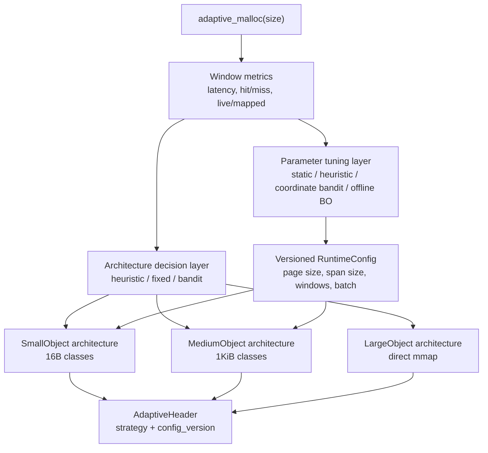
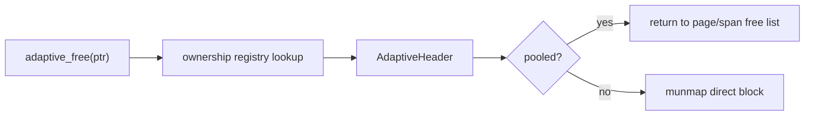
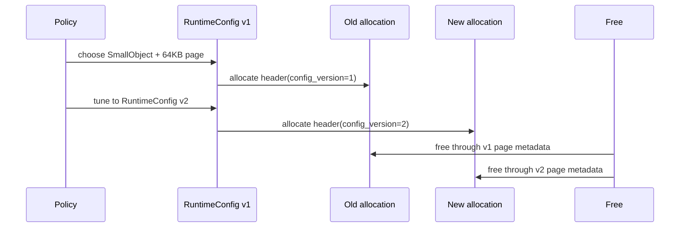

# Adaptive Allocator Backend

`MY_MALLOC_MODE=adaptive` selects the project's independent adaptive allocator. It is not a dispatcher over `ptmalloc`, `tcmalloc_like`, `jemalloc_like`, or `mimalloc_like`; those are teaching allocators used for comparison. Adaptive owns its metadata, telemetry, architecture policy, parameter policy, and free routing.

## 1. Design Goal

The adaptive allocator is designed as a learning platform for runtime allocator adaptation:

- keep a stable ownership model so architecture changes do not break `free`;
- switch allocation architecture only at coarse windows because architecture changes are expensive;
- tune runtime parameters at a separate, usually more frequent window;
- allow future adaptive architectures to expose their own parameter schema without hard-coding every policy around one fixed struct;
- keep current code simple enough to benchmark and debug.

The current implementation is intentionally smaller than a production allocator, but the architecture is shaped so new internal architecture profiles can be added later.



## 2. Ownership Model

Every adaptive allocation has an `AdaptiveHeader` and is recorded in the adaptive ownership registry.

The header stores:

- magic number;
- internal architecture id;
- flags;
- runtime `config_version`;
- requested and usable size;
- mmap region base and mapped size;
- page/span owner pointer for pooled allocations;
- ownership registry links.

`adaptive_free(ptr)` always uses allocation-time metadata. It does not ask the current architecture policy where the pointer should go. This is what makes soft switching possible: new allocations can use a new architecture/configuration while old allocations still free through the metadata they were created with.



## 3. Internal Architectures

The current adaptive allocator implements three internal architecture profiles. They are not exact clones of industrial allocators; they are adaptive-specific building blocks.

| Architecture id | Default size range | Current implementation |
|---|---:|---|
| `SmallObject` | `size <= 1024` | 16B size classes backed by adaptive pages |
| `MediumObject` | `1025 .. 64 KiB` | 1KiB classes backed by adaptive spans |
| `LargeObject` | `> 64 KiB` | direct mmap with adaptive header |

Current defaults:

| Parameter | Default | Runtime env |
|---|---:|---|
| Small page size | `64 KiB` | `MY_MALLOC_ADAPTIVE_SMALL_PAGE_SIZE` |
| Medium span size | `256 KiB` | `MY_MALLOC_ADAPTIVE_MEDIUM_SPAN_SIZE` |
| Architecture decision window | `4096` allocations per size band | `MY_MALLOC_ADAPTIVE_ARCH_WINDOW` |
| Parameter tuning window | `8192` allocations | `MY_MALLOC_ADAPTIVE_PARAM_WINDOW` |
| Local batch hint | `32` | `MY_MALLOC_ADAPTIVE_LOCAL_BATCH` |

The current code already versions the runtime config. New pages/spans record the active config version; old pages/spans keep their original mapped size and free path.

## 4. Two-Layer Adaptation

Adaptive decisions are split into two layers.

### Architecture Decision Layer

This layer chooses which internal architecture should serve future allocations. It is deliberately windowed for telemetry policies:

- `heuristic`, `fixed:*`, and `round_robin` are simple baselines;
- `epsilon_greedy`, `ucb1`, and `thompson_sampling` update the active architecture only every architecture window for each size band;
- between window boundaries, allocations use the active architecture for that band if it is size-compatible.

Supported `MY_MALLOC_ADAPTIVE_POLICY` values:

| Policy | Meaning |
|---|---|
| `heuristic` | Size-based routing: small, medium, large. |
| `fixed:small` | Prefer small, then safely fall back for larger sizes. |
| `fixed:medium` | Prefer medium, then fall back to large. |
| `fixed:large` | Use direct mmap large path. |
| `round_robin` | Cycle architectures to stress ownership routing. |
| `epsilon_greedy` / `eps_greedy` | Mostly exploit the best telemetry score, sometimes explore. |
| `ucb1` / `ucb` | Add an exploration bonus for under-tested architectures. |
| `thompson_sampling` / `thompson` | Sample from success/failure uncertainty with lightweight jitter. |

### Parameter Tuning Layer

This layer changes runtime parameters under the selected architecture. It is controlled by `MY_MALLOC_ADAPTIVE_PARAM_POLICY`.

| Parameter policy | Current behavior | Best use |
|---|---|---|
| `static` | Read env/default config once and never tune it. | Reproducible benchmarks and debugging. |
| `heuristic` | Adjust page/span size and batch hint from memory pressure and pool miss signals. | Default low-overhead runtime adaptation. |
| `coordinate_bandit` / `coordinate` | Explore one parameter coordinate per tuning window. | Teaching baseline for online tuning. |
| `bayesian_offline` / `bayesian` | Runtime stays fixed and consumes env/offline-tuned values. | Offline benchmark replay and slow tuning. |

Bayesian optimization is feasible, but it is better as an offline or slow-online tuner. A malloc workload is often non-stationary, so a high-frequency Bayesian optimizer can overfit phase noise and add too much overhead. In this project the intended split is:

```text
fast runtime tuning: heuristic or coordinate bandit
slow/offline tuning: Bayesian optimization over benchmark replay
experimental tuning: RL or contextual policy once metrics are stable
```

## 5. Current Metrics

Adaptive records lightweight relaxed-atomic metrics:

- malloc/free/realloc calls;
- policy decisions;
- architecture switches;
- parameter decisions;
- allocation failures;
- per-architecture allocation/free counts;
- requested and usable bytes;
- policy trials, successes, and failures;
- EWMA allocation latency;
- pool hits and misses;
- live bytes and mapped bytes.

These metrics are adaptive-internal. They are separate from the teaching allocator lab metrics.

## 6. Soft Switching

Soft switching means the allocator changes only the decision used for future allocations:



This avoids a hard migration step. The tradeoff is that old pages/spans may keep older parameter choices alive until their objects are freed.

## 7. Extension Plan

Future internal architectures should be registered as profiles rather than hard-coded in a policy switch. A full registry should expose:

```text
arch_id
name
size compatibility function
allocate/free/realloc hooks
parameter schema
default parameters
metrics export hook
```

A future parameter schema should be dynamic:

```text
ParamDescriptor {
  name
  type: u64 | double | bool | enum
  default
  min/max or enum values
  hot_update_allowed
}
```

The current code implements the first step of that design: versioned runtime config, separate architecture and parameter policy, and env-configurable parameters. It does not yet expose a general plugin-style adaptive architecture registry.

## 8. Simplifications

Current simplifications are deliberate:

- ownership registry is correctness-oriented and uses a global mutex;
- page/span pools use a global mutex;
- empty pages/spans are cached, not released to the OS;
- small classes use uniform 16B spacing;
- medium classes use uniform 1KiB spacing;
- aligned allocations use direct mmap;
- `local_batch_size` is currently a tunable hint for future local-cache work, not a full per-thread cache implementation;
- `bayesian_offline` does not run an optimizer inside the allocator; it represents the mode where env/config values come from an offline tuning run.

## 9. Commands

```bash
./build/allocator_validate --strategy adaptive
MY_MALLOC_ADAPTIVE_POLICY=ucb1 ./build/allocator_validate --strategy adaptive
MY_MALLOC_ADAPTIVE_POLICY=ucb1 MY_MALLOC_ADAPTIVE_PARAM_POLICY=heuristic ./build/allocator_validate --strategy adaptive
MY_MALLOC_ADAPTIVE_POLICY=ucb1 MY_MALLOC_ADAPTIVE_PARAM_POLICY=coordinate_bandit ./build/allocator_validate --strategy adaptive
MY_MALLOC_ADAPTIVE_PARAM_POLICY=static MY_MALLOC_ADAPTIVE_SMALL_PAGE_SIZE=32768 ./build/allocator_validate --strategy adaptive
LD_PRELOAD=./build/libmy_ptmalloc.so MY_MALLOC_MODE=adaptive ./build/test_basic
```
