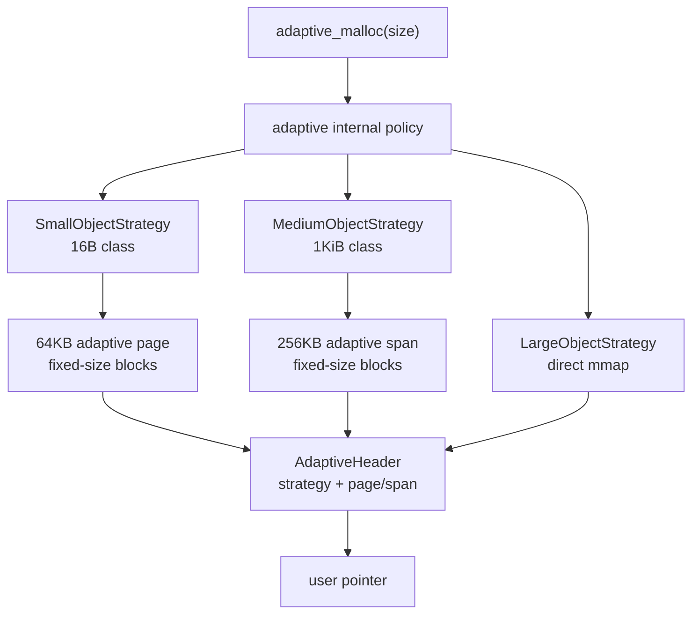
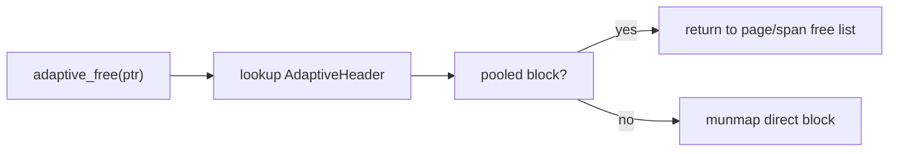

# Adaptive Allocator Backend

`MY_MALLOC_MODE=adaptive` selects an independent adaptive allocator backend. It is not the old dispatcher that chooses among `hybrid`, `ptmalloc`, `tcmalloc_like`, `jemalloc_like`, and `mimalloc_like`.

The project now has two separate areas:

| Area | Purpose |
|---|---|
| Allocator lab | Teaching implementations such as `hybrid`, `ptmalloc`, `tcmalloc_like`, `jemalloc_like`, and `mimalloc_like` for study, visualization, benchmarks, and comparison. |
| Adaptive allocator | A standalone backend with its own metadata, ownership checks, telemetry, policy layer, and internal strategies. |

The teaching allocators are not default candidates for adaptive routing. The legacy cross-allocator demo is kept as `MY_MALLOC_MODE=adaptive_demo` and can also be loaded by tools as `--strategy adaptive_demo` or `--strategy demo_all`.

## Ownership Model

Every adaptive allocation has an `AdaptiveHeader` and is registered in the adaptive ownership table. The metadata records:

- magic number;
- requested size and usable size;
- internal strategy id;
- flags;
- mmap region base and mapped size;
- adaptive page/span pointer for pooled allocations;
- ownership registry links.

`adaptive_free(ptr)` routes by the allocation-time strategy id stored in metadata. It does not ask the current policy where the pointer should be freed, and it never passes adaptive-owned pointers to the ptmalloc/slab/family allocator free paths.

Policy changes affect only future allocations.

## Internal Strategies

The adaptive allocator currently implements three adaptive-specific strategy ids:

| Strategy | Default size range | Current implementation |
|---|---:|---|
| `SmallObjectStrategy` | `size <= 1024` | 16B size classes backed by 64KB adaptive pages |
| `MediumObjectStrategy` | `1025 .. 64 KiB` | 1KiB span classes backed by 256KB adaptive spans |
| `LargeObjectStrategy` | `> 64 KiB` | direct mmap + adaptive header |

Small and medium no longer mmap every allocation. They use adaptive-owned pools:



On free, the header's allocation-time strategy and page/span pointer decide the return path:



This keeps strategy switching cheap: changing policy affects only future allocations, while old objects keep a stable free path.

## Policies

Configure the internal policy with `MY_MALLOC_ADAPTIVE_POLICY`:

| Policy | Meaning |
|---|---|
| `heuristic` | Select small, medium, or large by request size. This is the default. |
| `fixed:small` | Prefer the small strategy, with safe fallback to medium or large when the size is not suitable. |
| `fixed:medium` | Prefer the medium strategy, with safe fallback to large for oversized requests. |
| `fixed:large` | Use the large strategy. |
| `round_robin` | Cycle through small, medium, and large to stress ownership routing. |
| `epsilon_greedy` / `eps_greedy` | Classic bandit strategy: mostly choose the best telemetry score, but explore randomly with a small probability. |
| `ucb1` / `ucb` | Upper Confidence Bound bandit: choose the best score plus an exploration bonus for under-tested strategies. |
| `thompson_sampling` / `thompson` | Thompson-style bandit: sample from success/failure history with lightweight uncertainty noise. |

Examples:

```bash
MY_MALLOC_MODE=adaptive MY_MALLOC_ADAPTIVE_POLICY=heuristic ./build/test_basic
MY_MALLOC_MODE=adaptive MY_MALLOC_ADAPTIVE_POLICY=fixed:small ./build/allocator_validate --strategy adaptive
MY_MALLOC_MODE=adaptive MY_MALLOC_ADAPTIVE_POLICY=ucb1 ./build/allocator_validate --strategy adaptive
MY_MALLOC_MODE=adaptive MY_MALLOC_ADAPTIVE_POLICY=thompson_sampling ./build/allocator_validate --strategy adaptive
```

The telemetry-driven policies only choose among size-compatible adaptive internal strategies. For example, a 2 KiB allocation can choose medium or large, but not small. If a selected strategy cannot satisfy the request, allocation falls back through the size-based safe path.

Current policy scoring uses adaptive-internal telemetry:

- policy trials, successes, and failures per strategy;
- EWMA allocation latency per strategy;
- pool hit/miss counts for small/medium page/span pools;
- live bytes and mapped bytes as a coarse memory-pressure signal.

These are online baseline policies, not a full ML/RL allocator yet. They provide a practical place to plug in future offline decision tables, contextual bandits, or reinforcement-learning models.

## Stats

The adaptive backend records lightweight relaxed-atomic stats:

- malloc/free/realloc calls;
- policy decisions;
- allocation failures;
- per-strategy alloc/free count;
- per-strategy requested and usable bytes;
- per-strategy policy trials, successes, and failures;
- per-strategy EWMA allocation latency;
- per-strategy pool hits and misses;
- live bytes;
- mapped bytes.

These stats belong to the adaptive backend and are separate from the teaching allocator lab telemetry.

## Current Benchmark Snapshot

The May 5, 2026 local `bench_runner --profile micro` run shows that telemetry-driven policies are now measurable against the heuristic baseline:

| Adaptive policy | `same_size_64` ops/sec | `batch` ops/sec | `random` ops/sec |
|---|---:|---:|---:|
| `heuristic` | 8,185,376 | 8,230,347 | 844,231 |
| `epsilon_greedy` | 19,812,613 | 8,217,441 | 923,744 |
| `ucb1` | 22,236,701 | 9,492,521 | 922,979 |
| `thompson_sampling` | 18,707,184 | 2,483,404 | 796,735 |
| `round_robin` | 22,045,714 | 10,005,564 | 1,071,706 |

In this run, `ucb1` is the strongest telemetry-driven policy on fixed-size and batch micro workloads, while `epsilon_greedy` is close on random. `thompson_sampling` is intentionally kept as a lightweight baseline and is not yet tuned.

## Current Simplifications

The current implementation is still intentionally simple:

- page/span metadata and ownership are coarse-grained and protected by a simple mutex;
- empty adaptive pages/spans are cached, not returned to the OS yet;
- small classes use uniform 16B spacing;
- medium classes use uniform 1KiB spacing;
- aligned allocations use a safe direct-mmap path instead of the small/medium pools;
- the ownership registry is simple and correctness-oriented.

Next optimization steps:

- per-thread or per-CPU adaptive caches for small classes;
- empty page/span release and decay;
- telemetry for phase changes, cache hit rates, live/mapped ratio, and remote-free ratio;
- policy hooks that tune thresholds, batch sizes, and release aggressiveness;
- offline decision-table, contextual bandit, or RL policy over adaptive-internal signals.

## Run

```bash
./build/allocator_validate --strategy adaptive
MY_MALLOC_ADAPTIVE_POLICY=heuristic ./build/allocator_validate --strategy adaptive
MY_MALLOC_ADAPTIVE_POLICY=fixed:small ./build/allocator_validate --strategy adaptive
MY_MALLOC_ADAPTIVE_POLICY=fixed:medium ./build/allocator_validate --strategy adaptive
MY_MALLOC_ADAPTIVE_POLICY=fixed:large ./build/allocator_validate --strategy adaptive
MY_MALLOC_ADAPTIVE_POLICY=round_robin ./build/allocator_validate --strategy adaptive
MY_MALLOC_ADAPTIVE_POLICY=epsilon_greedy ./build/allocator_validate --strategy adaptive
MY_MALLOC_ADAPTIVE_POLICY=ucb1 ./build/allocator_validate --strategy adaptive
MY_MALLOC_ADAPTIVE_POLICY=thompson_sampling ./build/allocator_validate --strategy adaptive
LD_PRELOAD=./build/libmy_ptmalloc.so MY_MALLOC_MODE=adaptive ./build/test_basic
```
