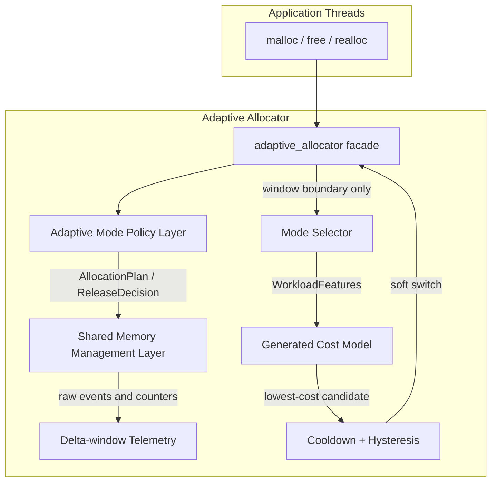
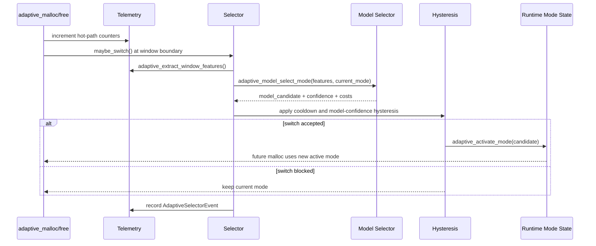
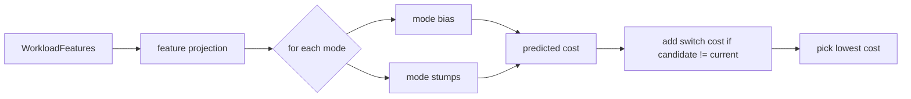
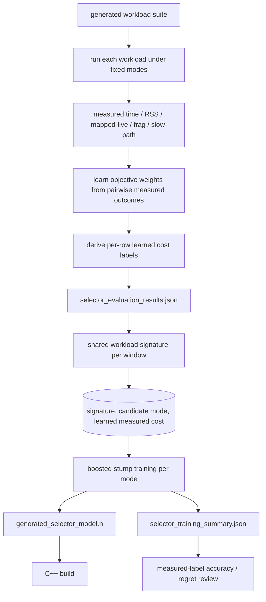
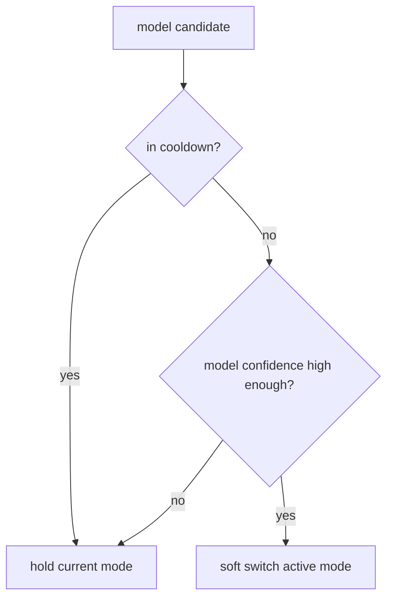
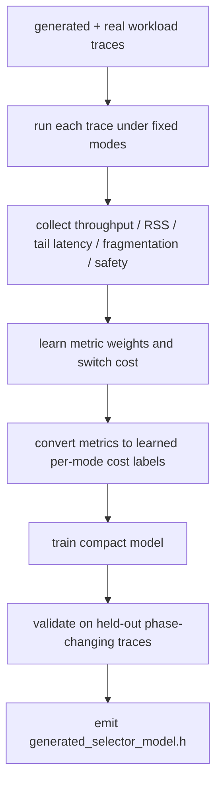

# Adaptive Selector Model

This document describes the offline-trained, online-lightweight selector used by
the adaptive allocator. The model is not an allocator and it does not replace the
two-layer memory architecture. It only chooses the next `AdaptiveModeId` at
telemetry window boundaries.

The design goal is:

```text
better mode choice than hand-written rules
without adding measurable malloc/free hot-path cost
```

The current implementation uses a generated compact boosted-stump cost model.
It is trained offline by `tools/train_selector_model.py` and emitted as the C++
header `include/my_ptmalloc/generated_selector_model.h`.

## Architecture

The model sits inside the Runtime Telemetry and Mode Selector layer.



Key boundaries:

- The hot path records counters and uses the currently active mode.
- Feature extraction happens only at selector window boundaries.
- Online inference evaluates the generated model only at those boundaries.
- `free`, `realloc`, and `usable_size` still route by allocation-time
  `AdaptiveHeader::mode_id`; the model never migrates live objects.

## Why A Cost Model

The selector is formulated as cost prediction instead of direct classification:

```text
for each candidate mode:
    predicted_cost = model(features, candidate_mode)
pick mode with minimum predicted_cost
```

That shape is useful because:

- every window can be evaluated against all eight modes;
- switch cost can be added after prediction;
- future trace training can label each `(window, mode)` pair with measured
  throughput, RSS, tail latency, fragmentation, or safety penalty.

The model predicts relative cost, not absolute runtime.

## Runtime Decision Flow



`AdaptiveSelectorEvent` is written to a ring buffer. The Web UI reads these
events from `/snapshot`; it does not call `adaptive_extract_window_features()`
and therefore does not consume selector windows.

## Inputs

The model consumes `WorkloadFeatures`, currently reduced to ten generated-model
features:

| Generated feature | Source field | Meaning |
|---|---|---|
| `LargeBytesRatio` | `large_bytes_ratio` | fraction of requested bytes from true streaming-large allocations above 256 KiB |
| `RemoteFreeRatio` | `remote_free_ratio` | fraction of frees done by a non-owner thread |
| `MappedLiveRatio` | `mapped_live_ratio` | mapped bytes divided by live bytes |
| `SlowPathRatio` | `slow_path_ratio` | allocator slow-path intensity in the window |
| `SizeEntropy` | `size_entropy` | object-size diversity |
| `InternalFragRatio` | `internal_frag_ratio` | usable/requested waste estimate |
| `CacheHitRate` | `cache_hit_rate` | shared/tcache reuse effectiveness |
| `SafetyErrorRate` | `safety_error_rate` | invalid/double/corrupt header signal |
| `LogAllocCalls` | `log1p(alloc_calls)` | window activity scale |
| `LogLiveBytes` | `log1p(live_bytes)` | retained live memory scale |

The larger `WorkloadFeatures` structure remains the stable telemetry API. The
generated model uses a smaller projection so online inference stays cheap.
`LargeBytesRatio` is computed from request-size buckets, not from DirectMap
storage counters, so the active mode cannot create a self-reinforcing
large-object signal by routing medium objects through a direct-map path.

## Model Structure

The generated header contains:

- `MODEL_ID`: deterministic model identity;
- `FEATURE_COUNT`;
- `TREE_COUNT`;
- `SWITCH_COST`;
- `BIAS[8]`: one base cost per mode;
- `TREES[]`: boosted decision stumps, each attached to one candidate mode.

Generated C++ shape:

```cpp
struct Tree {
    uint8_t mode;
    uint8_t feature;
    double threshold;
    double left_value;
    double right_value;
};
```

Runtime scoring:



The implementation in `src/adaptive_model_selector.cpp` does not allocate
memory, does not depend on any third-party runtime, and only performs fixed
array traversal.

## Training Pipeline

Training is dependency-free Python:

```bash
python3 tools/evaluate_selector_model.py \
  --bench-runner ./build/bench_runner \
  --iters 20000 \
  --slots 512 \
  --threads 2 \
  --seeds 12345 22345 32345 \
  --json-out models/selector_evaluation_results.json \
  --markdown-out docs/adaptive_selector_model_results.md

python3 tools/train_selector_model.py \
  --dataset models/selector_evaluation_results.json \
  --model-out include/my_ptmalloc/generated_selector_model.h \
  --summary-out models/selector_training_summary.json
```

Pipeline:



Training labels come from measured benchmark results, not a hand-written mode
preference formula and not a hand-written metric-weight score.
`evaluate_selector_model.py` runs the same generated workload under every fixed
mode. `train_selector_model.py` then learns an objective-cost formula from
pairwise measured outcomes inside each workload and trains:

```text
predicted learned measured cost = f(shared workload signature, candidate mode)
```

The learned objective currently uses normalized `ms`, `peak_rss_kb`,
`mapped_live_ratio`, `fragmentation_estimate`, `slow_path_ratio`,
`mode_switches`, and `validation_errors`. The weights and `SWITCH_COST` are
written to `models/selector_training_summary.json` and the generated C++ model.
The evaluation report loads those learned weights instead of using a separate
hand-written score formula.

Training also uses two regularizers and one leakage guard:

- objective weights are lightly shrunk toward a uniform metric prior, so a small
  benchmark set cannot collapse the learned cost onto one noisy metric;
- per-mode base costs are shrunk toward the global measured cost, so window
  features rather than a dataset-wide mode prior drive decisions;
- the shared candidate signature comes from the fixed `balanced` run for the
  workload, avoiding leakage from a candidate mode's own storage behavior.

## Checked-In Training Result

The checked-in model is generated from:

```text
dataset: models/selector_training_dataset.json
benchmark seeds: 10001..10020
training examples: 980
train examples: 784
test examples: 196
rounds_per_mode: 10
tree_count: 70
learning_rate: 0.35
signature_source: balanced
mode_prior_shrink: 0.75
objective_regularization: 0.04
```

The summary is stored in `models/selector_training_summary.json`.

Current measured-label test metrics:

| Metric | Value |
|---|---:|
| learned objective pairwise accuracy | 0.966 |
| top-1 accuracy vs learned-cost best | 0.464 |
| mean regret | 0.0377 |
| test workloads | 28 |
| test examples | 196 |

The post-training evaluation is stored in
[adaptive_selector_model_results.md](adaptive_selector_model_results.md).
On the current generated workload suite, `model` improves over the legacy rule
selector's mean score and has the best mean score among the compared adaptive
cases. The fixed `large_object` baseline is no longer a dominant winner; it is
best mainly on true large-streaming cases, while model final modes are spread
across `balanced`, `throughput_cache`, `deterministic_latency`, and
`large_object`.

## Selector Backends

Configure through `MY_MALLOC_ADAPTIVE_MODE_SELECTOR`:

| Selector | Behavior |
|---|---|
| `model` | Default auto selector; generated measured-cost model |
| `rule` | Legacy/debug baseline only |
| `fixed` | Keep configured mode |
| `manual` | Tests may call `adaptive_set_mode()` |

Examples:

```bash
MY_MALLOC_ADAPTIVE_MODE=auto \
MY_MALLOC_ADAPTIVE_MODE_SELECTOR=model \
MY_MALLOC_ADAPTIVE_MODE_WINDOW=64 \
./build/bench_runner --strategy adaptive --bench generated_workload \
  --workload-template adaptive_mix --json

```

## Model Hysteresis

The model is the decision source for auto switching. Runtime still applies
generic switching mechanics so a low-confidence candidate does not cause
window-to-window oscillation.



Switching controls:

- cooldown prevents window-to-window oscillation;
- model-confidence hysteresis blocks low-impact switches;
- the default cadence is `MY_MALLOC_ADAPTIVE_MODE_WINDOW=1024` with one
  cooldown window; visual demos can lower the window explicitly;
- explicit `MY_MALLOC_ADAPTIVE_DEBUG_MODE=1` starts the allocator in
  `HardenedDebug`, but auto model decisions are not mixed with rule decisions.

Switching remains soft: old objects keep their allocation-time `mode_id` and are
freed by that mode's release policy.

## Telemetry And Web UI

`bench_runner` exposes selector events through `/snapshot`:

```json
{
  "selector_last_window": {
    "current_mode": "compact_rss",
    "candidate_mode": "large_object",
    "switched": true,
    "reason": "model_cost",
    "selector_backend": "model",
    "model_candidate": "large_object",
    "model_confidence": 0.42,
    "large_bytes_ratio": 0.91,
    "remote_free_ratio": 0.0,
    "mapped_live_ratio": 1.3
  }
}
```

The Web UI renders:

- active mode rail;
- mode timeline;
- model confidence;
- feature values that explain the decision.

This keeps visualization passive and cheap. If no telemetry server is started,
the model selector has no Web-related overhead.

## Testing

CTest includes model selector coverage:

- `generated_workload_adaptive_model_selector`.

Manual smoke examples:

```bash
MY_MALLOC_ADAPTIVE_MODE=auto \
MY_MALLOC_ADAPTIVE_MODE_SELECTOR=model \
MY_MALLOC_ADAPTIVE_MODE_WINDOW=32 \
MY_MALLOC_ADAPTIVE_MODE_COOLDOWN=0 \
./build/bench_runner --strategy adaptive --bench generated_workload \
  --workload-config workloads/smoke_large_to_small.json \
  --workload-realtime --json
```

## Future Trace Expansion

The intended next step is to expand the measured labels beyond generated
workloads:



Future training data should add external application traces and then relearn the
objective weights from those measurements. Benchmark-family specific priorities
should be represented as training data or preference data, not as hard-coded
runtime rules.

## Current Limitations

- The checked-in model is trained from generated-workload measurements, not
  external application traces.
- The model does not yet use p95/p99 latency because latency sampling is not
  implemented in allocator telemetry.
- The selector still uses window/cooldown/confidence hysteresis around model
  output to avoid switch thrash; candidate mode choice itself is model-driven.
- The model is regenerated manually; there is no automatic training target in
  CMake yet.
