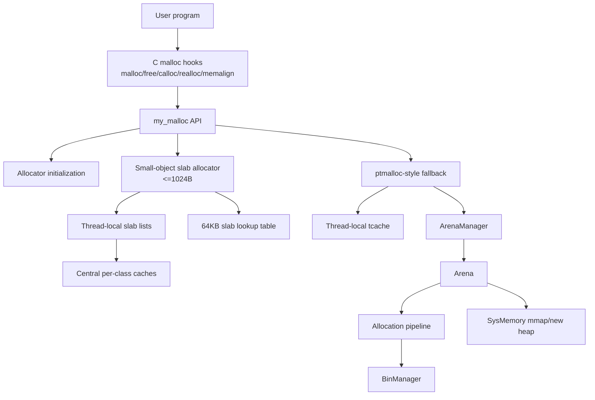
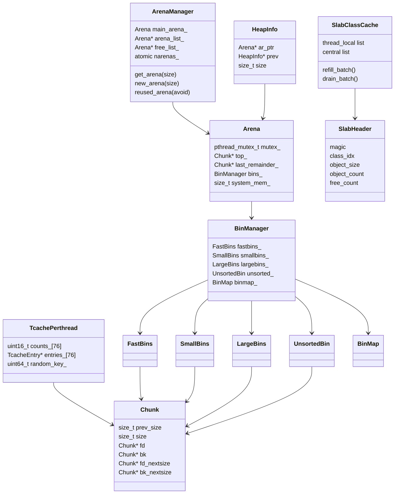
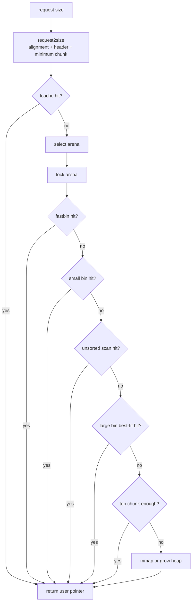
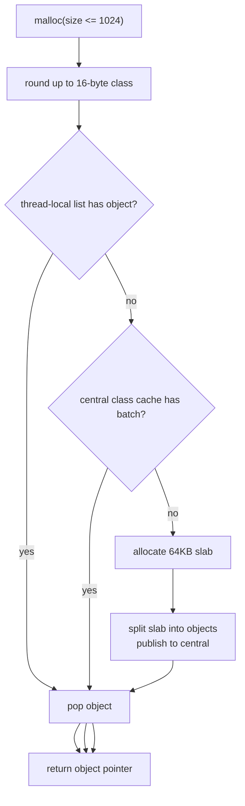
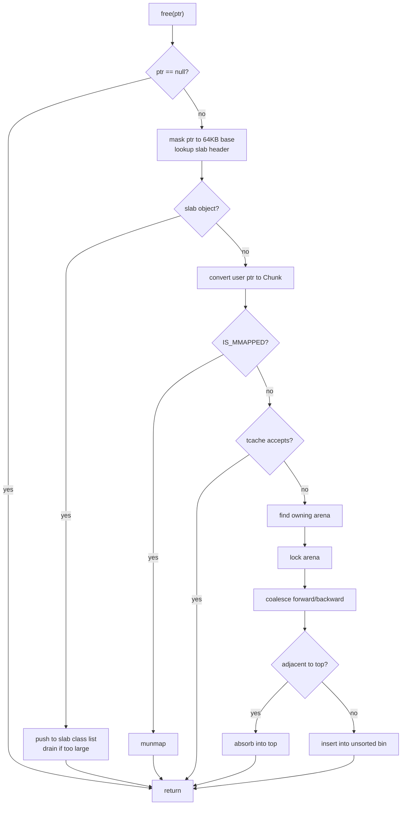

# System Architecture

This document explains how the allocator is organized internally. It focuses on data structures, ownership relationships, and control flow. Allocator theory is covered separately in [allocator_families.md](allocator_families.md).

## 1. Design Goal

`my_malloc` is a learning allocator with two goals:

1. Keep a readable ptmalloc-style implementation: chunks, boundary tags, bins, arenas, top chunk, and mmap.
2. Add a modern small-object frontend: size classes, slabs, thread-local caches, and central refill/drain.

The result is a hybrid design:

```text
malloc request
  |
  +-- small normal allocation, size <= 1024
  |      -> slab allocator
  |
  +-- aligned / medium / large / fallback allocation
         -> ptmalloc-style allocator
```

Runtime mode:

| Mode | Meaning |
|---|---|
| `MY_MALLOC_MODE=hybrid` | Use slab frontend first, then ptmalloc-style fallback. This is the default. |
| `MY_MALLOC_MODE=ptmalloc` | Disable the slab frontend and use only the chunk/bin/arena path. |

## 2. Top-level Components



Main source files:

| Component | Files |
|---|---|
| Public API | `include/my_ptmalloc/my_malloc.h`, `src/my_malloc.cpp` |
| LD_PRELOAD hooks | `include/my_ptmalloc/hooks.h`, `src/hooks.cpp` |
| Initialization | `src/init.cpp` |
| Slab allocator | `include/my_ptmalloc/slab_allocator.h`, `src/slab_allocator.cpp` |
| Allocation pipeline | `include/my_ptmalloc/alloc_pipeline.h`, `src/alloc_pipeline.cpp`, `src/malloc_impl.cpp` |
| Free / coalescing | `src/free_impl.cpp`, `src/consolidate.cpp`, `src/coalesce.cpp` |
| Realloc | `src/realloc_impl.cpp` |
| Arenas/heaps | `include/my_ptmalloc/arena.h`, `src/arena_manager.cpp`, `src/heap.cpp` |
| Bins | `include/my_ptmalloc/*bins*.h`, `src/large_bins.cpp`, `src/unsorted_bin.cpp` |
| Strategy lab | `include/my_ptmalloc/strategy.h`, `src/strategy.cpp`, `tools/bench_runner.cpp` |

## 3. Data Structure Relationship



Ownership rules:

- `TcachePerthread` is per-thread. Tcache allocation/free does not lock an arena.
- `Arena` owns chunk-backed free lists. Its mutex must be held when touching small, unsorted, large, top, and most consolidation state.
- `FastBins` use atomic stacks, but consolidation still belongs to the arena path.
- `HeapInfo` maps non-main heap regions back to the owning arena during free.
- Slab objects are not chunk-backed. Their owner is recovered from a 64KB-aligned slab base lookup.

## 4. Chunk-backed Allocation Path

Chunk-backed allocation follows a ptmalloc-like sequence:



Important implementation detail: tcache is checked before arena locking. That keeps the most common chunk-backed hit path lock-free.

The pipeline is stored in a fixed `std::array<AllocStrategy*, 7>` instead of a `std::vector`. This is intentional: constructing a vector during allocator initialization can call `operator new`, re-enter `malloc`, and crash before global allocator state exists.

## 5. Slab Allocation Path

The slab path handles normal allocations up to 1024 bytes in hybrid mode.



Slab layout:

```text
64KB aligned address
|
+-- SlabHeader
|     magic
|     class index
|     object size
|     object count
|     free count
|
+-- object 0
+-- object 1
+-- object 2
+-- ...
```

Why this path exists:

- small objects avoid per-object chunk headers;
- fixed-size objects do not need boundary-tag coalescing;
- thread-local lists make the hot path fast;
- central caches reduce per-thread memory isolation by allowing batch exchange.

Current limitation: empty slabs are not yet returned to the OS. This is a major reason RSS can exceed glibc in fragmentation-heavy or phase-changing workloads.

## 6. Free Path



The free path first distinguishes slab pointers from chunk pointers. This is necessary because slab objects do not have chunk headers.

## 7. Realloc Path

`realloc` tries to avoid copying:

1. `realloc(nullptr, size)` becomes `malloc(size)`.
2. `realloc(ptr, 0)` frees `ptr` and returns null.
3. If the existing usable size is enough, keep the allocation.
4. For chunk-backed allocations, try to grow into adjacent free space or top chunk.
5. Otherwise allocate a new object, copy the old contents, and free the old object.

Slab realloc currently uses the generic path when it crosses size classes. This keeps the implementation simple, but it is not as optimized as production allocators that can sometimes move between size classes with tighter policies.

## 8. LD_PRELOAD Bootstrap

Interposing `malloc` is tricky because dynamic loader and libc initialization can allocate memory before this allocator is fully ready.

This project uses:

- a small static bootstrap buffer before real symbols are resolved;
- real libc allocation for some early hook initialization cases;
- tracking of real-bootstrap pointers so later `free`/`realloc` calls go back to libc instead of this allocator.

This prevents a class of early startup crashes where memory allocated by libc was accidentally freed through `my_malloc`.

## 9. Observability

Observability is opt-in:

```text
MY_MALLOC_STATS=1
MY_MALLOC_TRACE=1
```

The default hot path avoids always-on counters because atomic telemetry can change benchmark results. This is an important allocator engineering lesson: measurement code can become part of the workload.

## 10. Main Simplifications

| Area | Simplification | Consequence |
|---|---|---|
| Slab reclamation | Empty slabs are cached, not unmapped | Higher RSS in fragmentation and phase-changing workloads |
| Remote free | Slab frees return to the current thread path | Producer/consumer workloads can be worse than mimalloc/tcmalloc |
| Size classes | Uniform 16-byte classes up to 1024B | Easier to understand, less tuned than production tables |
| Large bins | Sorted list plus binmap, not full glibc nextsize behavior | Simpler maintenance, less optimal search/update behavior |
| Adaptive policy | Coarse runtime modes | Good for experiments, not yet a fine-grained online selector |
| System memory | Simplified heap/span management | Less release/reuse sophistication than jemalloc/tcmalloc/mimalloc |
