# my_ptmalloc Allocator Design

This document explains the current hybrid allocator architecture, the relationships between the major data structures, and the optimized allocation/free paths. It is written as a system design document rather than a line-by-line source tour.

For allocator-family theory, including ptmalloc, tcmalloc-like slab allocation, jemalloc-like extent ideas, mimalloc-like remote-free ideas, and which parts are implemented or simplified in this project, see [allocator_families.md](allocator_families.md).

## 1. Design Goals

`my_ptmalloc` started as a compact C++17 reimplementation of the main ptmalloc ideas used by glibc malloc. It now uses a hybrid design:

- normal small allocations up to 1024 bytes use a custom slab allocator;
- medium, aligned, and large allocations use the existing ptmalloc-style arena/bin fallback.

The ptmalloc-style fallback keeps:

- chunk headers with boundary-tag metadata;
- thread-local tcache;
- fastbins, small bins, large bins, and an unsorted bin;
- arenas for reducing multi-threaded lock contention;
- top chunks for heap growth;
- direct mmap for large allocations;
- `HeapInfo` ownership lookup for non-main arenas.

The project deliberately differs from glibc in implementation style. Instead of one macro-heavy `malloc.c`, it uses small C++ classes and POD metadata: `SlabHeader`, `ArenaManager`, `Arena`, `BinManager`, `TcachePerthread`, `FastBins`, `SmallBins`, `LargeBins`, and `UnsortedBin`.

The project is also an allocator lab. Runtime controls can switch between the optimized hybrid frontend and the ptmalloc-style backend, and optional counters/tracing make allocation decisions observable without forcing telemetry overhead into default benchmark runs.

## 2. System Overview

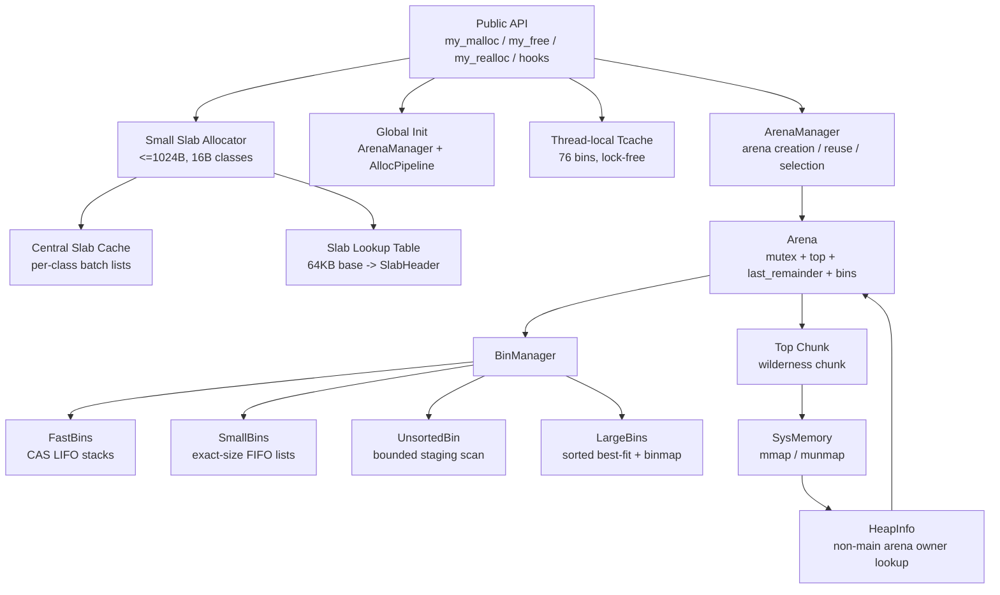

## 3. Allocator Lab Controls

The runtime policy is selected once during allocator initialization:

```text
MY_MALLOC_MODE=hybrid    default: slab frontend + ptmalloc fallback
MY_MALLOC_MODE=ptmalloc  disable slab frontend for baseline experiments
```

Observability is opt-in:

```text
MY_MALLOC_STATS=1  enable atomic path counters
MY_MALLOC_TRACE=1  enable trace ring and stats
```

Stats are exposed through:

```cpp
my_malloc_stats_snapshot();
my_malloc_dump_stats_json(FILE*);
my_malloc_stats_reset();
```

Telemetry is deliberately disabled by default. A benchmark run with always-on atomic counters showed a large same-size throughput regression, so the current design keeps performance mode and learning/inspection mode separate.

The intended hot paths are:

1. For normal `<=1024B` allocations, use the slab allocator and avoid chunk headers entirely.
2. For chunk-backed allocations, try tcache without locking.
3. Only on tcache miss, select and lock an arena.
4. Search arena-local structures from cheapest to most expensive.
5. Grow the heap or mmap only if all reusable structures miss.

## 4. Core Data Structure Relationships

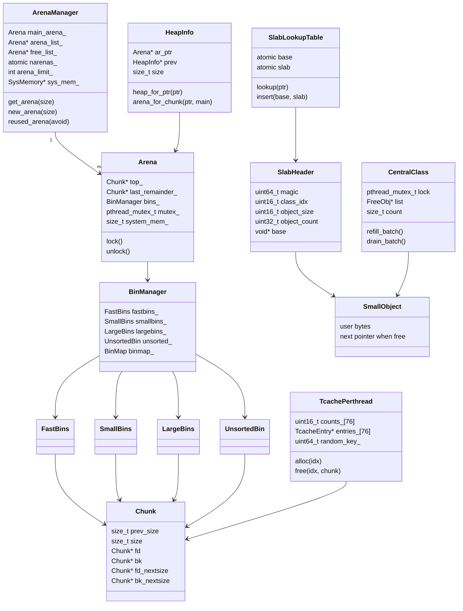

Important ownership rules:

- `tcache` is thread-local and does not require an arena lock.
- slab objects are headerless from the user's object point of view; ownership is recovered from a 64KB-aligned slab base lookup.
- `Arena` owns all non-tcache bin structures and must be locked before touching them.
- `Chunk` objects are not separately allocated metadata; chunk headers live inside the managed heap.
- Non-main arena chunks carry `NON_MAIN_ARENA`, and `my_free` uses `HeapInfo` to find the owning arena.
- `BinManager::unlink_free_chunk` is the single slow-path unlink helper for chunks that may be in unsorted, small, or large bins.

## 5. Small Slab Layout

The slab path is intentionally not ptmalloc-shaped. A slab is a 64KB-aligned mapping with one `SlabHeader` at the start and fixed-size objects after it.

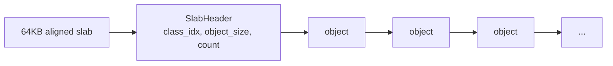

Size classes are 16-byte spaced from 16 to 1024 bytes. Free objects use their own first word as a `FreeObj* next` pointer. Allocated objects do not carry per-object headers.

Pointer classification uses:

```text
base = ptr & ~(64KB - 1)
slab = slab_lookup_table[base]
```

The lookup table is populated under a mutex when a slab is created, but reads are lock-free atomic loads because entries are immutable after insertion. This avoids the global-lock-on-free problem that made the first slab version slower.

Each size class has a central list. Thread-local slab caches refill from central in batches and drain surplus objects back to central:

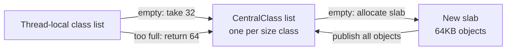

Current limitation: slabs are not yet returned to the OS when empty. The central list reduces per-thread isolation and improves multi-thread performance, but empty-span reclamation still needs a span/page-map layer.

## 6. Chunk Layout

Each allocation starts with a `Chunk` header. The user pointer points after `prev_size` and `size`.

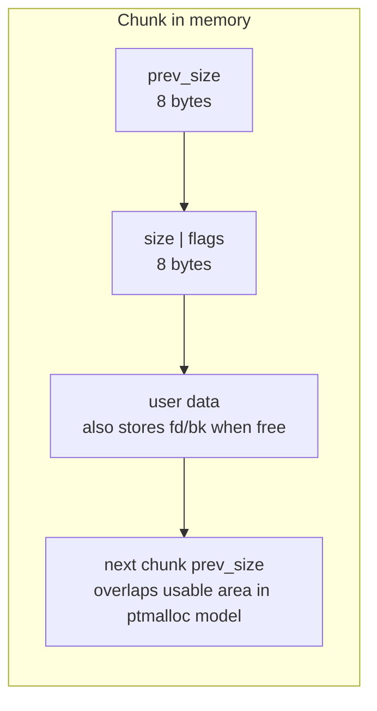

The low bits of `size` are flags:

| Flag | Meaning |
|---|---|
| `PREV_INUSE` | Previous physical chunk is considered allocated, so backward coalescing must not use `prev_size`. |
| `IS_MMAPPED` | Chunk was directly mmap'd and should be unmapped on free. |
| `NON_MAIN_ARENA` | Chunk belongs to a non-main arena; free must recover its owner through `HeapInfo`. |

Free chunks reuse the user area for intrusive list pointers:

```text
allocated chunk:
  [prev_size][size|flags][user bytes...]

free chunk:
  [prev_size][size|flags][fd][bk][fd_nextsize][bk_nextsize]...
```

`fd_nextsize` and `bk_nextsize` exist for layout compatibility, but the active large-bin implementation currently uses sorted `fd`/`bk` lists plus a binmap instead of maintaining a secondary next-size chain.

## 7. Arena and Heap Layout

Main arena memory is mapped as a heap region with one top chunk and a fencepost at the end.

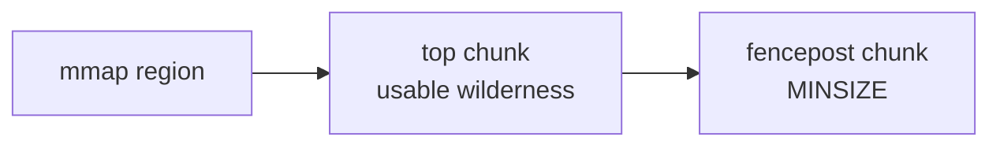

Non-main arenas place `HeapInfo` and `Arena` metadata at the beginning of a `HEAP_MAX_SIZE`-aligned heap:

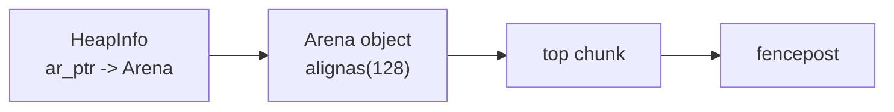

The alignment is essential:

```text
heap_for_ptr(p) = p & ~(HEAP_MAX_SIZE - 1)
```

That mask only works if non-main heaps begin on `HEAP_MAX_SIZE` boundaries. The implementation overmaps and trims prefix/suffix pages to guarantee the alignment.

The fencepost prevents `Chunk::mark_inuse()` from writing past the mapped heap when the previous chunk reaches the region boundary.

## 8. Allocation Path

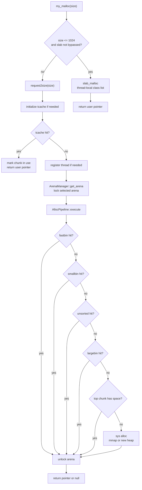

The key architectural change is that small normal allocations bypass chunk metadata, tcache, bins, and arena locks entirely. For chunk-backed allocations, tcache is still checked before `ArenaManager::get_arena`, so a tcache hit no longer pays for arena lookup or a mutex lock.

Aligned allocations temporarily bypass the slab path because `my_memalign` still manipulates chunk headers internally.

## 9. Free Path

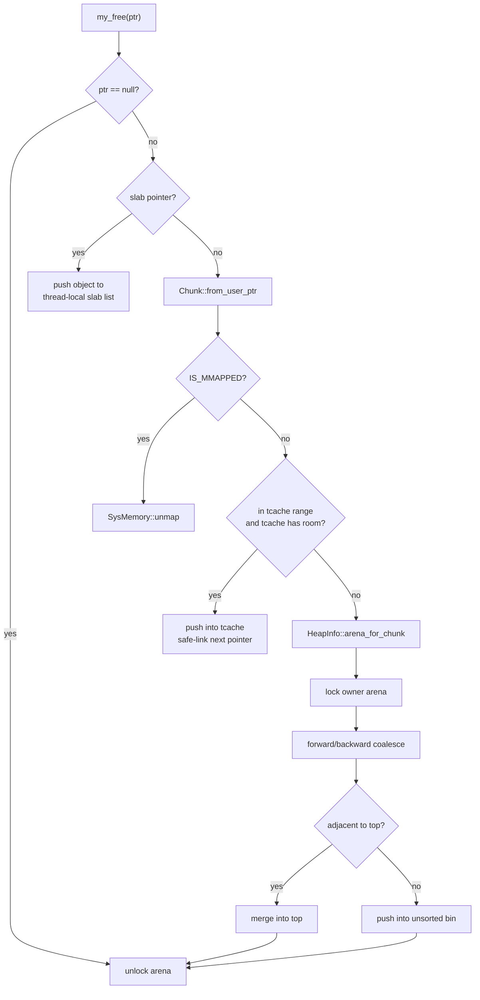

Tcache chunks are treated as allocated from the arena coalescing perspective. That is why pushing a chunk to tcache does not immediately clear neighboring `PREV_INUSE` metadata.

Forward and backward coalescing now use bin membership rather than assuming that every adjacent free chunk is still in unsorted. This matters because an earlier allocation may have scanned unsorted and moved the neighbor into a small or large bin. The free path asks `BinManager` to unlink the neighbor from the correct structure before merging.

## 10. Realloc Growth Path

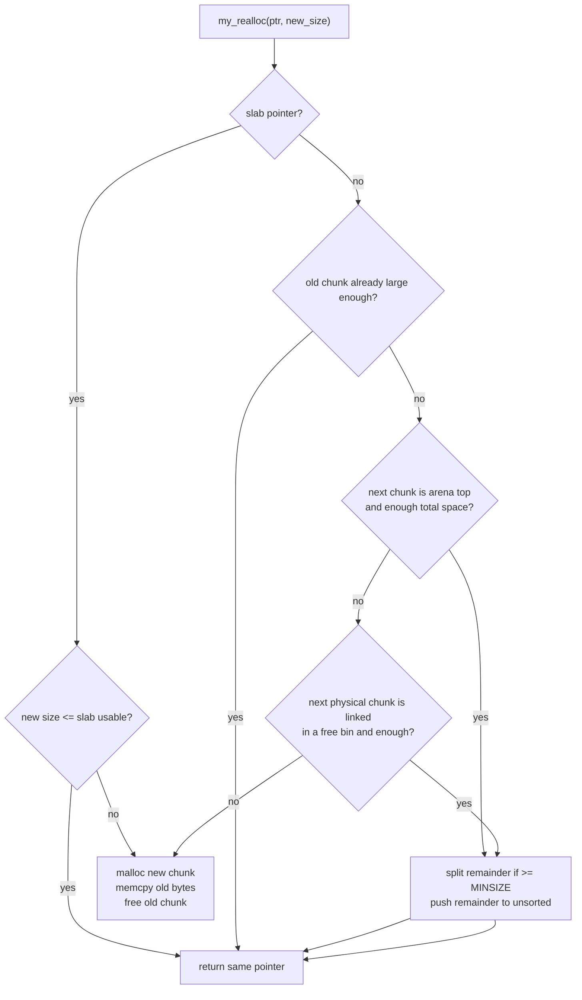

For slab objects, `realloc` returns the same pointer when the new size fits the size class; otherwise it allocates a new object/chunk, copies the old class size, and frees the slab object.

For chunk-backed objects, the previous implementation always used allocate-copy-free for growth. The current implementation first tries to grow in place:

- absorb the arena top chunk when the allocation is adjacent to top;
- unlink and absorb the next physical free chunk when it is in unsorted, small, or large bins;
- split any remaining tail back into unsorted.

This directly targets fragmentation-heavy realloc workloads because it avoids creating a new allocation and freeing the old one when neighboring space is already available.

## 11. Bin Flow

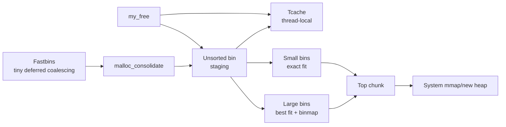

The unsorted bin is intentionally a staging area, not a permanent store. On allocation, it scans a bounded number of entries:

- exact-size chunks can satisfy the current request;
- exact-size chunks can refill the current tcache bin;
- non-matching chunks are moved to small or large bins;
- arbitrary larger chunks are not split directly from unsorted, because that acts like first-fit and caused severe fragmentation in random workloads.

## 12. Large Bin Search

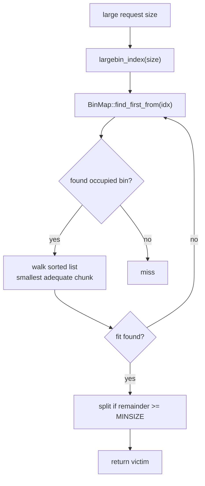

Large bins are sorted largest-to-smallest in insertion order, and allocation walks from the back to find the smallest chunk that can satisfy the request. The binmap avoids scanning empty large-bin ranges.

## 13. What Comes From ptmalloc and What Is Custom

| Area | ptmalloc-style design | Project-specific implementation |
|---|---|---|
| Small objects | Usually chunk/tcache based | Headerless 64KB slabs with 16-byte size classes |
| Chunk metadata | Boundary tags, low-bit flags | C++ `Chunk` methods and strong `ChunkSize` wrappers |
| Tcache | Per-thread lock-free cache | Safe-linking plus static bootstrap storage |
| Fastbins | Deferred coalescing for tiny chunks | Atomic CAS stack class |
| Small bins | Exact-size bins | `SmallBins` class with intrusive FIFO lists |
| Large bins | Best-fit by size range | Sorted lists plus `BinMap`, no active `fd_nextsize` chain |
| Unsorted bin | Deferred sorting after free/coalesce | Bounded scan and exact-size tcache refill only |
| Arenas | Per-thread arena assignment | `ArenaManager` create/reuse logic with `HeapInfo` owner lookup |
| Realloc | Try to expand in place before moving | Grow into top or next linked free chunk, then split remainder |
| Debug checks | Development diagnostics | Compiled out unless `MY_PTMALLOC_ENABLE_DEBUG=1` |
| Learning controls | Usually external profiling | Runtime mode switch, opt-in JSON stats, optional trace ring |

## 14. Optimization Summary

### Small-object Slab Path

Normal allocations up to 1024 bytes now use fixed-size slab objects instead of chunk headers. This reduces metadata traffic and lets the common small-object path avoid arena locks and bin operations.

The first implementation intentionally keeps slab reclamation simple: objects return to thread-local lists, and slabs are kept for reuse. A future central span cache can reclaim empty slabs or rebalance them across threads.

### Tcache Before Arena Lock

Previous behavior selected and locked an arena before running the allocation pipeline, even when tcache could satisfy the request. Now `my_malloc` checks tcache first. This turns the common small-object hit path into:

```text
request size -> tcache index -> pop thread-local entry -> return
```

No arena mutex is involved.

### Per-thread Arenas

Threads are no longer pinned to `main_arena`. The manager creates arenas up to `ncpus * ARENA_MULTIPLIER`, then reuses or try-locks existing arenas. This reduces contention for workloads that miss tcache.

### Bounded Unsorted Scan

Unsorted scanning is capped by `UNSORTED_SCAN_LIMIT`. This prevents one unlucky allocation from sorting an arbitrarily long unsorted list.

### Exact Tcache Refill Only

An attempted optimization filled tcache with unrelated unsorted chunks. It improved some local hits but badly increased fragmentation and RSS in random workloads. The final design only refills tcache with exact-size chunks for the current request.

### Binmap-assisted Large Bins

Large-bin allocation now skips empty ranges with `BinMap::find_first_from`, then performs best-fit inside the selected sorted list. This is safer than restoring `fd_nextsize` before all split/unlink/coalesce paths maintain it correctly.

### Bin-aware Coalescing

Coalescing no longer assumes adjacent free chunks are still in unsorted. `BinManager::unlink_free_chunk` checks unsorted, small, and large bins and updates large-bin binmaps when needed. This improves fragmentation behavior after unsorted chunks have already been sorted into their final bins.

### In-place Realloc Growth

`my_realloc` now tries to grow into the top chunk or the next linked free chunk before falling back to allocate-copy-free. This reduced the documented fragmentation benchmark RSS from the previous 89MB+ range to about 25MB in the current run.

### Top-merge Trimming

When free/coalescing merges a chunk into the arena top, the allocator now calls `systrim` with the configured threshold policy. This lowers retained RSS for workloads that create large top chunks.

### Hot-path Debug Gating

Metadata validation and `fprintf` diagnostics are useful during allocator development but expensive in release builds. They are behind `MY_PTMALLOC_ENABLE_DEBUG`.

## 15. Current Performance Shape

Measured on Linux x86_64 with `-O2 -march=native` on May 4, 2026:

- 32B, 64B, and 256B same-size allocation are slightly ahead of glibc in the current run;
- batch allocation/free remains faster because small objects stay in slab thread-local lists;
- random alloc/free/realloc is still slower than glibc;
- fragmentation-heavy realloc workloads improved again after the slab path and central batching but remain a throughput gap;
- large allocation throughput is ahead in this run, with RSS close to glibc;
- multi-threaded throughput is ahead in this run after central slab refill/drain, but true remote-free ownership is still not implemented.

## 16. Remaining Work

- Replace slab-header lookup with a real page map so every page maps directly to span metadata.
- Add explicit `Span` metadata with owner, free count, page count, and state.
- Track empty slabs and return them to the page heap or OS.
- Add remote-free handling so cross-thread frees do not poison the freeing thread's local cache.
- Move large allocations to a page heap/span allocator instead of the ptmalloc-style large/top path.
- Add more `realloc` cases: shrink splitting, mmap remap, and more aggressive next/top remainder handling.
- Trigger `systrim` on more heap-growth/free paths, not only top merges.
- Add automatic thread-exit tcache flushing.
- Restore `fd_nextsize` only with complete tests for large-bin insertion, unlink, split, and coalescing.
- Add targeted benchmarks for arena reuse, unsorted scan limits, and fragmentation.
