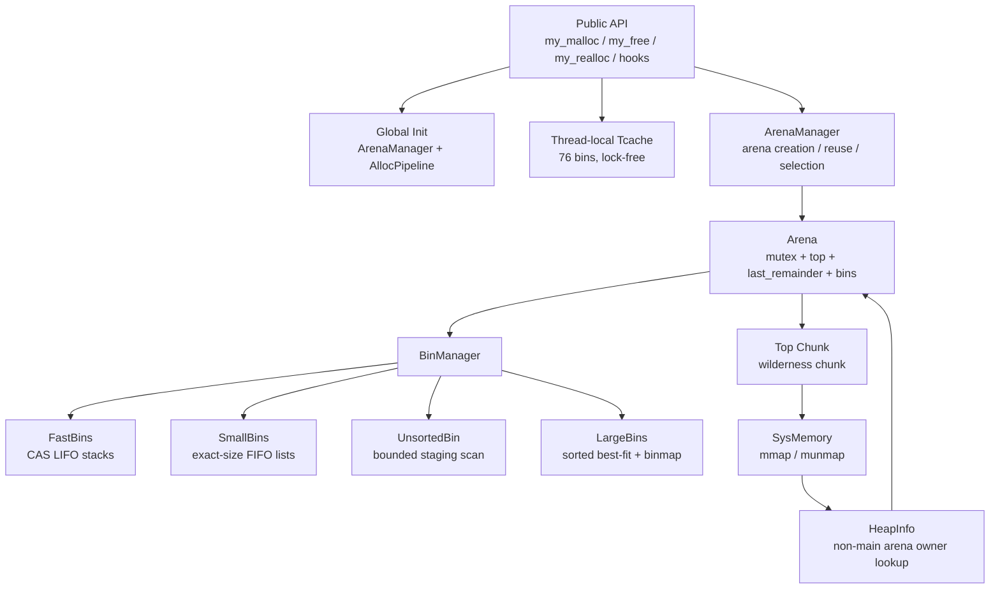
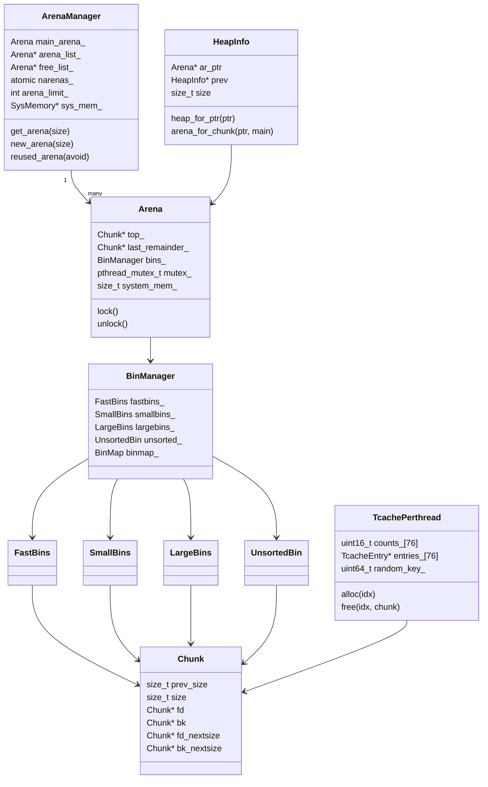
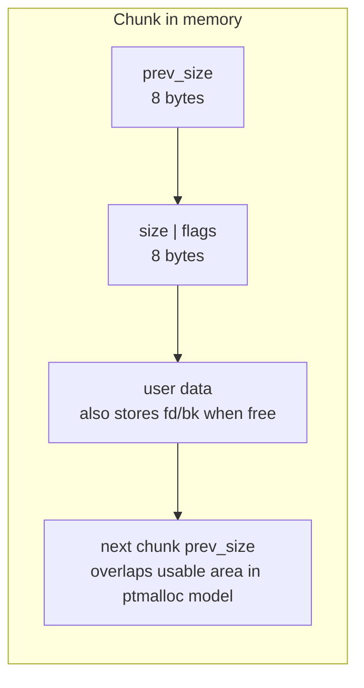
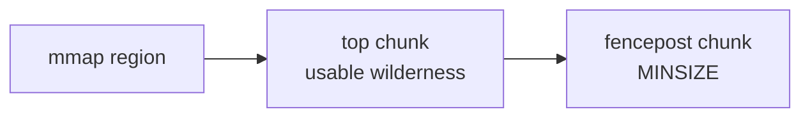
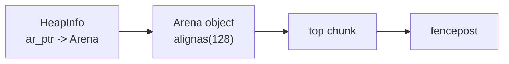
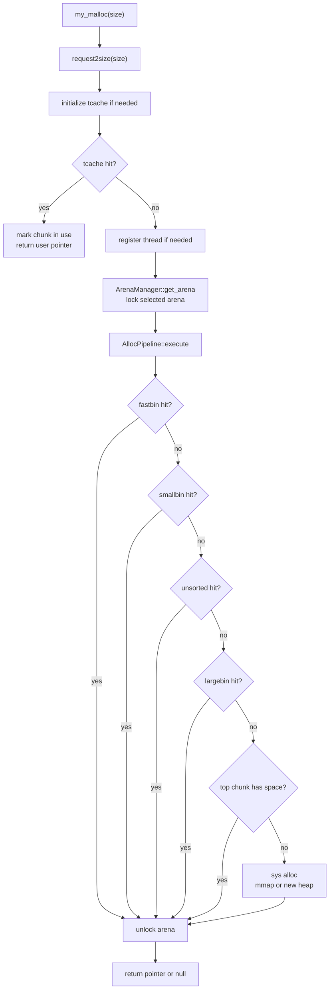
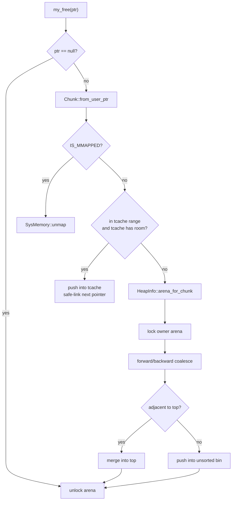
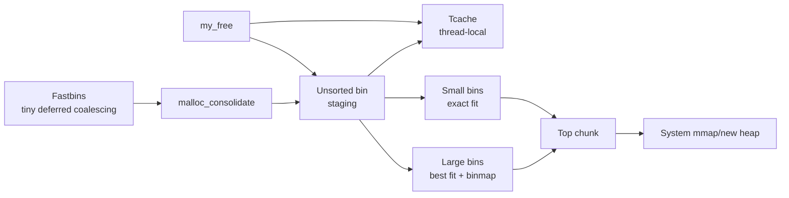
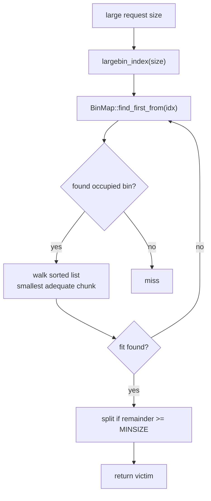

# my_ptmalloc Allocator Design

This document explains the current allocator architecture, the relationships between the major data structures, and the optimized allocation/free paths. It is written as a system design document rather than a line-by-line source tour.

## 1. Design Goals

`my_ptmalloc` is a compact C++17 reimplementation of the main ptmalloc ideas used by glibc malloc:

- chunk headers with boundary-tag metadata;
- thread-local tcache;
- fastbins, small bins, large bins, and an unsorted bin;
- arenas for reducing multi-threaded lock contention;
- top chunks for heap growth;
- direct mmap for large allocations;
- `HeapInfo` ownership lookup for non-main arenas.

The project deliberately differs from glibc in implementation style. Instead of one macro-heavy `malloc.c`, it uses small C++ classes: `ArenaManager`, `Arena`, `BinManager`, `TcachePerthread`, `FastBins`, `SmallBins`, `LargeBins`, and `UnsortedBin`.

## 2. System Overview



The intended hot path is:

1. Try tcache without locking.
2. Only on tcache miss, select and lock an arena.
3. Search arena-local structures from cheapest to most expensive.
4. Grow the heap or mmap only if all reusable structures miss.

## 3. Core Data Structure Relationships



Important ownership rules:

- `tcache` is thread-local and does not require an arena lock.
- `Arena` owns all non-tcache bin structures and must be locked before touching them.
- `Chunk` objects are not separately allocated metadata; chunk headers live inside the managed heap.
- Non-main arena chunks carry `NON_MAIN_ARENA`, and `my_free` uses `HeapInfo` to find the owning arena.

## 4. Chunk Layout

Each allocation starts with a `Chunk` header. The user pointer points after `prev_size` and `size`.



The low bits of `size` are flags:

| Flag | Meaning |
|---|---|
| `PREV_INUSE` | Previous physical chunk is considered allocated, so backward coalescing must not use `prev_size`. |
| `IS_MMAPPED` | Chunk was directly mmap'd and should be unmapped on free. |
| `NON_MAIN_ARENA` | Chunk belongs to a non-main arena; free must recover its owner through `HeapInfo`. |

Free chunks reuse the user area for intrusive list pointers:

```text
allocated chunk:
  [prev_size][size|flags][user bytes...]

free chunk:
  [prev_size][size|flags][fd][bk][fd_nextsize][bk_nextsize]...
```

`fd_nextsize` and `bk_nextsize` exist for layout compatibility, but the active large-bin implementation currently uses sorted `fd`/`bk` lists plus a binmap instead of maintaining a secondary next-size chain.

## 5. Arena and Heap Layout

Main arena memory is mapped as a heap region with one top chunk and a fencepost at the end.



Non-main arenas place `HeapInfo` and `Arena` metadata at the beginning of a `HEAP_MAX_SIZE`-aligned heap:



The alignment is essential:

```text
heap_for_ptr(p) = p & ~(HEAP_MAX_SIZE - 1)
```

That mask only works if non-main heaps begin on `HEAP_MAX_SIZE` boundaries. The implementation overmaps and trims prefix/suffix pages to guarantee the alignment.

The fencepost prevents `Chunk::mark_inuse()` from writing past the mapped heap when the previous chunk reaches the region boundary.

## 6. Allocation Path



The key optimization is that tcache is checked before `ArenaManager::get_arena`. A tcache hit no longer pays for arena lookup or a mutex lock.

## 7. Free Path



Tcache chunks are treated as allocated from the arena coalescing perspective. That is why pushing a chunk to tcache does not immediately clear neighboring `PREV_INUSE` metadata.

## 8. Bin Flow



The unsorted bin is intentionally a staging area, not a permanent store. On allocation, it scans a bounded number of entries:

- exact-size chunks can satisfy the current request;
- exact-size chunks can refill the current tcache bin;
- non-matching chunks are moved to small or large bins;
- arbitrary larger chunks are not split directly from unsorted, because that acts like first-fit and caused severe fragmentation in random workloads.

## 9. Large Bin Search



Large bins are sorted largest-to-smallest in insertion order, and allocation walks from the back to find the smallest chunk that can satisfy the request. The binmap avoids scanning empty large-bin ranges.

## 10. What Comes From ptmalloc and What Is Custom

| Area | ptmalloc-style design | Project-specific implementation |
|---|---|---|
| Chunk metadata | Boundary tags, low-bit flags | C++ `Chunk` methods and strong `ChunkSize` wrappers |
| Tcache | Per-thread lock-free cache | Safe-linking plus static bootstrap storage |
| Fastbins | Deferred coalescing for tiny chunks | Atomic CAS stack class |
| Small bins | Exact-size bins | `SmallBins` class with intrusive FIFO lists |
| Large bins | Best-fit by size range | Sorted lists plus `BinMap`, no active `fd_nextsize` chain |
| Unsorted bin | Deferred sorting after free/coalesce | Bounded scan and exact-size tcache refill only |
| Arenas | Per-thread arena assignment | `ArenaManager` create/reuse logic with `HeapInfo` owner lookup |
| Debug checks | Development diagnostics | Compiled out unless `MY_PTMALLOC_ENABLE_DEBUG=1` |

## 11. Optimization Summary

### Tcache Before Arena Lock

Previous behavior selected and locked an arena before running the allocation pipeline, even when tcache could satisfy the request. Now `my_malloc` checks tcache first. This turns the common small-object hit path into:

```text
request size -> tcache index -> pop thread-local entry -> return
```

No arena mutex is involved.

### Per-thread Arenas

Threads are no longer pinned to `main_arena`. The manager creates arenas up to `ncpus * ARENA_MULTIPLIER`, then reuses or try-locks existing arenas. This reduces contention for workloads that miss tcache.

### Bounded Unsorted Scan

Unsorted scanning is capped by `UNSORTED_SCAN_LIMIT`. This prevents one unlucky allocation from sorting an arbitrarily long unsorted list.

### Exact Tcache Refill Only

An attempted optimization filled tcache with unrelated unsorted chunks. It improved some local hits but badly increased fragmentation and RSS in random workloads. The final design only refills tcache with exact-size chunks for the current request.

### Binmap-assisted Large Bins

Large-bin allocation now skips empty ranges with `BinMap::find_first_from`, then performs best-fit inside the selected sorted list. This is safer than restoring `fd_nextsize` before all split/unlink/coalesce paths maintain it correctly.

### Hot-path Debug Gating

Metadata validation and `fprintf` diagnostics are useful during allocator development but expensive in release builds. They are behind `MY_PTMALLOC_ENABLE_DEBUG`.

## 12. Current Performance Shape

Measured on Linux x86_64 with `-O2 -march=native` on May 4, 2026:

- same-size tcache-heavy workloads are faster than glibc in this benchmark;
- batch allocation/free is faster because most operations avoid arena locks;
- multi-threaded throughput improves after enabling per-thread arenas;
- random alloc/free/realloc is still slower than glibc;
- fragmentation-heavy realloc workloads remain the biggest gap;
- large allocation RSS remains higher because trimming and adaptive thresholds are simpler.

## 13. Remaining Work

- Implement in-place `realloc` growth by merging with the next free chunk.
- Trigger `systrim` automatically after large frees or top growth.
- Add automatic thread-exit tcache flushing.
- Restore `fd_nextsize` only with complete tests for large-bin insertion, unlink, split, and coalescing.
- Add targeted benchmarks for arena reuse, unsorted scan limits, and fragmentation.
