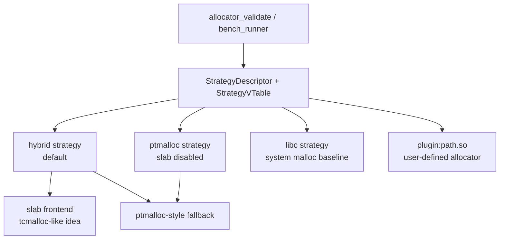
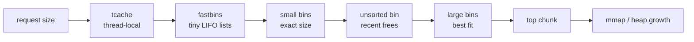
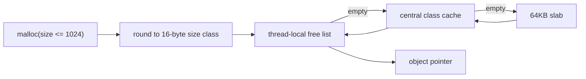
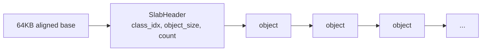
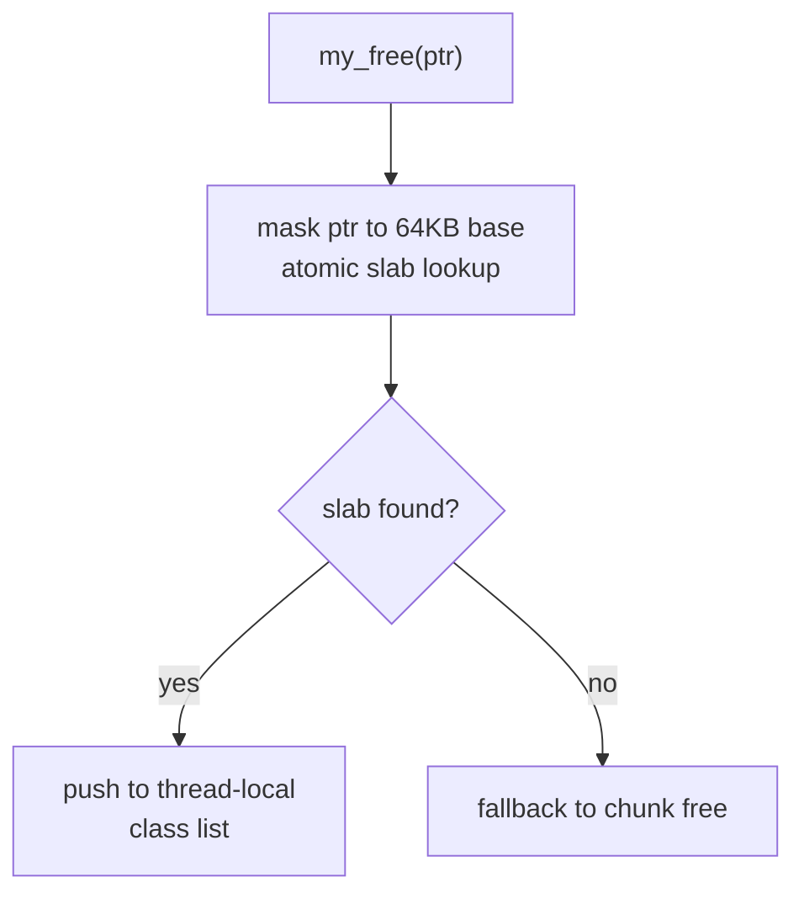
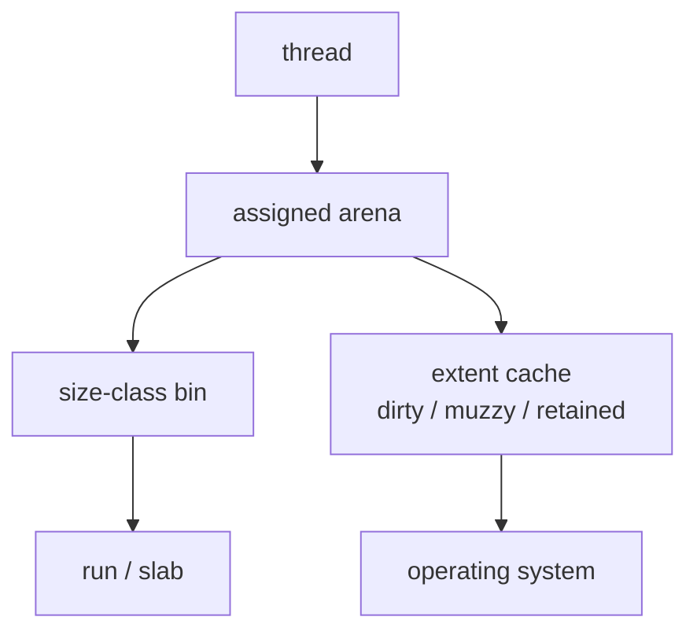
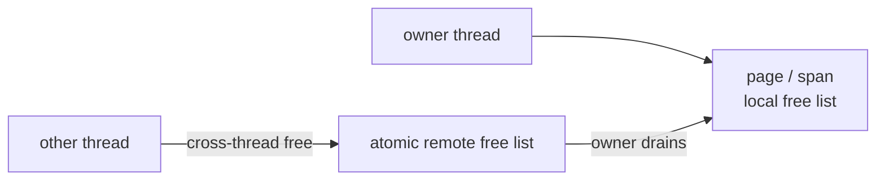
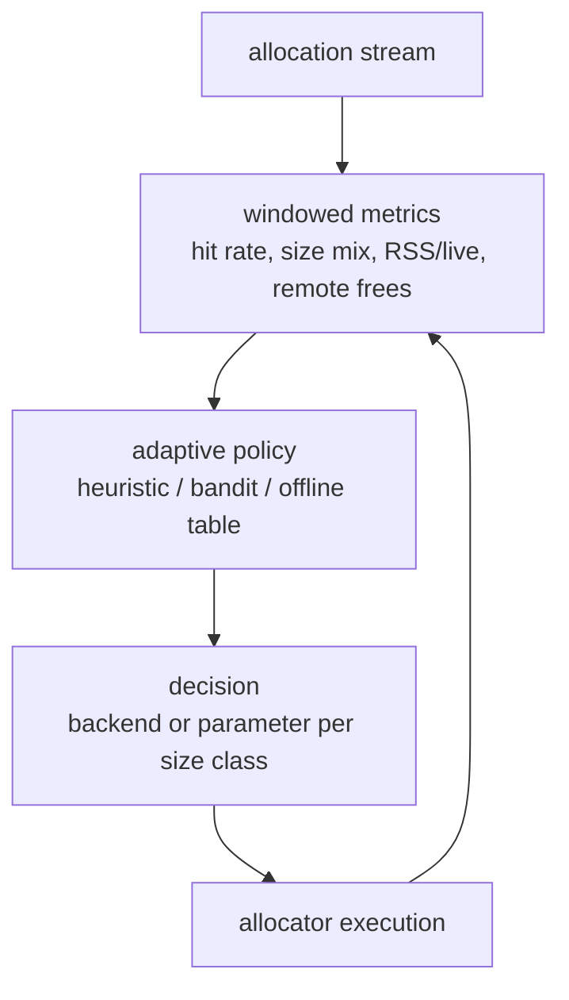
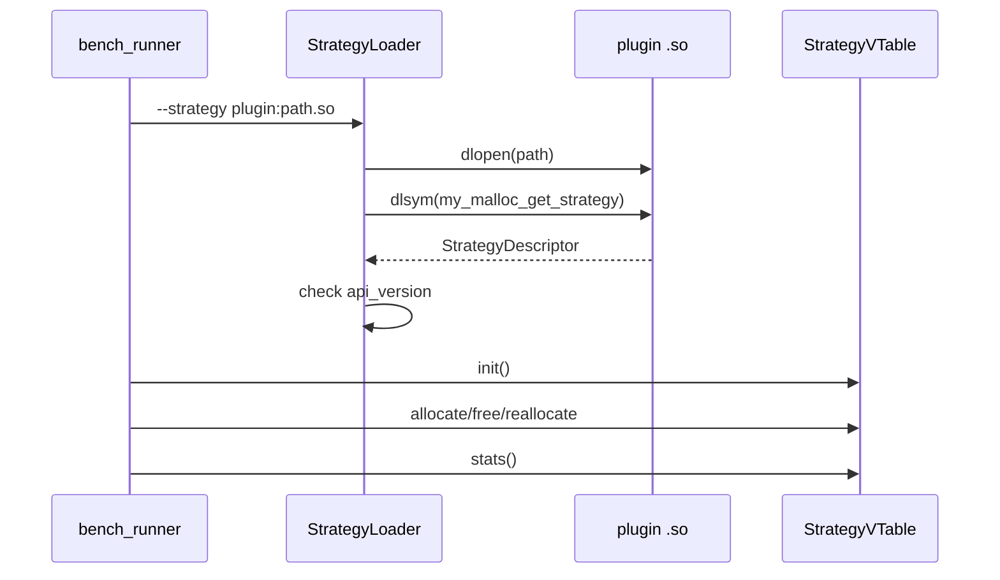

# Allocator Families Implemented in This Project

This document explains the allocator designs represented in `my_malloc`, how the current code implements them, which features are intentionally simplified, and how to use each part as a learning target.

Read this document together with:

- [allocator_design.md](allocator_design.md): concrete internal data structures and allocation/free paths.
- [allocator_lab.md](allocator_lab.md): strategy API, plugins, validation, and benchmarking.

The project is not a full clone of glibc, jemalloc, tcmalloc, or mimalloc. It is a learning allocator that implements selected core ideas from those families, exposes them as comparable strategies, and leaves room for custom experiments.

## 1. Current Strategy Map



Built-in strategies:

| Strategy | What it runs | Main learning purpose |
|---|---|---|
| `hybrid` | Headerless small-object slab path plus ptmalloc-style fallback | Compare modern size-class caching against chunk/bin allocation. |
| `ptmalloc` | Chunk, tcache, bins, arenas, top chunk, mmap | Learn classic ptmalloc mechanisms in a smaller C++ codebase. |
| `libc` | System `malloc/free/realloc` | External performance baseline. |
| `plugin:path.so` | User-provided strategy from a shared object | Let other people test custom allocator ideas in the same harness. |

The allocator can also run as an `LD_PRELOAD` allocator through `libmy_ptmalloc.so`. The strategy runner path is better for controlled experiments because it can validate and benchmark multiple implementations without interposing the entire process.

## 2. ptmalloc-style Allocator

### 2.1 Core Idea

ptmalloc is built around boundary-tag chunks, bins, arenas, and coalescing:



Each chunk carries metadata in front of the user pointer:

```text
allocated:
  [prev_size][size | flags][user bytes...]

free:
  [prev_size][size | flags][fd][bk][fd_nextsize][bk_nextsize]...
```

The important flags are:

| Flag | Purpose |
|---|---|
| `PREV_INUSE` | Tells the allocator whether backward coalescing may read `prev_size`. |
| `IS_MMAPPED` | Marks a direct `mmap` allocation that should be unmapped directly. |
| `NON_MAIN_ARENA` | Marks chunks owned by a non-main arena. |

### 2.2 How This Project Implements It

Main code locations:

| Component | Files |
|---|---|
| Chunk metadata | `include/my_ptmalloc/chunk.h` |
| Tcache | `include/my_ptmalloc/tcache.h`, `src/tcache.cpp` |
| Fastbins | `include/my_ptmalloc/fastbins.h` |
| Small bins | `include/my_ptmalloc/small_bins.h` |
| Large bins | `include/my_ptmalloc/large_bins.h`, `src/large_bins.cpp` |
| Unsorted bin | `include/my_ptmalloc/unsorted_bin.h`, `src/unsorted_bin.cpp` |
| Arenas and heaps | `include/my_ptmalloc/arena.h`, `src/arena_manager.cpp`, `src/heap.cpp` |
| Allocation pipeline | `src/malloc_impl.cpp`, `src/alloc_pipeline.cpp` |
| Free and coalescing | `src/free_impl.cpp`, `src/consolidate.cpp`, `src/coalesce.cpp` |
| Realloc | `src/realloc_impl.cpp` |

The implementation keeps the classic ptmalloc order but makes the code easier to study:

- `TcachePerthread` owns 76 per-thread bins and uses pointer mangling.
- `FastBins` use lock-free CAS stacks for tiny chunk-backed allocations.
- `SmallBins` use exact-size intrusive FIFO lists.
- `LargeBins` keep sorted intrusive lists and use `BinMap` to skip empty bin ranges.
- `UnsortedBin` is a bounded staging area, not an unbounded full scan.
- `ArenaManager` assigns arenas per thread and uses `HeapInfo` to recover the owner on free.
- `my_malloc` checks tcache before locking an arena, so tcache hits avoid the arena mutex.

### 2.3 Simplifications Compared With glibc

This code intentionally avoids some glibc complexity:

| glibc-grade feature | Current project status | Why simplified |
|---|---|---|
| Large-bin `fd_nextsize` ordering | Fields exist, active search uses sorted `fd/bk` plus binmap | Avoids fragile secondary-chain maintenance while split/unlink/coalesce paths are still compact. |
| Dynamic mmap/trim threshold tuning | Static threshold API exists | Keeps policy effects easier to reason about in benchmarks. |
| Full thread-exit cache flushing | Tcache flush exists, OS destructor integration is limited | Enough for tests, not full production lifecycle coverage. |
| `malloc_info`, full `mallopt`, XML stats | Not implemented | Outside the educational hot path. |
| `mremap` and many realloc corner cases | Realloc can grow into top or next linked free chunk | Covers the important fragmentation lesson without reproducing all glibc logic. |

### 2.4 What to Measure

This backend should be studied with:

- mixed-size workloads;
- realloc-heavy fragmentation workloads;
- arena contention workloads;
- workloads that produce many medium chunks outside the slab size limit.

It is usually not the fastest design for tiny same-size allocations because every chunk has metadata and eventually interacts with arena-local structures.

## 3. Hybrid Small-object Slab Allocator

### 3.1 Core Idea

Small allocations are often short-lived and concentrated in a small number of sizes. A size-class slab allocator avoids per-object chunk headers and returns objects from thread-local lists:



A slab contains one header and many fixed-size objects:



### 3.2 How This Project Implements It

Main files:

- `include/my_ptmalloc/slab_allocator.h`
- `src/slab_allocator.cpp`
- `src/malloc_impl.cpp`
- `src/free_impl.cpp`
- `src/realloc_impl.cpp`

Current implemented features:

- normal allocations up to 1024 bytes use the slab path in `hybrid` mode;
- size classes are spaced every 16 bytes;
- slabs are 64KB aligned;
- allocated objects do not carry per-object chunk headers;
- free objects store the next pointer inside the object memory;
- thread-local lists handle the common allocation/free path;
- per-class central caches refill and drain in batches;
- slab pointer classification uses an atomic lookup table from aligned slab base to `SlabHeader`;
- aligned allocation bypasses slabs because the current `memalign` path is chunk-header based.

The free path starts by asking whether the pointer belongs to a registered slab:



### 3.3 Relationship to tcmalloc

This slab path borrows the most visible tcmalloc idea:

```text
Thread cache -> Central free list -> Page/Span source
```

Current project mapping:

| tcmalloc concept | Project implementation |
|---|---|
| Size classes | 16-byte classes up to 1024 bytes |
| ThreadCache | Thread-local slab free lists |
| CentralFreeList | Per-class central cache with batch refill/drain |
| Span/PageHeap | Simplified 64KB slab mappings |
| PageMap | Simplified atomic slab lookup table |

### 3.4 Simplifications Compared With tcmalloc

| Full tcmalloc feature | Current project status |
|---|---|
| Rich tuned size-class table | Uniform 16-byte spacing. Easier to study but can waste memory for some sizes. |
| PageHeap and span splitting/coalescing | Not implemented. New slabs come from mapped memory and are kept for reuse. |
| Empty span return to OS | Not implemented yet. This is why RSS can remain higher than glibc in some workloads. |
| Cross-thread ownership transfer | Free returns to the current thread-local list, not an owner-thread remote list. |
| Per-CPU cache mode | Not implemented. The project uses thread-local caches. |

### 3.5 What to Measure

This path is designed to show advantages on:

- repeated same-size allocation/free;
- batch allocation/free;
- small-object multi-threaded workloads with low cross-thread free;
- workloads where avoiding chunk headers improves cache locality.

It can lose on:

- random size workloads with poor size-class locality;
- long-running workloads where unreclaimed empty slabs increase RSS;
- producer/consumer cross-thread free patterns that need remote-free ownership.

## 4. jemalloc-like Ideas

### 4.1 Core Idea

jemalloc organizes allocation around many arenas, size classes, runs/slabs, and extents. Its strong point is balancing throughput and memory footprint under mixed, long-running, multi-threaded workloads.



The important jemalloc lesson is not just "use arenas". It is also:

- keep per-arena metadata local;
- use size classes to reduce search;
- track large memory ranges as extents;
- decay or purge unused extents to control RSS;
- expose introspection and tuning knobs.

### 4.2 What This Project Implements

Implemented jemalloc-like pieces:

- multiple arenas instead of one global heap;
- size-class allocation in the slab frontend;
- a strategy/stats interface for observable experiments;
- runtime strategy selection through `MY_MALLOC_MODE` and `bench_runner`.

Not implemented as a full jemalloc-like backend:

- arena-local extent trees;
- dirty/muzzy/retained extent states;
- decay timers or allocation-window based purging;
- per-arena background purge;
- jemalloc-style mallctl namespace.

### 4.3 How to Extend Toward jemalloc

A useful next learning step is a shared `Span`/`Extent` layer:

```text
Span:
  base
  page_count
  size_class
  owner_arena
  live_count
  free_count
  state: active | dirty | retained
```

Then experiments become concrete:

- compare immediate `munmap` versus delayed decay;
- measure RSS/live memory ratio over time;
- add an arena-local extent cache for large allocations;
- let adaptive policy lower RSS by changing purge aggressiveness.

## 5. mimalloc-like Ideas

### 5.1 Core Idea

mimalloc emphasizes per-thread heaps, page-local allocation, and explicit remote-free handling:



This design makes ownership explicit. A thread normally allocates and frees from its own pages. If another thread frees an object, it pushes to a remote list and the owner drains that list later.

### 5.2 What This Project Implements

The project does not yet have a mimalloc-like backend. It has parts that could support one:

- slab pointer lookup can identify slab metadata from a pointer;
- thread-local slab lists already exist;
- central caches can rebalance objects between threads;
- strategy plugins can prototype a mimalloc-like allocator outside the core.

### 5.3 Current Simplification

The current slab free path puts freed slab objects into the current thread-local list. This is simple and fast for same-thread free, but it does not model true owner-thread remote free.

That choice is acceptable for the current learning stage because it keeps the first slab allocator compact. It also makes the next experiment clear: add `owner_thread` and `remote_free` to slab/span metadata and benchmark producer/consumer workloads.

## 6. Adaptive Allocator Direction

### 6.1 What Adaptive Means Here

Adaptive allocation should choose a policy based on measured workload behavior:



The current project has the foundation:

- runtime mode selection;
- opt-in stats;
- opt-in trace ring;
- strategy validation and benchmarking;
- plugin strategies.

It does not yet hot-swap live allocations between unrelated backends. That is deliberately hard: a pointer allocated by one backend must be freed by the same compatible backend unless shared span metadata identifies ownership.

### 6.2 Practical Adaptive Steps

The safe progression is:

1. Make parameters adaptive inside one backend, such as slab refill batch size, local cache limit, or trim threshold.
2. Add per-size-class policy decisions where ownership is still unambiguous.
3. Add shared pointer ownership metadata through `Span`/`PageMap`.
4. Only then allow multiple independent backends to coexist in one process.

Example heuristic policy:

```text
if slab hit rate is high and RSS/live is acceptable:
    increase local cache limit

if RSS/live grows beyond a threshold:
    drain local caches more aggressively
    purge empty spans when span metadata exists

if realloc move rate is high for medium sizes:
    prefer chunk-backed allocation for those sizes

if remote-free rate is high:
    use owner-thread remote-free pages for affected size classes
```

## 7. Plugin Strategy Model

The plugin API makes the project useful for other people who want to test their own allocator.



A strategy only needs to implement:

- `allocate`;
- `deallocate`;
- `reallocate`;
- `usable_size`;
- optional `init`, `shutdown`, and `stats`.

Before benchmarking a custom allocator, run:

```bash
./build/allocator_validate --strategy plugin:./libyour_strategy.so
./build/bench_runner --strategy plugin:./libyour_strategy.so --json
```

The example plugin in `plugins/counting_malloc_strategy.cpp` wraps libc and counts calls. It is intentionally simple so new experiments can copy it.

## 8. Learning Checklist

Use this order if you are reading the project for the first time:

1. Read `include/my_ptmalloc/chunk.h` to understand boundary tags.
2. Read `src/malloc_impl.cpp` and `src/free_impl.cpp` to see frontend routing.
3. Read `src/slab_allocator.cpp` to understand the headerless small-object path.
4. Read `src/alloc_pipeline.cpp` to see the ptmalloc-style fallback order.
5. Read `src/unsorted_bin.cpp` and `src/large_bins.cpp` to understand fragmentation-related tradeoffs.
6. Read `include/my_ptmalloc/strategy.h` and `tools/strategy_loader.h` to understand plugins.
7. Run `allocator_validate` before trusting any new strategy.
8. Run `bench_runner --json` to compare strategy behavior under the same workloads.

## 9. Feature Matrix

| Feature | hybrid | ptmalloc | libc baseline | plugin |
|---|---:|---:|---:|---:|
| Headerless small objects | yes | no | external | depends |
| Chunk boundary tags | fallback only | yes | external | depends |
| Thread-local tcache | fallback only | yes | external | depends |
| Fastbins/smallbins/largebins | fallback only | yes | external | depends |
| Multi-arena fallback | yes | yes | external | depends |
| Central size-class cache | yes | no | external | depends |
| Empty slab/span reclamation | no | n/a | external | depends |
| Remote-free owner lists | no | no | external | depends |
| Strategy validation | yes | yes | yes | yes |
| Standard benchmark runner | yes | yes | yes | yes |

## 10. Why the Simplifications Are Useful

The project intentionally separates "implemented and measurable" from "future allocator research":

- The ptmalloc-style backend is complete enough to teach chunk metadata, bins, arenas, coalescing, and realloc growth.
- The hybrid slab path is complete enough to show why modern allocators avoid chunk headers for hot small objects.
- The strategy API is complete enough for outside contributors to validate and benchmark new policies.
- The missing span/page-map layer is now a well-defined next step rather than hidden complexity.

This makes the allocator suitable as a learning project: every performance gap can be traced to a concrete missing mechanism, and every new mechanism can be tested in isolation.
