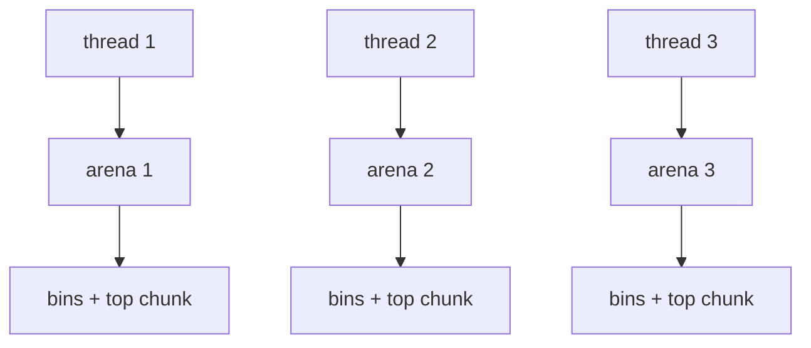
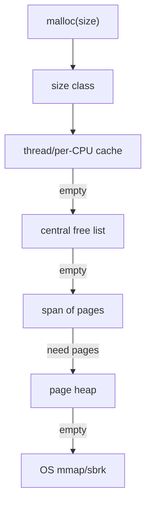
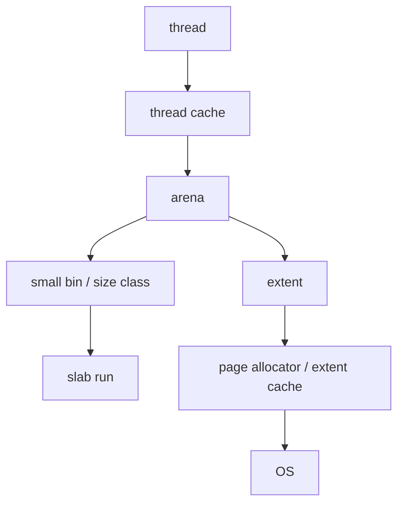
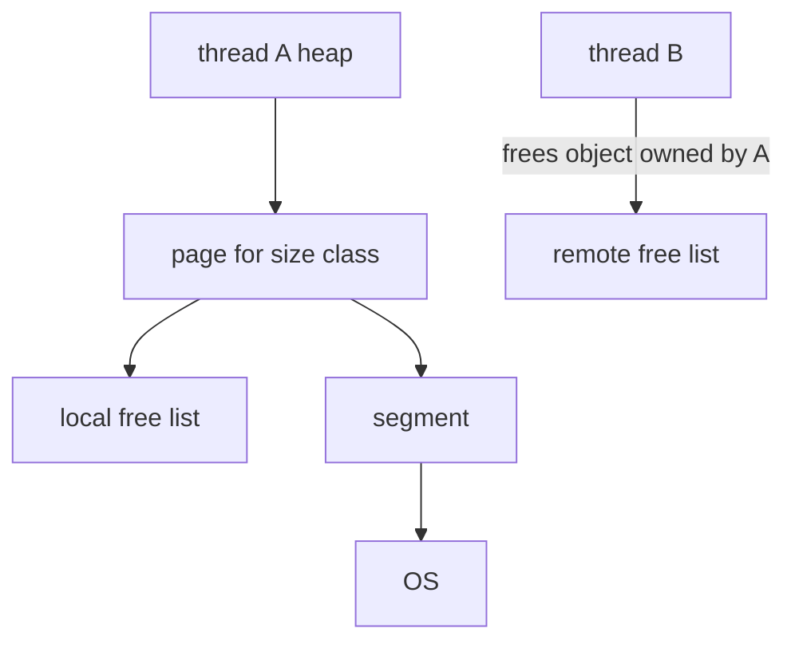

# Allocator Principles And Implemented Families

This document is the theory guide for the project. It explains the allocator designs that inspired `my_malloc`, how those allocators work, why they perform differently, and what this project implements or simplifies.

The project currently exposes these strategies:

| Strategy | Meaning |
|---|---|
| `hybrid` | Slab frontend for small objects plus ptmalloc-style fallback. |
| `ptmalloc` | Slab disabled; use the chunk/bin/arena allocator. |
| `libc` | System malloc baseline. |
| `plugin:path.so` | User-provided allocator strategy. |

## 1. Basic Allocator Problems

A general-purpose allocator must solve five problems:

| Problem | Question |
|---|---|
| Placement | Which free block should satisfy this request? |
| Splitting | If a free block is larger than needed, should it be split? |
| Coalescing | When blocks are freed, should adjacent free blocks be merged? |
| Caching | Should recently freed memory stay close to the current thread? |
| Returning memory | When should unused memory go back to the OS? |

Performance is mostly determined by the tradeoff among:

- throughput: operations per second;
- latency: especially p99 allocation/free time;
- memory footprint: RSS, mapped bytes, active bytes, internal fragmentation;
- scalability: whether threads share locks or mostly operate independently;
- locality: whether reused memory is cache-hot and NUMA-local.

No allocator wins every workload. That is why this project keeps multiple modes and a benchmark lab.

## 2. ptmalloc-style Allocation

### 2.1 Core Idea

ptmalloc, the family behind glibc malloc, manages heap memory as variable-size chunks. Each chunk has a header before the user pointer.

```text
allocated chunk:

  +-----------+----------------------+--------------------+
  | prev_size | size | flag bits     | user bytes         |
  +-----------+----------------------+--------------------+

free chunk:

  +-----------+----------------------+-----+-----+-------------+
  | prev_size | size | flag bits     | fd  | bk  | free space  |
  +-----------+----------------------+-----+-----+-------------+
```

The `size` field contains both the chunk size and low-bit flags:

| Flag | Meaning |
|---|---|
| `PREV_INUSE` | Previous physical chunk is allocated, so backward coalescing must not read `prev_size`. |
| `IS_MMAPPED` | Chunk was allocated directly with `mmap`; free should call `munmap`. |
| `NON_MAIN_ARENA` | Chunk belongs to a non-main arena. |

Free chunks live in bins:


### 2.2 tcache

tcache is a per-thread cache. It avoids arena locks on common small allocations.

```text
thread A tcache bin for size 64:

  head -> chunk -> chunk -> chunk
```

Benefits:

- allocation/free can be O(1);
- no arena mutex on hit;
- recently used memory stays hot in the same thread.

Costs:

- memory can be retained in per-thread caches;
- cross-thread frees are harder to handle well;
- double-free detection and pointer hardening are needed.

This project implements:

- 76 tcache bins;
- fixed per-bin count limit;
- safe-linking style pointer mangling;
- double-free checks;
- tcache checked before arena locking.

### 2.3 fastbins

Fastbins are lock-free LIFO lists for very small chunks. They defer coalescing because immediate coalescing would make free slower.

```text
free(32B) -> push chunk into fastbin
malloc(32B) -> pop chunk from fastbin
```

Benefit: very fast small chunk reuse.

Cost: fragmentation can increase until fastbins are consolidated.

This project implements fastbins as CAS-based atomic stacks.

### 2.4 small bins

Small bins hold exact-size chunks. If the requested normalized size is 128B, the allocator looks in the 128B bin.

```text
smallbin[128] <-> chunk <-> chunk <-> chunk
```

Benefit: exact fit and simple O(1) removal.

Cost: only useful for sizes in the small-bin range.

This project implements 64 exact-size FIFO small bins.

### 2.5 unsorted bin

The unsorted bin is a staging area for recently freed/coalesced chunks.

Why it exists:

- many programs free a chunk and soon allocate a similar size;
- immediately sorting every free chunk into final bins can waste work;
- the unsorted bin gives recent chunks a quick reuse chance.

Simplified flow:

```text
free chunk -> unsorted bin
malloc request -> scan some unsorted chunks
    exact/usable hit -> allocate
    otherwise -> sort chunk into small/large bin
```

This project implements bounded unsorted scanning, last-remainder reuse, and tcache fill for exact matches. It avoids full unbounded scans on every allocation.

### 2.6 large bins

Large bins hold larger variable-size chunks. They need best-fit or near-best-fit search to reduce fragmentation.

```text
largebin[k]:
  chunk(size 4096) <-> chunk(size 6144) <-> chunk(size 8192)
```

This project implements:

- size-indexed large bins;
- sorted lists;
- best-fit search;
- a binmap to skip empty bins.

Simplification:

- glibc's full `fd_nextsize` secondary ordering is not fully restored. The project keeps the fields but relies on simpler sorted lists plus binmap. This is easier to study and less fragile, but it is not as tuned as glibc.

### 2.7 arenas

Arenas reduce lock contention by giving different threads different heap states.



This project implements:

- main arena;
- per-thread arena assignment/reuse;
- arena mutex;
- `HeapInfo` ownership lookup for non-main arena frees.

Simplification:

- arena lifecycle and thread-exit behavior are smaller than glibc's production implementation.

### 2.8 What ptmalloc is good at

ptmalloc-style allocation is good for teaching:

- variable-size block management;
- boundary tags;
- splitting and coalescing;
- bin data structures;
- the cost of locks and fragmentation.

It can lose to slab/span allocators on:

- many tiny same-size objects;
- highly concurrent workloads;
- cross-thread producer/consumer patterns;
- workloads requiring aggressive page release.

## 3. tcmalloc-style Allocation

### 3.1 Core Idea

tcmalloc focuses on size classes, thread or CPU caches, central free lists, and a page heap.



Small objects are rounded to size classes. A span contains many same-size objects. Local caches make small allocations fast.

### 3.2 Why it is fast

- No per-object variable chunk header for small objects.
- Local cache allocation is usually just pop from a singly linked list.
- Central lists refill in batches to amortize locks.
- Page heap manages larger units instead of individual objects.

### 3.3 What this project implements

The `hybrid` small-object frontend implements selected tcmalloc-like ideas:

| tcmalloc concept | Project implementation |
|---|---|
| Size classes | 16-byte classes up to 1024B |
| Thread cache | Thread-local slab free lists |
| Central free list | Per-class central cache with batch refill/drain |
| Span | 64KB slab |
| Page map | Atomic lookup from 64KB-aligned base to `SlabHeader` |

### 3.4 What is simplified

| Production tcmalloc feature | Current project status |
|---|---|
| Tuned size-class table | Uniform 16-byte spacing |
| PageHeap with span split/merge | Not implemented |
| Empty span return | Not implemented |
| Per-CPU cache mode | Not implemented |
| Transfer cache tuning | Simplified fixed batch movement |

### 3.5 Expected benchmark behavior

Should be strong:

- repeated same-size allocation/free;
- small batch allocation/free;
- workloads with mostly same-thread allocation/free.

Can be weak:

- memory footprint after phase changes;
- cross-thread frees;
- random sizes that spread across many classes.

## 4. jemalloc-style Allocation

### 4.1 Core Idea

jemalloc combines arenas, size classes, slabs/runs, and extents. Its strength is long-running mixed workloads where both fragmentation and concurrency matter.



Important jemalloc ideas:

- many arenas to reduce contention;
- carefully tuned size classes;
- tcache for per-thread hot paths;
- extents for large allocations;
- dirty/muzzy/retained page states;
- background purging and decay policies;
- rich statistics and profiling.

### 4.2 What this project borrows

This project borrows the broad idea of separating:

- small object classes;
- arena-local state;
- large allocation paths;
- reusable cached memory.

### 4.3 What this project does not implement

| jemalloc feature | Status |
|---|---|
| Extent hooks | Not implemented |
| Dirty/muzzy retained states | Not implemented |
| Decay-based purging | Not implemented |
| Rich mallctl tree | Not implemented |
| Profiling heap samples | Not implemented |
| Production size-class tuning | Not implemented |

### 4.4 Why this matters

jemalloc often performs well in real servers because it pays attention to memory lifecycle, not only allocation speed. `my_malloc` currently lacks that full extent lifecycle, which explains why RSS and fragmentation are still weaker than glibc/jemalloc-like designs on several tests.

## 5. mimalloc-style Allocation

### 5.1 Core Idea

mimalloc organizes memory around pages, segments, per-thread heaps, and strong remote-free handling.



Key ideas:

- each thread owns heaps/pages;
- local frees and remote frees use different paths;
- remote frees are batched and later collected by the owning heap;
- pages can be abandoned and reclaimed;
- metadata is designed for fast pointer lookup and low contention.

### 5.2 What this project borrows

The project borrows the lesson that ownership matters:

- slab pointer lookup recovers slab metadata quickly;
- central caches reduce isolation;
- benchmark suite includes cross-thread free workloads.

### 5.3 What is not implemented yet

| mimalloc feature | Status |
|---|---|
| Owner-thread remote-free list | Not implemented for slab objects |
| Abandoned page reclaim | Not implemented |
| Segment-level lifecycle | Not implemented |
| Fine-grained page states | Not implemented |
| Secure/free-list hardening beyond tcache | Limited |

### 5.4 Why remote free matters

In a producer/consumer system, one thread may allocate objects and another thread may free them.

Bad simplified behavior:

```text
producer allocates from cache P
consumer frees into cache C
producer later needs more memory even though its objects were freed elsewhere
```

Better owner-based behavior:

```text
producer owns page/slab
consumer remote-frees into producer-owned remote list
producer later drains remote list and reuses objects
```

This is one of the most important future improvements for this project.

## 6. Adaptive Allocation

The project has a strategy lab and runtime modes, but it is not yet a fine-grained adaptive allocator.

Possible adaptive signals:

| Signal | Meaning |
|---|---|
| Allocation size histogram | Choose slab classes or chunk path. |
| Realloc frequency | Prefer coalescing/reuse policies. |
| Cross-thread free ratio | Prefer owner-remote-free design. |
| RSS growth vs live bytes | Trigger slab/span release. |
| Lock contention | Increase arena/span distribution. |
| Cache miss / latency samples | Change batch sizes or class policy. |

Possible adaptive policies:

- heuristic thresholds;
- configurable rule tables;
- offline-trained strategy selector;
- reinforcement learning for choosing batch sizes or release thresholds.

For this project, the practical next step is not full reinforcement learning. It is to expose stable metrics first: live bytes, mapped bytes, free bytes by structure, remote-free rate, and per-path hit counts.

## 7. Feature Matrix

| Feature | ptmalloc mode | hybrid mode | Full production allocators |
|---|---:|---:|---:|
| Boundary-tag chunks | yes | fallback only | glibc yes |
| Tcache | yes | fallback only | glibc/jemalloc yes |
| Fastbins | yes | fallback only | glibc yes |
| Small/large bins | yes | fallback only | glibc yes |
| Multiple arenas | yes | fallback only | glibc/jemalloc yes |
| Small-object slab frontend | no | yes | tcmalloc/jemalloc/mimalloc yes |
| Central free lists | no | simplified | tcmalloc yes |
| Empty slab/span release | no | no | yes |
| Owner remote-free queues | no | no | mimalloc/tcmalloc-like designs yes |
| Extent lifecycle | no | no | jemalloc yes |
| Strategy plugins | yes | yes | project-specific learning feature |

## 8. How To Study The Project

Recommended reading order:

1. Read [allocator_design.md](allocator_design.md) for the concrete architecture.
2. Read the ptmalloc section above and inspect `chunk.h`, `tcache.h`, `small_bins.h`, `large_bins.h`, and `free_impl.cpp`.
3. Read the tcmalloc-style section and inspect `slab_allocator.cpp`.
4. Run `bench_runner` with `hybrid`, `ptmalloc`, and `libc`.
5. Modify one policy at a time, then compare results with the same benchmark matrix.
