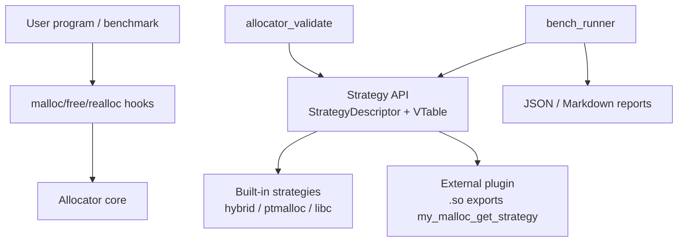
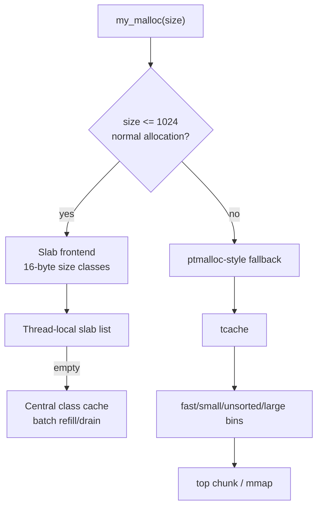
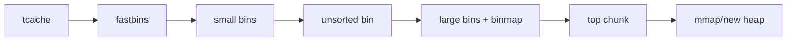
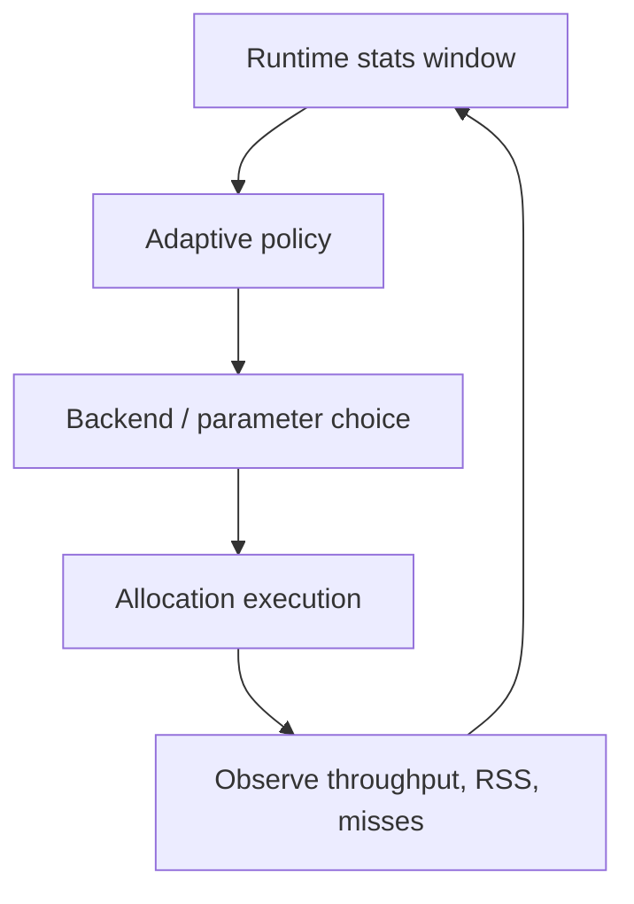

# my_malloc Allocator Lab Guide

This project is now structured as a learning-oriented allocator laboratory. It contains real allocator implementations, a strategy/plugin API, validation tools, benchmark tools, and documentation for comparing allocator design choices.

The goal is not to claim full jemalloc/tcmalloc/mimalloc compatibility. The goal is to expose their important ideas as experimental modes and make those ideas measurable.

For a more detailed explanation of each allocator family, the features implemented by this project, and the simplifications made for learning, read [allocator_families.md](allocator_families.md). For benchmark profiles, benchmark parameters, JSON output, and external suites, read [benchmarking.md](benchmarking.md).

## 1. Quick Start

Build everything:

```bash
cmake -B build .
cmake --build build -j$(nproc)
```

Run correctness validation:

```bash
./build/allocator_validate --strategy hybrid
./build/allocator_validate --strategy ptmalloc
./build/allocator_validate --strategy plugin:./build/libcounting_malloc_strategy.so
```

Run standardized benchmarks:

```bash
./build/bench_runner --strategy hybrid
./build/bench_runner --strategy ptmalloc
./build/bench_runner --strategy libc
./build/bench_runner --strategy plugin:./build/libcounting_malloc_strategy.so
```

Run named benchmark profiles:

```bash
./build/bench_runner --strategy hybrid --profile smoke
./build/bench_runner --strategy hybrid --profile micro
./build/bench_runner --strategy hybrid --profile stress
./build/bench_runner --strategy hybrid --profile all --json
```

Run individual configurable benchmark methods:

```bash
./build/bench_runner --strategy hybrid --bench same_size --size 32 --iters 1000000
./build/bench_runner --strategy hybrid --bench random --random-iters 500000 --slots 8192
./build/bench_runner --strategy hybrid --bench fragmentation --iters 100000 --min-size 16 --max-size 16384
./build/bench_runner --strategy hybrid --bench cross_thread_free --threads 8 --batch 10000
```

Machine-readable output:

```bash
./build/bench_runner --strategy hybrid --json
```

Run the LD_PRELOAD allocator:

```bash
LD_PRELOAD=./build/libmy_ptmalloc.so ./your_program
```

Switch runtime mode:

```bash
MY_MALLOC_MODE=hybrid ./build/bench_my
MY_MALLOC_MODE=ptmalloc ./build/bench_my
```

Enable observability:

```bash
MY_MALLOC_STATS=1 ./build/test_basic
MY_MALLOC_TRACE=1 ./build/test_basic
```

## 2. Project Architecture



There are two ways to use the project:

- As a drop-in allocator through `LD_PRELOAD`.
- As a lab framework through `allocator_validate` and `bench_runner`.

The lab framework is the recommended path for comparing new allocator strategies.

## 3. Strategy API

External strategies expose one C symbol:

```cpp
extern "C" my_ptmalloc::StrategyDescriptor my_malloc_get_strategy() noexcept;
```

The descriptor contains a function table:

```cpp
struct StrategyVTable {
    void (*init)() noexcept;
    void (*shutdown)() noexcept;
    void* (*allocate)(size_t size) noexcept;
    void (*deallocate)(void* ptr) noexcept;
    void* (*reallocate)(void* ptr, size_t size) noexcept;
    size_t (*usable_size)(void* ptr) noexcept;
    StrategyStats (*stats)() noexcept;
};
```

The simple example plugin is:

```text
plugins/counting_malloc_strategy.cpp
```

It wraps libc `malloc/free/realloc`, counts calls, and exports `my_malloc_get_strategy`.

Build target:

```bash
cmake --build build --target example_counting_strategy
```

Use it:

```bash
./build/allocator_validate --strategy plugin:./build/libcounting_malloc_strategy.so
./build/bench_runner --strategy plugin:./build/libcounting_malloc_strategy.so --json
```

## 4. Built-in Strategies

| Strategy | What it means | Purpose |
|---|---|---|
| `hybrid` | Small-object slab frontend plus ptmalloc-style fallback | Default optimized experimental allocator |
| `ptmalloc` | Disables slab frontend and uses chunk/bin/arena path | Baseline for learning ptmalloc concepts |
| `libc` / `glibc` | Uses system `malloc/free/realloc` | External baseline |
| `plugin:path.so` | Loads a user-defined strategy | Custom allocator experiments |

## 5. Current Hybrid Backend



Important characteristics:

- Small normal allocations avoid per-object chunk headers.
- Slabs are 64KB aligned.
- Each size class is spaced by 16 bytes up to 1024 bytes.
- Thread caches refill from central lists in batches.
- Surplus thread-local objects drain back to central lists.
- Aligned allocation currently bypasses slab because it still manipulates chunk headers.

## 6. ptmalloc-style Backend



This backend teaches classic ptmalloc mechanisms:

- chunk boundary tags;
- `PREV_INUSE`, `IS_MMAPPED`, `NON_MAIN_ARENA`;
- tcache;
- fastbins;
- small bins;
- unsorted bin sorting;
- large bin best-fit;
- top chunk growth;
- multiple arenas.

It is useful for comparing older chunk/bin/coalescing architecture against the newer slab/central-cache path.

## 7. Allocator Families and Key Ideas

The project can grow toward several allocator-inspired modes. These are educational interpretations of important design ideas, not full upstream clones.

### ptmalloc-like

Core idea:

```text
chunk metadata + bins + arenas + coalescing
```

Strengths:

- Good for learning boundary tags and coalescing.
- Handles realloc-heavy cases naturally when adjacent chunks can merge.
- Mature conceptual model for general malloc semantics.

Weaknesses:

- Bin scans and arena locks can hurt multi-threaded small-object workloads.
- Per-object chunk metadata costs memory and cache bandwidth.

### tcmalloc-like

Core idea:

```text
ThreadCache -> CentralFreeList -> PageHeap
```

Strengths:

- Very fast same-size and batch small-object workloads.
- Batch refill/drain reduces lock traffic.
- PageHeap can make large allocation management simple.

Weaknesses:

- RSS can rise if thread caches hold too much memory.
- Cross-thread free needs careful transfer/remote handling.

Current project status:

- Implemented: small-object thread cache and central per-class batch cache.
- Missing: full PageHeap and span reclamation.

### jemalloc-like

Core idea:

```text
many arenas + size-class bins + extents + decay/purge
```

Strengths:

- Strong multi-threaded mixed-size behavior.
- Good RSS control through dirty/muzzy extent decay.
- Arena sharding limits global contention.

Weaknesses:

- Extent state and decay policy are complex.
- More metadata and policy tuning.

Future experiment:

- Add arena-local extent caches.
- Add dirty span decay timers or allocation-count windows.
- Compare RSS on long-running mixed-size workloads.

### mimalloc-like

Core idea:

```text
per-thread heap + page-local allocation + remote free list
```

Strengths:

- Excellent thread-local locality.
- Cross-thread free is explicit and cheap when remote lists are well designed.
- Page reset can reduce RSS.

Weaknesses:

- Requires robust page ownership and remote-free draining.
- Thread exit and owner migration need careful handling.

Future experiment:

- Add `owner_thread` to span metadata.
- Add atomic remote free lists.
- Add producer/consumer cross-thread benchmark.

## 8. Adaptive Policies

Adaptive mode should choose strategies based on measured workload behavior, not names.



Recommended policy plugins:

| Policy | How it works | Why useful |
|---|---|---|
| `heuristic` | Rules based on hit rate, RSS/live ratio, remote free rate | Easy to understand and debug |
| `bandit` | Treats backends as arms and optimizes reward | Lightweight online learning |
| `offline_table` | Loads a trained table from file | Lets RL-style training happen outside hot path |

Example heuristic:

```text
if size <= 1024 and slab hit rate is high:
    prefer tcmalloc-like slab path
if remote free rate is high:
    prefer mimalloc-like remote-free path
if mapped/live ratio is high:
    prefer jemalloc-like decay/purge behavior
if realloc move rate is high:
    prefer chunk/coalescing path
```

The current project has the stats/trace foundation and runtime mode selection. The next step is a pluggable policy interface that updates decisions per size class or per workload window.

## 9. Validation

Every strategy should pass validation before benchmarking:

```bash
./build/allocator_validate --strategy hybrid
./build/allocator_validate --strategy ptmalloc
./build/allocator_validate --strategy plugin:./build/libcounting_malloc_strategy.so
```

Validation currently checks:

- basic allocate/free;
- zero-size allocation;
- realloc growth and data preservation;
- randomized allocate/free/realloc stress.

Future validation work:

- aligned allocation validation through strategy API;
- cross-thread free validation;
- redzone/guard mode;
- longer randomized stress with reproducible seeds.

## 10. Benchmarking

Run one strategy:

```bash
./build/bench_runner --strategy hybrid
```

JSON output:

```bash
./build/bench_runner --strategy hybrid --json
```

Plugin benchmark:

```bash
./build/bench_runner --strategy plugin:./build/libcounting_malloc_strategy.so --json
```

Current built-in workload methods:

- `same_size`;
- `same_size_64`;
- `same_size_256`;
- `batch`;
- `random`;
- `fragmentation`;
- `cross_thread_free`;
- `latency_sample`.

The runner supports profiles (`smoke`, `micro`, `stress`, `all`) and parameters such as `--iters`, `--random-iters`, `--size`, `--min-size`, `--max-size`, `--slots`, `--batch`, `--rounds`, `--threads`, and `--seed`. See [benchmarking.md](benchmarking.md) for the full benchmark guide and for external suites such as `mimalloc-bench`.

Existing legacy benchmarks remain available:

```bash
./build/bench_my
./build/bench_sys
./build/test_perf
```

Future benchmark work:

- producer/consumer cross-thread free;
- long-running RSS/decay workload;
- phase-changing workload for adaptive policies;
- latency percentiles, not just throughput.

## 11. How to Add a Custom Strategy

1. Copy `plugins/counting_malloc_strategy.cpp`.
2. Replace `allocate/deallocate/reallocate/usable_size`.
3. Export `my_malloc_get_strategy`.
4. Build a shared object.
5. Run validation.
6. Run benchmarks.

Minimal skeleton:

```cpp
extern "C" my_ptmalloc::StrategyDescriptor my_malloc_get_strategy() noexcept {
    return {
        my_ptmalloc::STRATEGY_API_VERSION,
        "my_strategy",
        "description",
        {
            init,
            shutdown,
            allocate,
            deallocate,
            reallocate,
            usable_size,
            stats,
        },
    };
}
```

Run:

```bash
./build/allocator_validate --strategy plugin:./libmy_strategy.so
./build/bench_runner --strategy plugin:./libmy_strategy.so --json
```

## 12. Design Direction

The next major architecture step is to introduce shared span metadata:

```text
PageMap: page_id -> Span*

Span:
  backend id
  size class
  owner thread
  page count
  free count
  local/remote free lists
```

That layer will make it easier to implement:

- tcmalloc-like PageHeap;
- jemalloc-like extent decay;
- mimalloc-like remote free;
- adaptive policy decisions by size class and span state.
