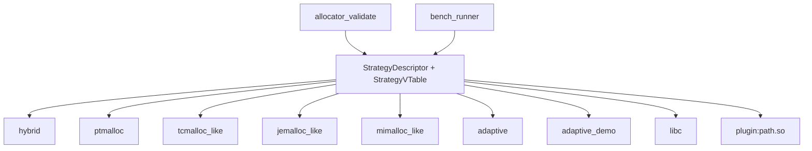

# Allocator Lab Guide

This project is also a small allocator laboratory. It lets you run teaching allocators based on industrial designs, run the independent adaptive allocator, add your own allocator strategy, validate correctness, and measure performance with the same benchmark harness.

## 1. Why A Strategy Lab Exists

The lab has two roles:

- reproduce the core mechanisms of industrial allocators for learning, without claiming production completeness;
- compare those teaching allocators with the independent adaptive allocator under the same correctness and benchmark harness.

Allocator comparisons are easy to make unfair. A meaningful comparison needs:

- the same workload;
- the same process shape;
- the same number of iterations;
- correctness checks before benchmark runs;
- machine-readable output;
- clear notes about environment and missing external tools.

The strategy API exists so that different allocator designs can be tested behind the same interface.



## 2. Built-in Strategies

| Strategy | What it uses | Purpose |
|---|---|---|
| `hybrid` | Slab frontend plus ptmalloc-style fallback | Default experimental allocator |
| `ptmalloc` | Chunk/bin/arena allocator only | Baseline for studying ptmalloc ideas |
| `tcmalloc_like` | Thread caches, central free lists, 64KB spans | Study tcmalloc-style batching and size classes |
| `jemalloc_like` | Arenas, size-class runs, per-thread tcache | Study arena/run organization |
| `mimalloc_like` | Per-thread heaps, owned pages, remote-free queues | Study cross-thread free ownership |
| `adaptive` | Independent multi-mode adaptive backend | Study adaptive ownership, allocation-time mode metadata, soft switching, and telemetry |
| `adaptive_demo` / `demo_all` | Legacy dispatcher over teaching modes | Demonstrate cross-allocator policy selection |
| `libc` / `glibc` | System malloc | Reference baseline |
| `plugin:path.so` | External shared library | User-defined allocator experiments |

Run validation:

```bash
./build/allocator_validate --strategy hybrid
./build/allocator_validate --strategy ptmalloc
./build/allocator_validate --strategy tcmalloc_like
./build/allocator_validate --strategy jemalloc_like
./build/allocator_validate --strategy mimalloc_like
./build/allocator_validate --strategy adaptive
./build/allocator_validate --strategy libc
```

Run benchmarks:

```bash
./build/bench_runner --strategy hybrid --profile smoke
./build/bench_runner --strategy ptmalloc --profile smoke
./build/bench_runner --strategy tcmalloc_like --profile smoke
./build/bench_runner --strategy jemalloc_like --profile smoke
./build/bench_runner --strategy mimalloc_like --profile smoke
./build/bench_runner --strategy adaptive --profile smoke
./build/bench_runner --strategy libc --profile smoke
```

## 3. Strategy Interface

A plugin exports one C symbol:

```cpp
extern "C" my_ptmalloc::StrategyDescriptor my_malloc_get_strategy() noexcept;
```

The descriptor contains metadata and a function table:

```cpp
struct StrategyVTable {
    void (*init)() noexcept;
    void (*shutdown)() noexcept;
    void* (*allocate)(size_t size) noexcept;
    void (*deallocate)(void* ptr) noexcept;
    void* (*reallocate)(void* ptr, size_t size) noexcept;
    size_t (*usable_size)(void* ptr) noexcept;
    StrategyStats (*stats)() noexcept;
};
```

Minimum requirements:

- `allocate(size)` returns null on failure.
- `deallocate(nullptr)` is allowed and must do nothing.
- `reallocate(nullptr, size)` behaves like `allocate(size)`.
- `reallocate(ptr, 0)` may free and return null.
- Returned pointers must satisfy normal malloc alignment.
- `usable_size(ptr)` should return at least the requested size when known; returning 0 for unknown is acceptable for simple experiments.

## 4. Example Plugin

The repository includes a simple plugin:

```text
plugins/counting_malloc_strategy.cpp
```

It wraps libc malloc, counts calls, and exposes those counters through the strategy stats hook.

Build it:

```bash
cmake --build build --target example_counting_strategy
```

Validate it:

```bash
./build/allocator_validate --strategy plugin:./build/libcounting_malloc_strategy.so
```

Benchmark it:

```bash
./build/bench_runner --strategy plugin:./build/libcounting_malloc_strategy.so --profile micro --json
```

## 5. Suggested Workflow For A New Allocator Idea

1. Implement a plugin strategy in `plugins/your_strategy.cpp`.
2. Build it as a CMake module or compile it manually as a shared object.
3. Run `allocator_validate`.
4. Run `bench_runner --profile smoke`.
5. Run focused workloads that match the idea.
6. Compare with `hybrid`, `ptmalloc`, `tcmalloc_like`, `jemalloc_like`, `mimalloc_like`, `adaptive`, and `libc`.
7. Record results and limitations.

Example comparison matrix:

```bash
for s in hybrid ptmalloc tcmalloc_like jemalloc_like mimalloc_like adaptive libc plugin:./build/libyour_strategy.so; do
  ./build/allocator_validate --strategy "$s"
  ./build/bench_runner --strategy "$s" --profile micro --json
  ./build/bench_runner --strategy "$s" --profile stress --json
done
```

## 6. Matching Ideas To Benchmarks

| Allocator idea | Useful benchmark |
|---|---|
| Tcache or thread-local cache | `same_size`, `batch`, `glibc-thread` |
| Size-class tuning | `same_size`, `random`, `fragmentation` |
| Coalescing policy | `fragmentation`, `random` |
| Remote-free design | `cross_thread_free`, Redis, producer/consumer workloads |
| Large allocation policy | `malloc-large`, large-size built-in tests |
| Empty span release | `fragmentation`, `rptest`, long phase-changing workloads |
| Lock contention reduction | `larson`, `alloc-test`, `cross_thread_free` |

## 7. Adaptive Allocator Experiments

The built-in `adaptive` strategy is the experimental allocator design in this project, not a wrapper around the teaching allocators. Its top-level abstraction is `AdaptiveMode`, and all modes share one header, ownership table, stats path, and free-routing model.

Current modes:

- `balanced`;
- `throughput_cache`;
- `deterministic_latency`;
- `compact_rss`;
- `fragmentation_stable`;
- `cross_thread`;
- `large_object`;
- `hardened_debug`.

Useful telemetry includes:

- allocation/free count by mode;
- pool hit/miss rate;
- remote-free ratio;
- size entropy and large-byte ratio;
- mapped bytes;
- active bytes;
- mapped/live ratio;
- internal fragmentation estimate;
- slow-path ratio;
- invalid/double-free counters.

The rule selector is intentionally simple:

```text
if debug mode is forced:
    use hardened_debug

if mapped/live pressure is high:
    use compact_rss

if remote_free_ratio is high:
    use cross_thread

if large_bytes_ratio is high:
    use large_object
```

Machine-learning or reinforcement-learning policies can be added later, but they need stable observations and a reward function. For allocator experiments, a practical reward usually combines throughput, p99 latency, adaptation speed after phase changes, and memory overhead:

```text
reward = throughput_score - latency_penalty - rss_penalty - switching_penalty
```

Without reliable metrics, an ML/RL policy will mostly learn benchmark noise.

## 8. Notes For Contributors

- Keep allocator metadata easy to inspect.
- Add one adaptive mode behavior or storage-helper hook at a time.
- Benchmark against at least `hybrid`, `ptmalloc`, `tcmalloc_like`, `jemalloc_like`, `mimalloc_like`, `adaptive`, and `libc`.
- Do not report external benchmark results if a dependency was stubbed or skipped.
- Document simplifications clearly. This is a learning project, so knowing what is not implemented is as important as knowing what is implemented.
