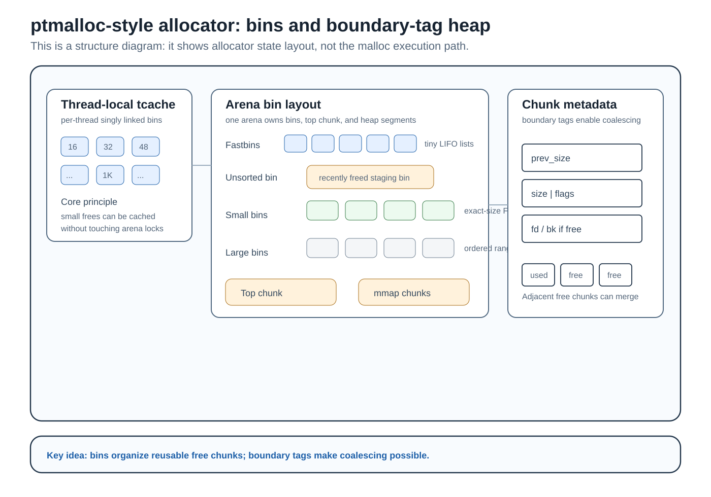
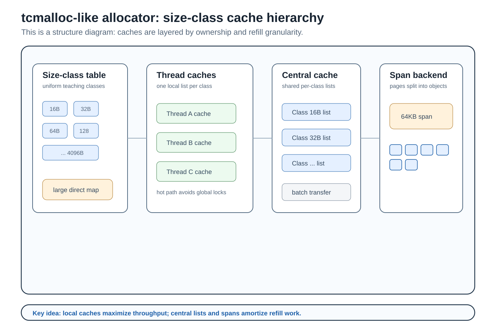
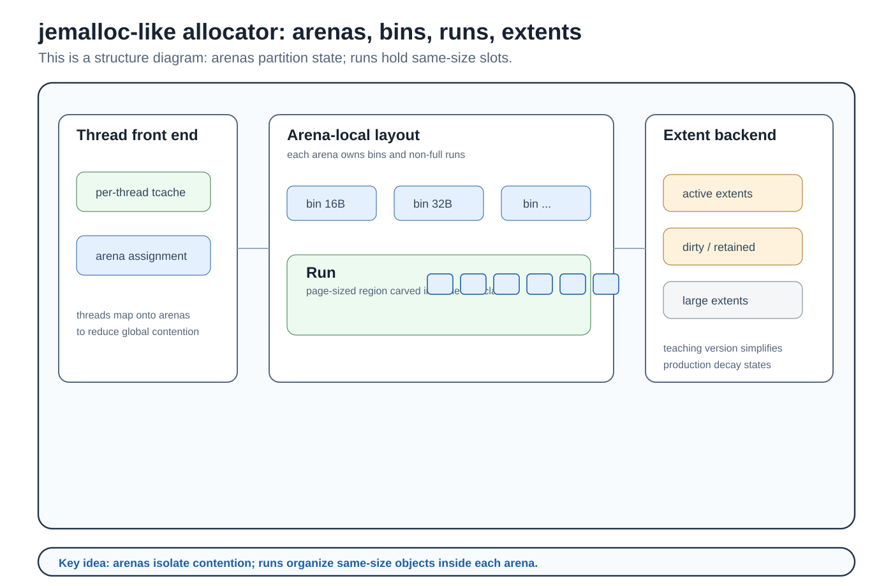
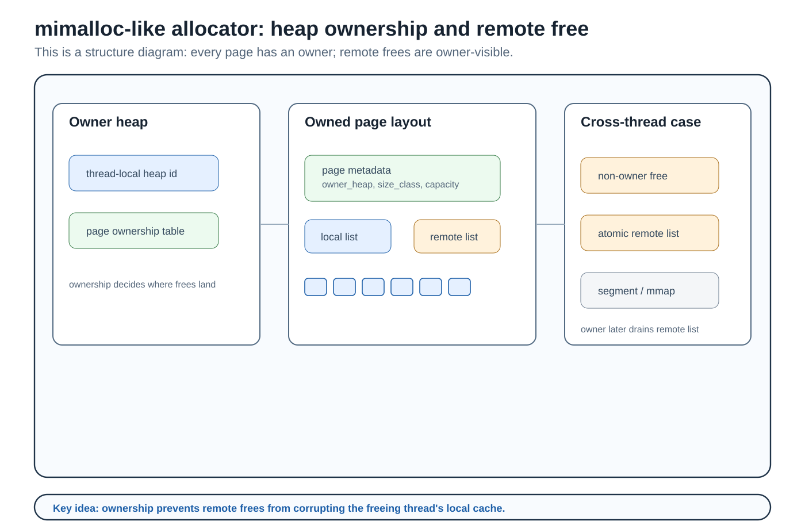
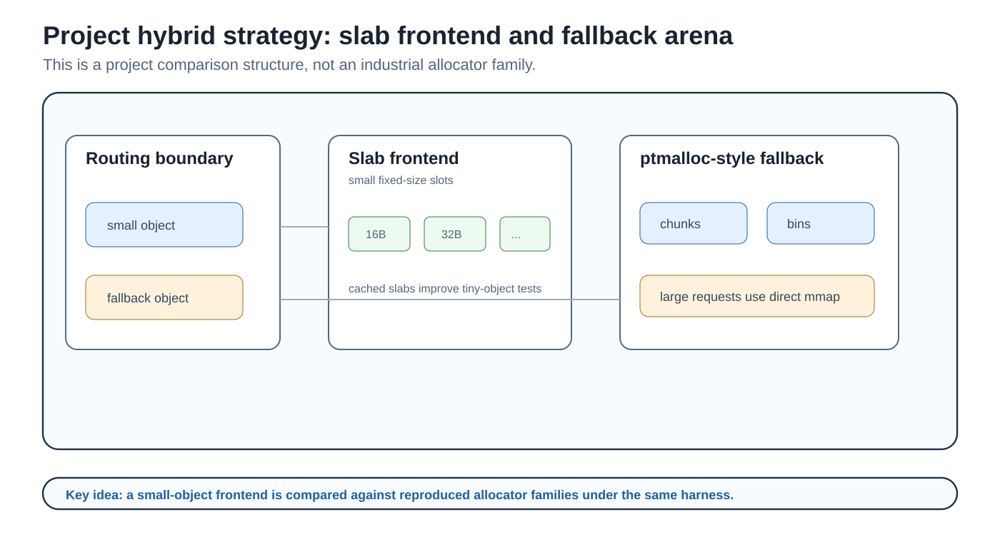
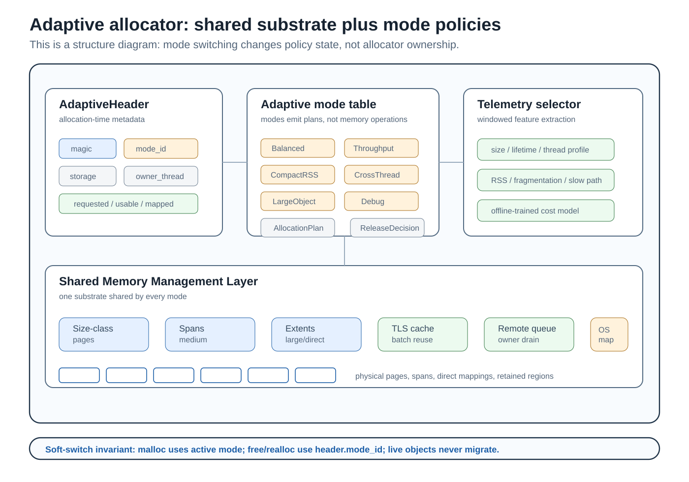

# Allocator Architecture Diagrams

This document collects high-level architecture figures in a paper-style format.
The goal is to make the project structure easy to read at a glance:

1. the reproduced allocator lab, with one principle diagram per industrial
   allocator family implemented for learning;
2. the project-specific hybrid strategy; and
3. the independent adaptive allocator, which uses a shared memory-management
   substrate plus mode policies and a runtime selector.

The diagrams are structural principle diagrams, not malloc/free flowcharts and
not call graphs. They intentionally show the internal layouts and state
organization that make each allocator family different: bins, chunk headers,
size-class caches, arenas, runs, ownership queues, adaptive headers, mode
tables, and shared substrates.

## Visual Conventions

| Visual element | Meaning |
|---|---|
| Blue boxes/arrows | Fast-path allocation or active policy path |
| Warm boxes/arrows | System-memory, release, metadata, or switching path |
| Green boxes/arrows | Reuse, remote-free, reclaim, or telemetry support path |
| Thin connector lines | Structural relationship between adjacent components |

## Reproduced Industrial Allocator Architectures

All reproduced allocators share the same public API, LD_PRELOAD hooks,
benchmark harness, validation tool, and runtime strategy selection. After
`MY_MALLOC_MODE` chooses a strategy, the request enters one allocator family.
The figures below are separated by family so each drawing can focus on the
allocator's principle rather than forcing every allocator into a request-flow
shape.

### ptmalloc-style

**Figure 1** shows the ptmalloc-style backend as a state-layout diagram. The
center of the figure is the arena's bins layout: tcache sits above the arena,
fastbins cache tiny chunks, the unsorted bin stages newly freed chunks, small
bins hold exact-size chunks, large bins cover ordered size ranges, and top/mmap
regions represent system-memory boundaries. The chunk metadata block shows why
boundary tags make coalescing possible.

### tcmalloc-like

**Figure 2** shows the tcmalloc-like backend as a cache-hierarchy diagram:
size-class tables index per-thread caches, central lists hold shared objects,
and spans are split into fixed-size objects for a single class.

### jemalloc-like

**Figure 3** shows the jemalloc-like backend as an arena organization diagram:
thread front ends map to arenas, arenas own bins and non-full runs, and extents
back arena runs and large objects. The production dirty/muzzy/retained lifecycle
is simplified, but the arena/run principle is preserved.

### mimalloc-like

**Figure 4** shows the mimalloc-like backend as an ownership diagram: heaps own
pages, pages contain local and remote free-list state, and non-owner frees are
published to owner-visible remote queues.

### Project Hybrid Strategy

**Figure 5** shows the project-specific `hybrid` strategy as a structure
diagram. It is not a separate industrial allocator family. It exists to compare
a simple slab frontend for small hot objects against a ptmalloc-style fallback
under the same harness.

| Backend | Industrial allocator principle shown by the lane | Main implementation files |
|---|---|---|
| `ptmalloc` | Boundary-tag chunks, arena locking, tcache, fast/small/large bins, top-chunk growth, and direct mmap. | `src/malloc_impl.cpp`, `src/free_impl.cpp`, `src/realloc_impl.cpp`, `src/tcache.cpp` |
| `tcmalloc_like` | Size classes, thread-local free lists, central free lists, batch refill/drain, and fixed spans. | `src/family_allocators.cpp` |
| `jemalloc_like` | Thread caches refill from arena-local size-class runs, reducing global contention. | `src/family_allocators.cpp` |
| `mimalloc_like` | Page ownership makes local frees cheap and routes cross-thread frees through owner-visible remote lists. | `src/family_allocators.cpp` |
| `hybrid` | Project-specific comparison strategy: a slab frontend handles small hot objects before falling back to the ptmalloc-style arena path. | `src/slab_allocator.cpp`, `src/malloc_impl.cpp`, `src/free_impl.cpp` |

The reproduced allocators are intentionally small teaching versions. They
preserve core mechanisms without claiming full glibc, tcmalloc, jemalloc, or
mimalloc compatibility.

## Adaptive Allocator

**Figure 6** shows the current adaptive allocator as a metadata and substrate
diagram. The important distinction is that adaptive modes are policies over one
shared substrate, not separate allocator copies and not a dispatcher over the
teaching allocators.

The adaptive backend has three layers:

| Layer | Responsibility | Main files |
|---|---|---|
| Adaptive facade | Public adaptive API, hot-path dispatch, header lookup, allocation-time mode routing. | `include/my_ptmalloc/adaptive_allocator.h`, `src/adaptive_allocator.cpp` |
| Adaptive Mode Policy Layer | Converts workload intent into `AllocationPlan` and `ReleaseDecision` for eight modes. | `include/my_ptmalloc/adaptive_mode.h`, `src/adaptive_modes.cpp` |
| Shared Memory Management Layer | Owns `AdaptiveHeader`, registry/page table, size-class pages, spans, direct maps, TLS magazines, remote-free queues, reclaim, quarantine, and OS interaction. | `include/my_ptmalloc/adaptive_services.h`, `src/adaptive_services.cpp`, `include/my_ptmalloc/adaptive_types.h` |
| Runtime Telemetry and Selector | Extracts delta-window features, runs the offline-trained selector model, applies cooldown/hysteresis, and records selector events. | `include/my_ptmalloc/adaptive_telemetry.h`, `src/adaptive_telemetry.cpp`, `include/my_ptmalloc/adaptive_selector.h`, `src/adaptive_selector.cpp`, `include/my_ptmalloc/adaptive_model_selector.h`, `src/adaptive_model_selector.cpp`, `src/adaptive_runtime.cpp` |

The figure highlights three critical adaptive invariants:

- `malloc` uses the current active `AdaptiveModeId`.
- `free`, `realloc`, and `usable_size` route through the allocation-time
  `AdaptiveHeader::mode_id`.
- telemetry can change the active mode only for future allocations.

This is what makes soft switching safe: a mode switch only changes future
allocations. Live objects are not migrated, and old objects are still released
through the policy that created them while all modes share the same memory
substrate.

## Mode Policy Interpretation

The mode policy layer maps workload-oriented modes to shared services:

| Mode | Figure-level interpretation |
|---|---|
| `Balanced` | Default shared-substrate path with moderate reuse and moderate retention. |
| `ThroughputCache` | Uses TLS magazines, batch refill/drain, and cache-biased release decisions. |
| `DeterministicLatency` | Keeps reuse predictable and avoids aggressive hot-path release work. |
| `CompactRSS` | Favors low retained memory through targeted purge/unmap decisions. |
| `FragmentationStable` | Uses occupancy-aware page/span reuse to keep mixed-size workloads stable. |
| `CrossThreadMessage` | Uses owner metadata and remote-free queues for producer-consumer patterns. |
| `LargeObjectStreaming` | Sends true large objects to isolated extent/direct-map paths. |
| `HardenedDebug` | Uses validation metadata, redzone/canary checks, poison, and quarantine semantics. |

The selector does not allocate memory itself. It observes delta-window features
and updates the active mode state at window boundaries. The generated cost
model lives outside the allocation hot path except for reading the already
selected active mode.

## Relationship Between The Figures

The two figures should be read as separate systems inside one project:

- Figures 1-5 are the allocator learning lab. They show mechanism-level
  architecture diagrams for each reproduced industrial allocator family and the
  project hybrid strategy, making those mechanisms benchmarkable under one API.
- Figure 6 is the adaptive allocator. It is an independent backend with its own
  metadata, memory services, telemetry, model selector, and soft-switch
  semantics.

`MY_MALLOC_MODE` chooses between these systems at runtime. Choosing
`MY_MALLOC_MODE=adaptive` enters Figure 2 directly; it does not call through
Figure 1's `ptmalloc`, `tcmalloc_like`, `jemalloc_like`, or `mimalloc_like`
implementations.
