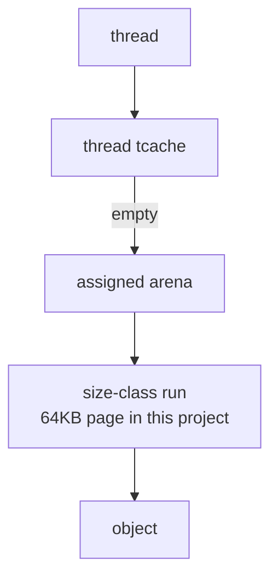
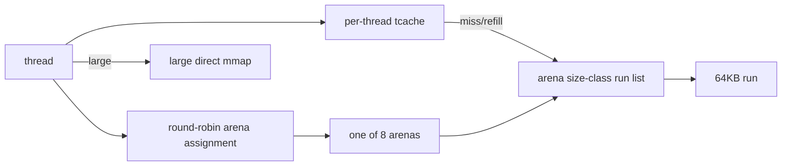

# jemalloc-like Mode

`MY_MALLOC_MODE=jemalloc_like` selects a teaching allocator based on arenas, size classes, runs, and per-thread tcache.

## Core Principle

jemalloc's architecture is built around arenas. Each thread is assigned to an arena. Small allocations use size-class runs owned by that arena, and thread caches reduce lock traffic.

Industrial jemalloc emphasizes scalable arenas and extent lifecycle management. Arenas partition allocator state so unrelated threads contend less. Runs carve pages into same-size slots, while extent states and decay policies decide when unused memory should be retained, purged, or returned.



The project implements the learning subset:



## Current Implementation

Implemented features:

| Feature | Implementation |
|---|---|
| Arenas | 8 teaching arenas |
| Arena assignment | Round-robin thread-local arena index |
| Size classes | 16-byte classes up to 4096B |
| Runs | 64KB mmap-backed pages split into one size class |
| Arena locks | One lock per arena class list |
| Tcache | Per-thread list per class |
| Refill | Move up to 32 objects from arena run to thread cache |
| Drain | Return cached objects to arena-owned run lists |
| Large allocation | Direct mmap-backed large block |

## Simplifications

| Real jemalloc | This project |
|---|---|
| Extents and extent hooks | Not implemented |
| Dirty/muzzy/retained states | Not implemented |
| Decay-based purging | Not implemented |
| Rich `mallctl` stats | Not implemented |
| Per-bin advanced policies | Simplified run lists |
| Background purge | Not implemented |

This simplified design is meant to show how arenas, runs, and tcaches fit together. It does not implement jemalloc's full extent tree, decay-based purging, profiling, `mallctl`, or advanced bin policies.

## Why It Is Useful

This mode demonstrates:

- arena-based scalability;
- how tcache and arena refill interact;
- why production jemalloc spends so much effort on extent lifecycle and purging;
- why arena organization alone is not enough for best RSS.

Run:

```bash
./build/allocator_validate --strategy jemalloc_like
./build/bench_runner --strategy jemalloc_like --profile stress --json
```
