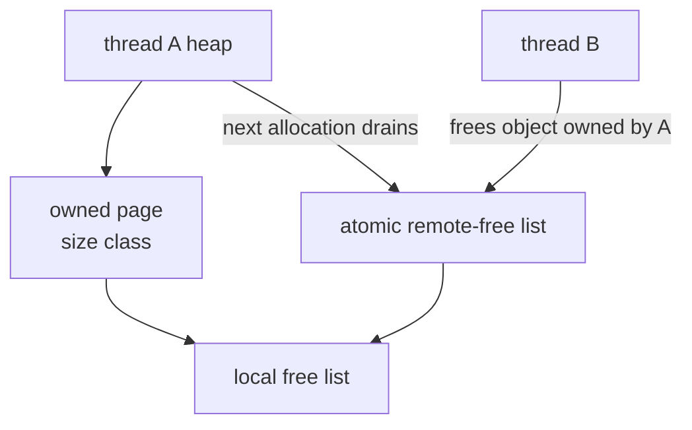
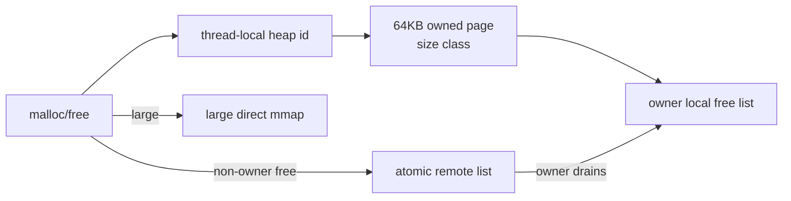

# mimalloc-like Mode

`MY_MALLOC_MODE=mimalloc_like` selects a teaching allocator focused on per-thread heap ownership and remote-free queues.

## Core Principle

mimalloc's most important lesson for this project is ownership. A page belongs to a heap/thread. Local frees can be reused immediately by the owner. Remote frees are placed on a remote list and later collected by the owner.

Industrial mimalloc organizes memory into heaps, segments, and pages. It is especially careful about page ownership, local free lists, remote frees, abandoned pages, and returning unused memory. The teaching version focuses on the ownership and remote-free path because that is the most visible design difference for cross-thread workloads.



The simplified project path is:



## Current Implementation

Implemented features:

| Feature | Implementation |
|---|---|
| Thread heap | `thread_local` heap ID |
| Page ownership | Each 64KB page records `owner_heap` |
| Size classes | 16-byte classes up to 4096B |
| Local free list | Owner thread keeps per-class local lists |
| Remote free | Non-owner free pushes object to page's atomic remote list |
| Remote drain | Owner drains remote list during allocation |
| Large allocation | Direct mmap-backed large block |

## Simplifications

| Real mimalloc | This project |
|---|---|
| Segments and abandoned pages | Not implemented |
| Eager page reset/decommit | Not implemented |
| Sophisticated free-list sharding | Simplified local/remote lists |
| Secure mode hardening | Limited |
| NUMA-aware ownership | Not implemented |

This simplified design does not model mimalloc's full segment lifecycle, abandoned-page recovery, eager reset/decommit policies, or security modes. It is intentionally focused on learning page ownership and remote-free mechanics.

## Why It Is Useful

This mode is designed to teach cross-thread free behavior. It makes the difference between:

```text
free into the freeing thread's cache
```

and:

```text
free into an owner-visible remote queue
```

Run:

```bash
./build/allocator_validate --strategy mimalloc_like
./build/bench_runner --strategy mimalloc_like --bench cross_thread_free --json
```
