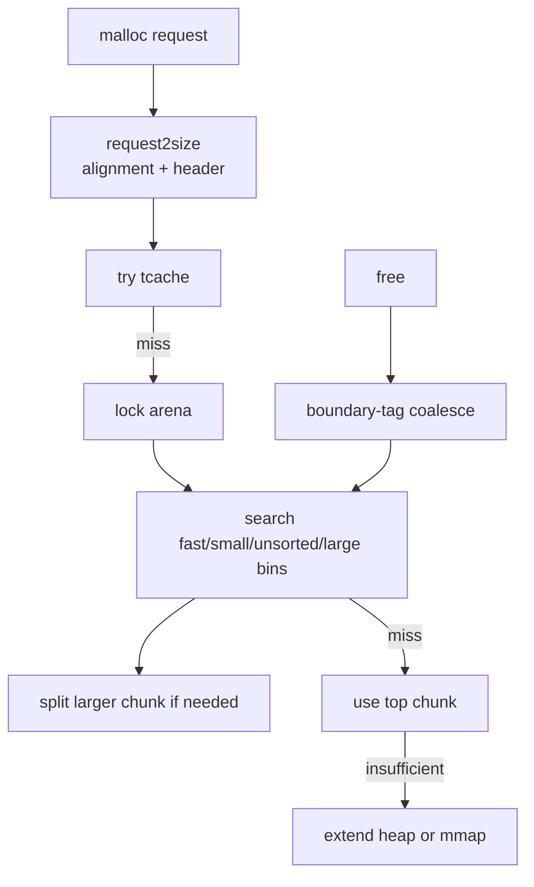

# ptmalloc-style Mode

`MY_MALLOC_MODE=ptmalloc` disables the slab frontend and uses the chunk/bin/arena allocator.

## Core Principle

ptmalloc manages variable-size chunks with boundary tags:

```text
[prev_size][size | flags][user bytes...]
```

Industrial ptmalloc is built around arenas, chunks, bins, and system-memory growth. The core idea is to keep enough metadata next to each allocation so `free` can coalesce adjacent free chunks, while bins make future search faster.

Free chunks are linked into bins:


The simplified chunk lifecycle in this project is:



## Implemented Features

| Feature | Current implementation |
|---|---|
| Boundary tags | `Chunk` header with `prev_size`, `size`, and flag bits |
| Tcache | 76 per-thread bins, safe-linking pointer mangling, double-free check |
| Fastbins | 10 CAS-based LIFO lists for tiny chunks |
| Small bins | 64 exact-size FIFO intrusive lists |
| Unsorted bin | Bounded scan, sorting into destination bins, last-remainder reuse |
| Large bins | Sorted lists with binmap skipping |
| Arenas | Per-thread arena assignment/reuse plus main arena |
| Coalescing | Forward/backward merge and top-chunk absorption |
| Large allocations | Direct mmap path |

## Simplifications

| Production ptmalloc behavior | Project simplification |
|---|---|
| Full glibc large-bin `fd_nextsize` maintenance | Uses sorted list plus binmap |
| Complex thread-exit cleanup | Limited lifecycle handling |
| Full `mallopt`/`malloc_info` support | Only common threshold knobs |
| Many realloc corner cases | Implements important in-place grow cases, then copy fallback |

The goal is to expose the mechanics: boundary tags, bin selection, arena locking, tcache fast paths, split/coalesce behavior, top chunk growth, and mmap fallback. It does not try to match every glibc tuning rule or hardening feature.

## What To Benchmark

Use:

```bash
./build/bench_runner --strategy ptmalloc --profile stress --json
./build/bench_runner --strategy ptmalloc --bench fragmentation --json
./build/bench_runner --strategy ptmalloc --bench cross_thread_free --json
```

Expected lessons:

- tcache hits are fast;
- arena/bin paths can suffer under contention;
- fragmentation depends heavily on split/coalesce behavior;
- variable-size chunks are flexible but carry metadata and search overhead.
