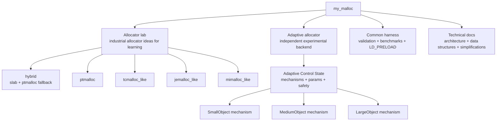
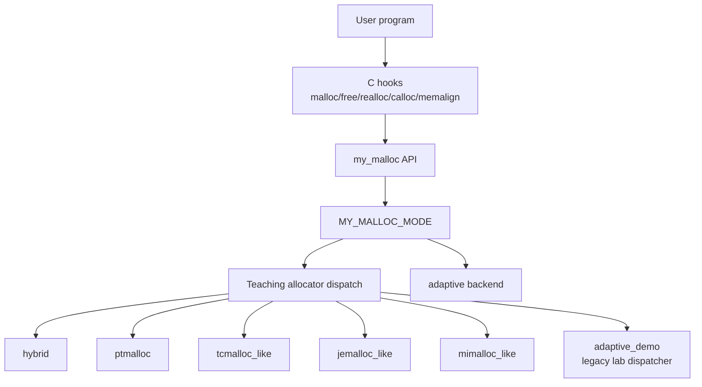
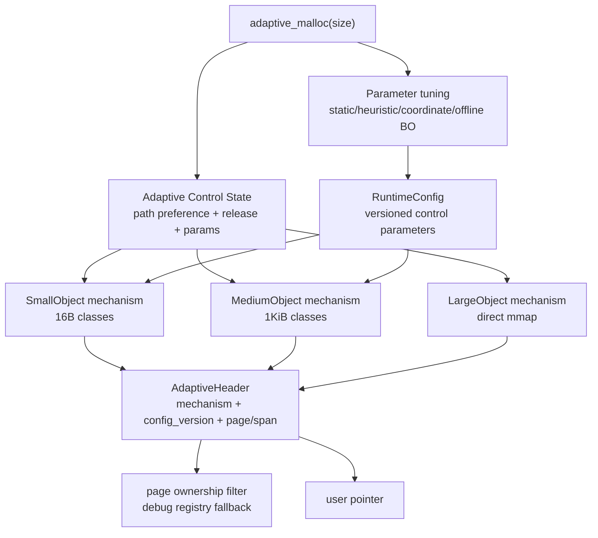

# System Architecture

This document is the top-level architecture map for `my_malloc`. The project has two main parts:

1. An allocator lab that reproduces the core ideas of classic industrial allocators for learning.
2. An independent `adaptive` allocator that is the project's experimental design.

The industrial-style allocators are not meant to be full production clones. They are simplified implementations that preserve the important mechanisms, data structures, and tradeoffs so they can be studied, visualized, validated, and benchmarked in one codebase. The `adaptive` allocator is different: it owns its own metadata, telemetry, base allocation mechanisms, runtime control state, and parameter policy, and is intended for runtime adaptation experiments.

## 1. Project Pillars



The allocator lab and the adaptive allocator are comparable through the same strategy API and benchmark tools, but they are not the same layer. `adaptive` does not default to calling the teaching allocators as backends.

## 2. Modes

Runtime modes are selected with `MY_MALLOC_MODE`:

| Mode | Role | Meaning |
|---|---|---|
| `hybrid` | Teaching allocator | Default mode. Small objects use the slab frontend; other allocations fall back to the ptmalloc-style path. |
| `ptmalloc` | Teaching allocator | Chunk/bin/arena allocator for studying glibc ptmalloc ideas. |
| `tcmalloc_like` | Teaching allocator | Size classes, thread caches, central free lists, and spans. |
| `jemalloc_like` | Teaching allocator | Arenas, runs, size classes, and per-thread tcache. |
| `mimalloc_like` | Teaching allocator | Per-thread heaps, page ownership, and remote-free queues. |
| `adaptive` | Experimental allocator | Independent adaptive backend with adaptive-internal policy and strategies. |
| `adaptive_demo` | Teaching demo | Legacy cross-teaching-allocator dispatcher, kept for demonstrations and mixed-ownership stress tests. |

Tool strategies use the same names:

```bash
./build/allocator_validate --strategy hybrid
./build/allocator_validate --strategy ptmalloc
./build/allocator_validate --strategy tcmalloc_like
./build/allocator_validate --strategy jemalloc_like
./build/allocator_validate --strategy mimalloc_like
./build/allocator_validate --strategy adaptive
./build/allocator_validate --strategy adaptive_demo
./build/bench_runner --strategy adaptive --profile smoke --json
```

## 3. Source Layout

| Area | Main files |
|---|---|
| Public allocator API | `include/my_ptmalloc/my_malloc.h`, `src/my_malloc.cpp` |
| LD_PRELOAD hooks | `include/my_ptmalloc/hooks.h`, `src/hooks.cpp` |
| Runtime mode selection | `include/my_ptmalloc/allocator_lab.h`, `src/allocator_lab.cpp`, `include/my_ptmalloc/runtime_allocator.h`, `src/runtime_allocator.cpp` |
| Strategy API and benchmark lab | `include/my_ptmalloc/strategy.h`, `src/strategy.cpp`, `tools/strategy_loader.h`, `tools/allocator_validate.cpp`, `tools/bench_runner.cpp` |
| Hybrid slab frontend | `include/my_ptmalloc/slab_allocator.h`, `src/slab_allocator.cpp` |
| ptmalloc-style backend | `include/my_ptmalloc/chunk.h`, `include/my_ptmalloc/arena.h`, `src/malloc_impl.cpp`, `src/free_impl.cpp`, `src/realloc_impl.cpp`, `src/arena_manager.cpp`, `src/*bins*.cpp` |
| tcmalloc/jemalloc/mimalloc-like teaching allocators | `include/my_ptmalloc/family_allocators.h`, `src/family_allocators.cpp` |
| Adaptive allocator | `include/my_ptmalloc/adaptive_allocator.h`, `src/adaptive_allocator.cpp` |
| Observability | `include/my_ptmalloc/observer.h`, `src/observer.cpp`, allocator-lab stats/trace in `src/allocator_lab.cpp` |

## 4. Allocation Flow

Public API calls enter `my_malloc`, `my_free`, `my_realloc`, and related wrappers. The runtime mode determines which allocator owns a new allocation.



Important boundary:

- `MY_MALLOC_MODE=adaptive` bypasses the teaching allocator dispatcher for new allocations and enters `src/adaptive_allocator.cpp`.
- `MY_MALLOC_MODE=adaptive_demo` is the old educational dispatcher that can choose among teaching allocators.
- `free` and `realloc` route by pointer ownership, not by the current allocation policy.

## 5. Ownership Rules

Every allocator family must be able to identify its own pointers on `free`, `realloc`, and `malloc_usable_size`.

| Pointer owner | Identification method | Free/realloc handler |
|---|---|---|
| Adaptive pooled small/medium object | Page ownership filter, `AdaptiveHeader`, and `owner_page` pointer | Return to adaptive page/span free list, with conservative empty release |
| Adaptive large/aligned object | Page ownership filter, `AdaptiveHeader`, and mmap metadata | Adaptive direct `munmap` path |
| Teaching family page object | 64KB page table in `family_allocators.cpp` | tcmalloc/jemalloc/mimalloc-like handler |
| Teaching family large block | large-pointer table in `family_allocators.cpp` | Family large free/realloc handler |
| Hybrid slab object | 64KB slab lookup in `slab_allocator.cpp` | Slab free/realloc path |
| ptmalloc chunk | chunk header plus arena/heap ownership | ptmalloc free/realloc path |
| libc bootstrap pointer | early-bootstrap pointer tracking | libc free/realloc path |

The key invariant is that an object is freed by the allocator that created it. Adaptive policy changes affect only future allocations; old adaptive objects return through their allocation-time metadata.

## 6. Teaching Allocators

The teaching allocators reproduce the essential mechanisms of well-known industrial allocators. They are implemented for learning and benchmarking, not as complete drop-in replacements for those production projects.

| Allocator | Industrial idea being studied | Project simplification | Detailed doc |
|---|---|---|---|
| `hybrid` | Practical combination of a small-object frontend and a general chunk allocator | Slab frontend for small objects plus ptmalloc-style fallback | This overview plus [ptmalloc_design.md](ptmalloc_design.md) |
| `ptmalloc` | Boundary-tag chunks, arenas, bins, tcache, top chunk, mmap fallback | Simplified large bins, lifecycle, mallopt, and realloc coverage | [ptmalloc_design.md](ptmalloc_design.md) |
| `tcmalloc_like` | Size classes, thread caches, central free lists, spans | Uniform classes, fixed batches, no full page heap or per-CPU cache | [tcmalloc_design.md](tcmalloc_design.md) |
| `jemalloc_like` | Arenas, runs, size classes, tcache, extent lifecycle concepts | Fixed arena count, simple 64KB runs, no extent decay/purging | [jemalloc_design.md](jemalloc_design.md) |
| `mimalloc_like` | Per-thread heaps, page ownership, remote-free queues | Simplified page model, no full segment/abandoned-page lifecycle | [mimalloc_design.md](mimalloc_design.md) |

Each detailed document should describe:

- industrial background and core principle;
- project design and data structures;
- allocation/free flow;
- simplifications compared with the real allocator;
- benchmark scenarios that expose the allocator's strengths and weaknesses.

## 7. Adaptive Allocator

`adaptive` is the independent experimental allocator. It is not an alias for the teaching allocator dispatcher.



Adaptive design rules:

- metadata and ownership are shared across adaptive base mechanisms;
- SmallObject/MediumObject/LargeObject are base allocation paths, not complete architectures;
- mechanism control chooses or biases mechanisms and updates related parameters;
- parameter policy updates a versioned runtime config;
- already allocated objects free through allocation-time metadata;
- adaptive-owned pointers are never handed to ptmalloc, slab, or teaching-family free paths.

Current compatibility mechanism policies:

| Policy | Meaning |
|---|---|
| `heuristic` | Select small/medium/large by request size. |
| `fixed:small` | Prefer small; safely fall back to medium/large when size does not fit. |
| `fixed:medium` | Prefer medium; safely fall back to large when size does not fit. |
| `fixed:large` | Prefer the direct mmap large mechanism. |
| `round_robin` | Cycle adaptive strategies to stress ownership routing. |
| `epsilon_greedy` | Windowed bandit baseline that mostly exploits the best telemetry score and sometimes explores. |
| `ucb1` | Windowed Upper Confidence Bound bandit that gives under-tested strategies an exploration bonus. |
| `thompson_sampling` | Windowed Thompson-style bandit that samples from success/failure uncertainty. |

Current parameter policies are `static`, `heuristic`, `coordinate_bandit`, and `bayesian_offline`. Runtime knobs include small page size, medium span size, mechanism-control window, parameter window, empty release keep limit, and a local-batch hint. `bayesian_offline` means the allocator consumes values produced by an external/offline tuning run; it does not run a Bayesian optimizer inside the malloc hot path.

Adaptive policy uses adaptive-specific telemetry, not teaching allocator metrics. Current online signals include base-mechanism success/failure counts, EWMA allocation latency, pool hit/miss counts, mechanism switches, parameter decisions, live bytes, and mapped bytes. Future work should add more adaptive-internal mechanisms such as TLS caches, remote-free queues, owner-aware reclaim, dynamic mmap thresholds, size-class table control, and decay/purge policy.

Detailed design: [adaptive_allocator.md](adaptive_allocator.md).

## 8. Validation And Benchmarking

The project compares allocators through common tools:

| Tool | Purpose |
|---|---|
| `allocator_validate` | Correctness checks for malloc/free/realloc/usable-size behavior. |
| `bench_runner` | Built-in smoke, micro, stress, and focused benchmarks. |
| `LD_PRELOAD` tests | Basic drop-in behavior through `libmy_ptmalloc.so`. |
| `scripts/external_bench.sh` | Optional external workloads such as mimalloc-bench and Redis when available. |

Typical workflow:

```bash
cmake --build build -j$(nproc)
ctest --test-dir build --output-on-failure

for s in hybrid ptmalloc tcmalloc_like jemalloc_like mimalloc_like adaptive libc; do
  ./build/allocator_validate --strategy "$s"
  ./build/bench_runner --strategy "$s" --profile smoke --json
done
```

Benchmark results should be interpreted as learning signals. A simplified teaching allocator may win a microbenchmark without being production-ready, and may lose broad workloads because production allocators have years of tuning around fragmentation, locality, concurrency, decommit, hardening, and platform-specific behavior.

## 9. Observability

Observability is opt-in:

```text
MY_MALLOC_STATS=1
MY_MALLOC_TRACE=1
```

The default hot path avoids always-on expensive tracing because measurement can become part of the workload. Adaptive stats use relaxed atomics and are kept lightweight.

## 10. LD_PRELOAD Bootstrap

LD_PRELOAD interposition is tricky because libc and the dynamic loader can allocate before this allocator is fully initialized. The project uses:

- a small static bootstrap buffer;
- fallback to real libc allocation for selected early hook paths;
- tracking for bootstrap pointers so they return to libc on `free`/`realloc`.

This avoids freeing libc-owned startup allocations through project-owned allocator paths.

## 11. Documentation Map

| Document | Scope |
|---|---|
| [allocator_lab.md](allocator_lab.md) | Strategy API, validation workflow, plugin strategy workflow, comparison methodology. |
| [benchmarking.md](benchmarking.md) | Built-in and external benchmark commands, profiles, and result interpretation. |
| [ptmalloc_design.md](ptmalloc_design.md) | ptmalloc-style chunks, bins, arenas, tcache, coalescing, and simplifications. |
| [tcmalloc_design.md](tcmalloc_design.md) | tcmalloc-like size classes, thread cache, central cache, spans, and simplifications. |
| [jemalloc_design.md](jemalloc_design.md) | jemalloc-like arenas, runs, tcache, extent concepts, and simplifications. |
| [mimalloc_design.md](mimalloc_design.md) | mimalloc-like heap ownership, pages, remote frees, and simplifications. |
| [adaptive_allocator.md](adaptive_allocator.md) | Independent adaptive backend, base mechanisms, control state, telemetry, and future mechanism-control hooks. |

If an allocator implementation changes, update both this system map and the allocator-specific design document.
