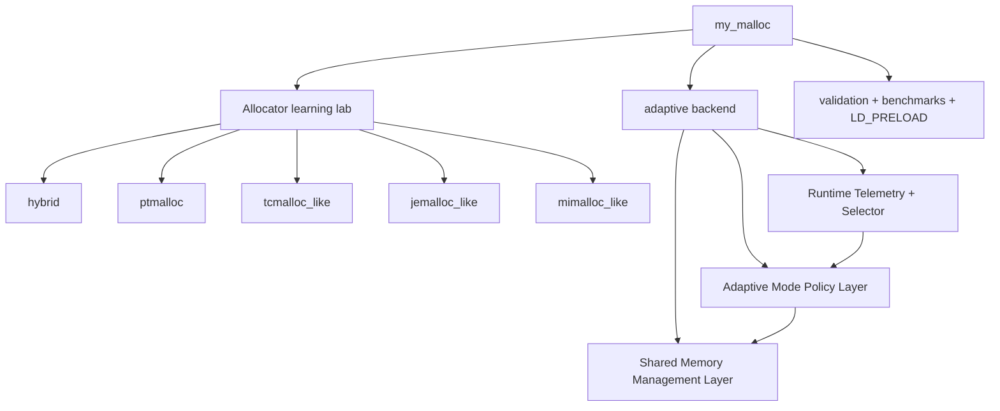
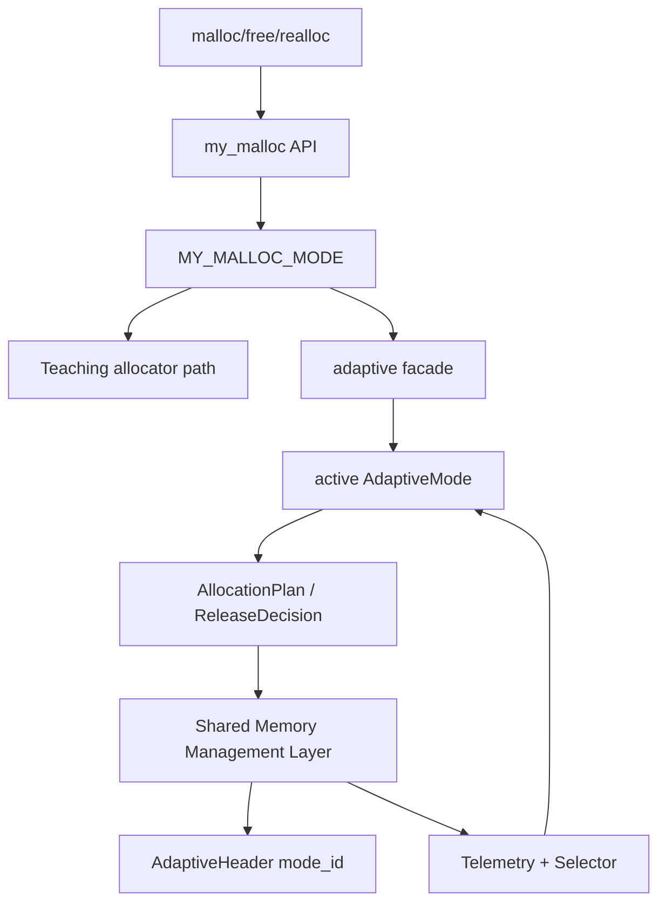

# System Architecture

`my_malloc` has two major parts:

1. **Industrial allocator learning lab**: simplified `hybrid`, `ptmalloc`, `tcmalloc_like`, `jemalloc_like`, and `mimalloc_like` implementations for studying allocator designs.
2. **Adaptive allocator experimental backend**: an independent two-layer adaptive allocator with shared memory services, mode policies, runtime telemetry, and soft switching.

The adaptive backend is not built by switching among the teaching allocators. It owns its own metadata, ownership tables, pages, spans, direct mappings, mode policies, and telemetry.

## Project Map



## Runtime Modes

`MY_MALLOC_MODE` selects the owner of new allocations:

| Mode | Role |
|---|---|
| `hybrid` | Teaching allocator: slab frontend plus ptmalloc-style fallback |
| `ptmalloc` | Teaching ptmalloc-style backend |
| `tcmalloc_like` | Teaching size-class/thread-cache/span allocator |
| `jemalloc_like` | Teaching arena/run/tcache allocator |
| `mimalloc_like` | Teaching per-thread heap/page allocator |
| `adaptive` | Independent adaptive backend |

Validation examples:

```bash
./build/allocator_validate --strategy hybrid
./build/allocator_validate --strategy ptmalloc
./build/allocator_validate --strategy tcmalloc_like
./build/allocator_validate --strategy jemalloc_like
./build/allocator_validate --strategy mimalloc_like
./build/allocator_validate --strategy adaptive
```

## Source Layout

| Area | Main files |
|---|---|
| Public API | `include/my_ptmalloc/my_malloc.h`, `src/my_malloc.cpp` |
| LD_PRELOAD hooks | `include/my_ptmalloc/hooks.h`, `src/hooks.cpp` |
| Runtime lab mode selection | `include/my_ptmalloc/allocator_lab.h`, `src/allocator_lab.cpp`, `include/my_ptmalloc/runtime_allocator.h`, `src/runtime_allocator.cpp` |
| Strategy API and tools | `include/my_ptmalloc/strategy.h`, `src/strategy.cpp`, `tools/strategy_loader.h`, `tools/allocator_validate.cpp`, `tools/bench_runner.cpp` |
| Teaching allocators | `src/slab_allocator.cpp`, `src/malloc_impl.cpp`, `src/free_impl.cpp`, `src/realloc_impl.cpp`, `src/family_allocators.cpp` |
| Adaptive facade | `include/my_ptmalloc/adaptive_allocator.h`, `src/adaptive_allocator.cpp` |
| Adaptive shared types | `include/my_ptmalloc/adaptive_types.h` |
| Adaptive shared memory layer | `include/my_ptmalloc/adaptive_services.h`, `src/adaptive_services.cpp` |
| Adaptive mode policy layer | `include/my_ptmalloc/adaptive_mode.h`, `src/adaptive_modes.cpp` |
| Adaptive telemetry | `include/my_ptmalloc/adaptive_telemetry.h`, `src/adaptive_telemetry.cpp` |
| Adaptive selector/runtime | `include/my_ptmalloc/adaptive_selector.h`, `src/adaptive_selector.cpp`, `include/my_ptmalloc/adaptive_runtime.h`, `src/adaptive_runtime.cpp` |

## Allocation Flow



Important invariants:

- `MY_MALLOC_MODE=adaptive` enters the adaptive facade.
- `adaptive_malloc` uses the current active mode policy.
- `adaptive_free`, `adaptive_realloc`, and `adaptive_usable_size` use allocation-time `AdaptiveHeader::mode_id`.
- Mode switches affect future allocations only.
- Live objects are not migrated.

## Ownership

Every allocator must identify its own pointers on `free`, `realloc`, and `malloc_usable_size`.

| Pointer owner | Identification | Handler |
|---|---|---|
| Adaptive size-class page object | adaptive page table + `AdaptiveHeader` + `owner_page` | allocation-time adaptive mode policy + shared services |
| Adaptive span object | adaptive page table + `AdaptiveHeader` + span metadata | allocation-time adaptive mode policy + shared services |
| Adaptive direct mapping | adaptive page table + `AdaptiveHeader::region_base` | allocation-time adaptive mode policy + shared services |
| Teaching family page object | family allocator page table | family allocator handler |
| Hybrid slab object | slab lookup | slab handler |
| ptmalloc chunk | chunk header and arena ownership | ptmalloc handler |
| libc bootstrap pointer | bootstrap tracking | libc handler |

## Adaptive Backend

Detailed design: [adaptive_allocator.md](adaptive_allocator.md).
Paper-style diagrams for both the reproduced allocator lab and the adaptive
backend: [architecture_diagrams.md](architecture_diagrams.md).

Summary:

- Shared Memory Management Layer owns `AdaptiveHeader`, registry, page table, size-class pages, spans, true-large extents/direct mappings, thread-local magazines, owner remote-free queues, central free lists, reclaim, and telemetry events.
- Adaptive Mode Policy Layer owns `AllocationPlan` and `ReleaseDecision` generation for `Balanced`, `ThroughputCache`, `DeterministicLatency`, `CompactRSS`, `FragmentationStable`, `CrossThreadMessage`, `LargeObjectStreaming`, and `HardenedDebug`. Modes combine shared cache, reclaim, remote-free, occupancy-packing, extent, and debug services instead of acting as separate allocator copies.
- Runtime Telemetry and Selector extracts `WorkloadFeatures`, applies the offline-trained model selector with window/cooldown/hysteresis, and soft-switches active mode. The older rule selector is kept only as an explicit baseline.

## Validation And Benchmarking

```bash
cmake --build build -j$(nproc)
ctest --test-dir build --output-on-failure

for s in hybrid ptmalloc tcmalloc_like jemalloc_like mimalloc_like adaptive libc; do
  ./build/allocator_validate --strategy "$s"
  ./build/bench_runner --strategy "$s" --profile smoke --json
done
```

Benchmark results are learning signals. The teaching allocators intentionally preserve core ideas without claiming production completeness.

## Documentation Map

| Document | Scope |
|---|---|
| [architecture_diagrams.md](architecture_diagrams.md) | Paper-style architecture figures for the reproduced allocator lab and adaptive allocator |
| [allocator_lab.md](allocator_lab.md) | Strategy API, validation workflow, plugin workflow, comparison methodology |
| [benchmarking.md](benchmarking.md) | Benchmark commands, adaptive JSON fields, external benchmark notes |
| [adaptive_allocator.md](adaptive_allocator.md) | Shared memory layer, mode policy layer, telemetry/selector, soft switching |
| [ptmalloc_design.md](ptmalloc_design.md) | ptmalloc-style allocator |
| [tcmalloc_design.md](tcmalloc_design.md) | tcmalloc-like allocator |
| [jemalloc_design.md](jemalloc_design.md) | jemalloc-like allocator |
| [mimalloc_design.md](mimalloc_design.md) | mimalloc-like allocator |
