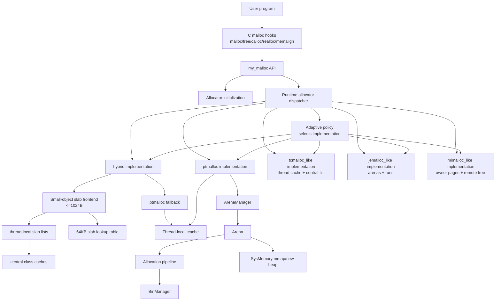
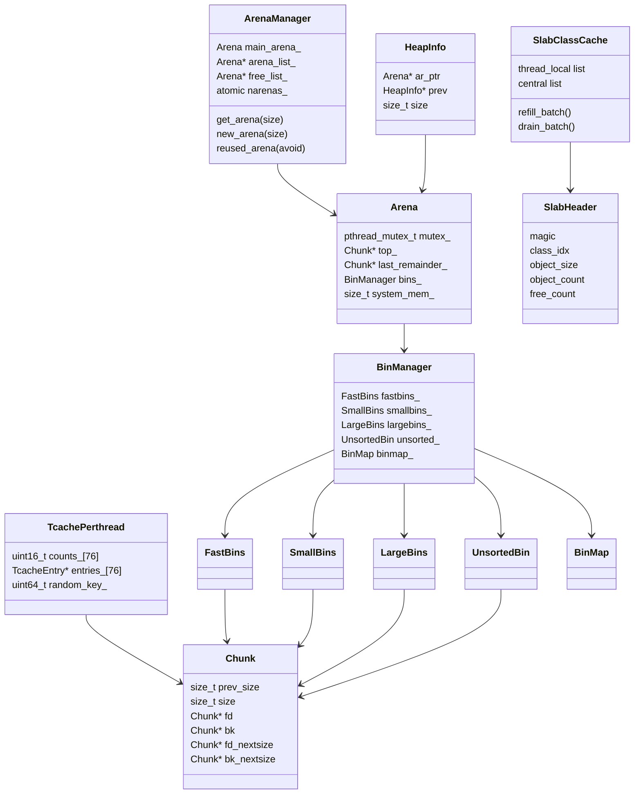
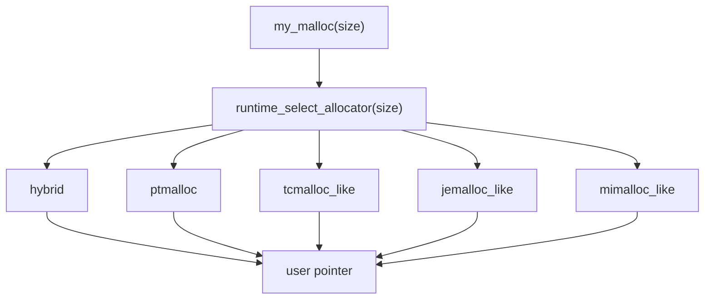
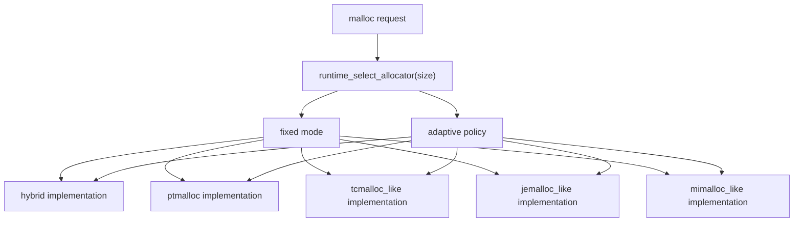

# System Architecture

This document explains how the allocator is organized internally. It focuses on module boundaries, data-structure ownership, runtime dispatch, and control flow.

## 1. Design Goal

`my_malloc` is a learning allocator with three goals:

1. Keep a readable ptmalloc-style implementation: chunks, boundary tags, bins, arenas, top chunk, and mmap.
2. Add a modern small-object frontend: size classes, slabs, thread-local caches, and central refill/drain.
3. Provide separate teaching implementations of common allocator families that can be selected at runtime.

The current architecture separates public API, runtime selection, concrete implementations, and adaptive policy:

```text
malloc/free/realloc API
  |
  v
runtime allocator dispatcher
  |
  +-- fixed mode: choose one concrete implementation
  |
  +-- adaptive mode: policy chooses one concrete implementation
         |
         +-- hybrid
         +-- ptmalloc
         +-- tcmalloc_like
         +-- jemalloc_like
         +-- mimalloc_like
```

Runtime mode:

| Mode | Meaning |
|---|---|
| `MY_MALLOC_MODE=hybrid` | Use slab frontend first, then ptmalloc-style fallback. This is the default. |
| `MY_MALLOC_MODE=ptmalloc` | Disable the slab frontend and use only the chunk/bin/arena path. |
| `MY_MALLOC_MODE=tcmalloc_like` | Use the teaching size-class/thread-cache/central-free-list allocator. |
| `MY_MALLOC_MODE=jemalloc_like` | Use the teaching arena/run/tcache allocator. |
| `MY_MALLOC_MODE=mimalloc_like` | Use the teaching per-thread heap/page allocator with remote-free queues. |
| `MY_MALLOC_MODE=adaptive` | Enable a configurable decision policy over all concrete allocator implementations. |

## 2. Top-level Components



Main source files:

| Component | Files |
|---|---|
| Public API | `include/my_ptmalloc/my_malloc.h`, `src/my_malloc.cpp` |
| LD_PRELOAD hooks | `include/my_ptmalloc/hooks.h`, `src/hooks.cpp` |
| Initialization | `src/init.cpp` |
| Slab allocator | `include/my_ptmalloc/slab_allocator.h`, `src/slab_allocator.cpp` |
| Runtime dispatcher | `include/my_ptmalloc/runtime_allocator.h`, `src/runtime_allocator.cpp` |
| Teaching allocator implementations | `include/my_ptmalloc/family_allocators.h`, `src/family_allocators.cpp` |
| Allocation pipeline | `include/my_ptmalloc/alloc_pipeline.h`, `src/alloc_pipeline.cpp`, `src/malloc_impl.cpp` |
| Free / coalescing | `src/free_impl.cpp`, `src/consolidate.cpp`, `src/coalesce.cpp` |
| Realloc | `src/realloc_impl.cpp` |
| Arenas/heaps | `include/my_ptmalloc/arena.h`, `src/arena_manager.cpp`, `src/heap.cpp` |
| Bins | `include/my_ptmalloc/*bins*.h`, `src/large_bins.cpp`, `src/unsorted_bin.cpp` |
| Strategy lab | `include/my_ptmalloc/strategy.h`, `src/strategy.cpp`, `tools/bench_runner.cpp` |

## 3. Data Structure Relationship



Ownership rules:

- `TcachePerthread` is per-thread. Tcache allocation/free does not lock an arena.
- `Arena` owns chunk-backed free lists. Its mutex must be held when touching small, unsorted, large, top, and most consolidation state.
- `FastBins` use atomic stacks, but consolidation still belongs to the arena path.
- `HeapInfo` maps non-main heap regions back to the owning arena during free.
- Slab objects are not chunk-backed. Their owner is recovered from a 64KB-aligned slab base lookup.

## 4. Request Routing

This document intentionally keeps request routing at the system level. Detailed chunk/bin paths belong in [ptmalloc_design.md](ptmalloc_design.md), and detailed size-class/span/page paths belong in the corresponding allocator documents.



`free(ptr)` and `realloc(ptr, size)` must first identify ownership:

| Pointer owner | Identification method | Handler |
|---|---|---|
| teaching family large block | large-pointer table in `family_allocators.cpp` | family large free/realloc |
| teaching family page object | 64KB page table in `family_allocators.cpp` | tcmalloc-like, jemalloc-like, or mimalloc-like handler |
| hybrid slab object | 64KB slab lookup in `slab_allocator.cpp` | slab free/realloc path |
| ptmalloc chunk | chunk header and arena/heap ownership | ptmalloc free/realloc path |

This ownership boundary is the important system-level rule. The details of how each allocator finds a free object, coalesces chunks, refills a cache, or drains a remote-free list are documented in the concrete allocator documents.

## 5. LD_PRELOAD Bootstrap

Interposing `malloc` is tricky because dynamic loader and libc initialization can allocate memory before this allocator is fully ready.

This project uses:

- a small static bootstrap buffer before real symbols are resolved;
- real libc allocation for some early hook initialization cases;
- tracking of real-bootstrap pointers so later `free`/`realloc` calls go back to libc instead of this allocator.

This prevents a class of early startup crashes where memory allocated by libc was accidentally freed through `my_malloc`.

## 6. Observability

Observability is opt-in:

```text
MY_MALLOC_STATS=1
MY_MALLOC_TRACE=1
```

The default hot path avoids always-on counters because atomic telemetry can change benchmark results. This is an important allocator engineering lesson: measurement code can become part of the workload.

## 7. Main Simplifications

| Area | Simplification | Consequence |
|---|---|---|
| Slab reclamation | Empty slabs are cached, not unmapped | Higher RSS in fragmentation and phase-changing workloads |
| Remote free | Slab frees return to the current thread path | Producer/consumer workloads can be worse than mimalloc/tcmalloc |
| Size classes | Uniform 16-byte classes up to 1024B | Easier to understand, less tuned than production tables |
| Large bins | Sorted list plus binmap, not full glibc nextsize behavior | Simpler maintenance, less optimal search/update behavior |
| Adaptive policy | Configurable runtime decision module | Current policies include heuristic, round-robin, bandit, and fixed-target selection |
| System memory | Simplified heap/span management | Less release/reuse sophistication than jemalloc/tcmalloc/mimalloc |

## 8. Runtime Dispatcher And Adaptive Policy

The runtime dispatcher is implemented in `src/runtime_allocator.cpp`. It maps the configured mode to a concrete allocator implementation. In adaptive mode, it applies a policy and still returns a concrete implementation. Adaptive is therefore a selection layer, not a separate allocator data structure.



Each concrete mode implements enough of the real allocator family's core mechanism to make benchmarks meaningful:

- `tcmalloc_like`: thread cache and central free-list batching.
- `jemalloc_like`: arena assignment and run-based refill.
- `mimalloc_like`: page ownership and remote-free transfer.
- `adaptive`: a decision module that can select any concrete implementation. Current policies include `heuristic`, `round_robin`, `bandit`, and `fixed:<impl>`.

Detailed documents:

- [ptmalloc_design.md](ptmalloc_design.md)
- [tcmalloc_design.md](tcmalloc_design.md)
- [jemalloc_design.md](jemalloc_design.md)
- [mimalloc_design.md](mimalloc_design.md)
- [adaptive_allocator.md](adaptive_allocator.md)
