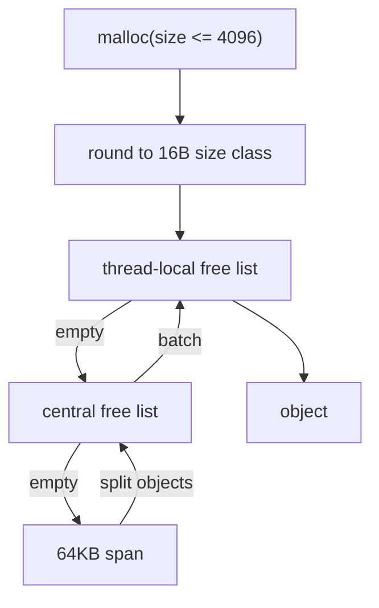
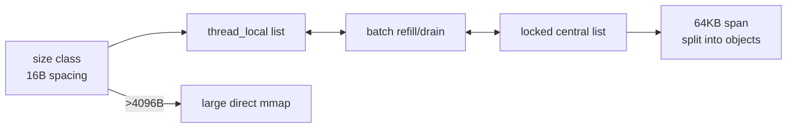

# tcmalloc-like Mode

`MY_MALLOC_MODE=tcmalloc_like` selects a teaching allocator based on tcmalloc's most important ideas: size classes, thread caches, central free lists, and spans.

## Core Principle

Small allocations are rounded into size classes. Each thread first allocates from a local list. If the local list is empty, it refills from a central list. If the central list is empty, a new span is split into objects.

Industrial tcmalloc separates the hot path from global memory management. Small objects are served from thread/per-CPU caches, central free lists refill those caches in batches, and a page heap manages spans of pages. The important teaching idea is that most small allocations should avoid variable-size chunk search and avoid global locks.



This project keeps the same conceptual pipeline with a smaller implementation:



## Current Implementation

Files:

```text
include/my_ptmalloc/family_allocators.h
src/family_allocators.cpp
```

Implemented features:

| Feature | Implementation |
|---|---|
| Size classes | Uniform 16-byte classes up to 4096B |
| Thread cache | `thread_local` free list and count per class |
| Central cache | One locked central list per class |
| Batch refill | Up to 32 objects moved from central to thread cache |
| Batch drain | Thread cache drains 64 objects when it grows too large |
| Span | 64KB mmap-backed page split into fixed-size objects |
| Large allocation | Direct mmap-backed large block with header |

## Simplifications

| Real tcmalloc | This project |
|---|---|
| Tuned size-class table | Simple 16-byte spacing |
| PageHeap with span split/merge | New 64KB spans, kept for reuse |
| Per-CPU cache mode | Thread-local cache only |
| Transfer cache tuning | Fixed batch constants |
| Empty span release | Not implemented yet |

The simplified design deliberately avoids the full page heap, transfer cache, per-CPU cache, huge-page aware backend, and tuned size-class table. That keeps the code readable while preserving the core lesson: size-class objects plus local caches can make small allocations very cheap.

## Why It Is Useful

This mode should show:

- small-object allocation can avoid variable chunk metadata;
- thread-local lists make hot paths simple;
- central lists reduce global contention but still provide sharing;
- missing span release can increase RSS.

Run:

```bash
./build/allocator_validate --strategy tcmalloc_like
./build/bench_runner --strategy tcmalloc_like --profile micro --json
```
